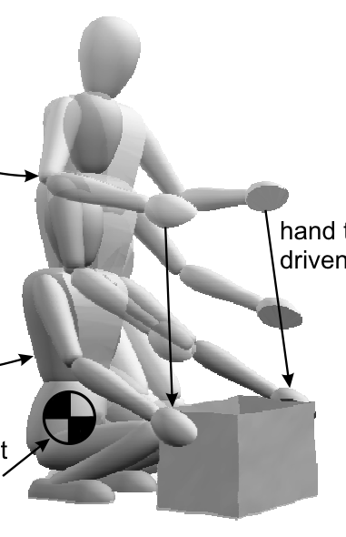

# Whole-Body Behaviors：基于行为基元分层控制的全身行为合成

[论文](https://doi.org/10.1142/S0219843605000594)

让人形机器人双手拿箱子时，手要到位，质心不能跑出支撑区域，躯干还要保持合适姿态。最直接的做法是给所有误差加权求和，但权重稍有变化，平衡任务就可能被手部任务牺牲。这篇论文的核心思想是把行为拆成有严格优先级的primitive：高优先级任务先占用它需要的自由度，低优先级任务只能在不破坏前者的剩余空间里工作。

## “任务+姿态”两层怎样合成

任务层在操作空间中描述手、质心或躯干等目标，利用任务空间动力学计算相应控制力；姿态层处理冗余关节，希望机器人在完成任务的同时维持自然或可控的全身构型。每增加一个低优先级任务，都要先投影到前面所有高优先级任务的动态一致零空间。于是“拿箱子”不是手、质心和躯干三个控制器简单叠加，而是一个有明确支配关系的递归结构。

这种做法的价值在冲突时最明显：如果双手目标和保持平衡不能同时满足，系统应先保住平衡，再在剩余能力内尽量靠近手部目标。严格层级比加权和更容易表达这种安全语义，但也意味着优先级选错会造成低层任务长期没有自由度，任务切换还可能带来不连续。

控制输入由机器人状态、任务参考和当前接触组成，每个primitive输出任务误差、雅可比及期望任务力；递归投影后合成为关节力矩。高层行为只需激活、停用或更新目标，底层层级负责同一控制周期内的资源分配。这个接口后来可以由规划器、遥操作或学习策略提供任务参考，但平衡优先级不能交给上层任意覆盖。

> **核心概念图：** Figure 1，PDF第3页。论文没有独立的网络式方法总览，这张图用抓箱子过程说明手部任务、全局质心平衡和躯干直立如何同时存在。阅读时应把三种行为对应到不同任务空间和优先级，而不是只把它当实验照片。来源：[原论文](https://doi.org/10.1142/S0219843605000594)。

## 从零空间投影到层级优化

零空间投影适合等式任务；关节限位、摩擦锥、单边接触和力矩饱和则是不等式约束，多接触切换还会带来秩变化与奇异。现代WBC因此常把约束纳入QP或层级QP，显式处理不可行性和松弛量。任务优先级仍是核心，只是从解析投影扩展到了带约束优化。
