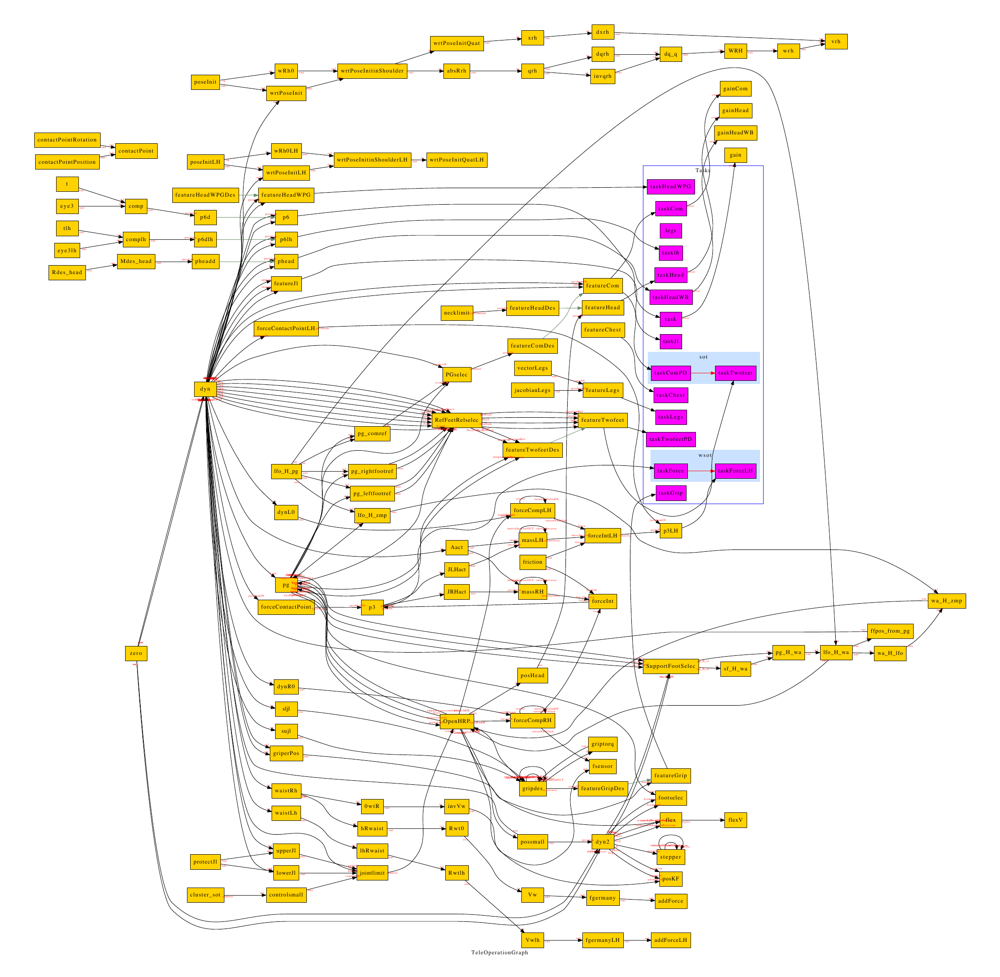

# Stack of Tasks：面向协作人形机器人的通用广义逆运动学任务栈

[论文](https://homepages.laas.fr/ostasse/hugo/fr/publication/int_conf/mansard-icar-09/) · [代码](https://github.com/stack-of-tasks)

Stack of Tasks将任务、约束、雅可比、数值求解和机器人状态组织成可动态组合的软件实体。任务可以在行为运行中插入、删除或调整优先级，使复杂人形行为由一组可复用的控制对象组合，而不必写成单体控制器。

## 速度层的递归求解

每个任务提供当前误差、期望变化和对应雅可比。最高优先级任务先求一个关节速度解；下一任务只在前一任务雅可比的零空间里修正，依次向下堆叠。若低优先级目标与高优先级目标冲突，它只能完成可兼容的部分。任务可以随行为阶段插入、删除或改变优先级；系统图还展示了关节限位相关的任务与feature节点。

求解器输入是当前广义位置、任务参考和各feature计算出的几何量，输出是广义速度或其积分后的姿态命令。任务对象封装误差、雅可比与增益，solver处理优先级组合；实体之间通过数据依赖连接，可以分别配置几何任务和接触任务。

## 力传感与顺应控制

论文在第IV-C节为位置控制机器人构造运动学逆导纳方案。接触点的六维位姿满足 `M r̈ + B ṙ = f`，其中f是力传感器测得的接触力与力矩，M和B分别描述虚拟质量和阻尼。外力由此转换成接触点的运动响应。

作者以机器人惯量矩阵A作为加权伪逆的关节权重，并取任务空间虚拟质量 `M = (J A⁻¹ Jᵀ)⁻¹`，得到 `A q̈ = Jᵀ f − B_q q̇`，其中 `B_q = Jᵀ B J`。这一构造将力传感顺应响应接入任务控制结构，使接触力任务与自由空间位置任务能够在同一系统中组织。

> **系统结构图：** Figure 1，PDF第3页。图中不是神经网络，而是控制时刻内的实体图：机器人动态量、feature、task、solver以及它们的依赖关系。读图重点是一个任务怎样从当前状态计算误差和雅可比，再被栈式求解器组合。来源：[作者论文页](https://homepages.laas.fr/ostasse/hugo/fr/publication/int_conf/mansard-icar-09/)。

## HRP-2上的任务切换

实验以HRP-2展示行走与人机交互时的任务重组：行为流程移除腿部任务，并加入接触力任务和左手力任务。任务栈通过push、pop、移除及优先级调整操作，改变当前要执行的目标；机器人状态更新后，各feature计算误差和雅可比，求解器递归生成运动命令。论文的主要结果是以可组合的软件实体连接几何控制、接触顺应和行为切换。

方法与实验见[作者托管论文](https://homepages.laas.fr/ostasse/mansard_icar09.pdf)第II、III及IV-C/D节。
