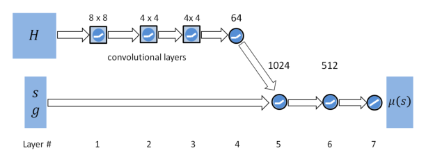

# DeepMimic：示例引导的物理角色技能深度强化学习

[论文](https://arxiv.org/abs/1804.02717) · [项目主页](https://xbpeng.github.io/projects/DeepMimic/index.html) · [代码](https://github.com/xbpeng/DeepMimic)

DeepMimic先为物理角色提供逐帧参考轨迹，再用强化学习寻找能在动力学和接触约束下跟踪它的控制策略。这一Motion Tracking范式把动作数据作为运动目标、把任务奖励作为行为条件，由策略学习兼顾动作风格与任务完成的可执行控制。

> **主要方法图：** Figure 2，PDF第4页。图中以地形任务为例：高度图经CNN编码后，与角色状态和任务目标拼接，再由MLP输出动作。来源：[原论文](https://arxiv.org/abs/1804.02717)。

## 参考动作怎样变成奖励

每个训练时刻都有一个相位变量，用它从动作片段中取出目标姿态。模仿奖励不是单一的关节角误差，而是同时比较关节姿态、关节速度、关键末端位置和质心位置；不同误差经指数函数转成奖励后加权。这样做的含义是：关节角负责动作外形，速度负责节奏，手脚位置约束接触几何，质心约束整体动态。如果只保留姿态项，角色可能“摆得像”却没有正确动量；如果权重和坐标系处理不当，几个目标也会互相打架。

策略观察当前物理状态、动作相位以及可选的任务目标，输出关节目标，再由PD控制器转成力矩。训练还使用Reference State Initialization：回合不总从动作第一帧开始，而是从参考片段的随机时刻初始化。这既扩大了状态覆盖，也让策略学会从动作中段恢复。严重偏离参考时提前终止，避免把算力浪费在已经不可恢复的轨迹上。

DeepMimic使用的是“当前相位对应的参考帧”，而不是后来tracker常见的多帧未来参考窗口。参考记录包含根节点、关节姿态和速度，策略状态则把根部信息改写到角色局部坐标系，以减少世界朝向带来的无关变化。动作端并不直接输出力矩，而是给出各关节的目标姿态，由低层PD闭环吸收一部分瞬时误差。这个设计降低了RL直接学习高频力矩的难度，也意味着PD增益、控制步长和角色惯量一旦变化，原策略的动作含义会随之变化。

## 为什么还能完成任务

总奖励由模仿奖励和任务奖励共同组成。前者维持动作风格，后者可以要求角色朝指定方向移动、击中目标或穿越地形。因此同一段跑步参考并不意味着只能原样回放，策略能根据目标改变朝向和落脚，同时尽量保持原动作的动态特征。论文还展示了受扰后的恢复，但恢复范围仍受训练状态覆盖和参考动作本身限制。

## 适用范围

DeepMimic的实验来自物理仿真角色，不构成真实机器人Sim2Real证据；其跟踪器依赖逐帧参考和相位，因此主要在训练动作及扰动范围内修正落脚与朝向，不能据此推断它能跟踪任意未见动作。后续通用tracker扩展的正是动作库规模、参考窗口、条件接口和脱离固定相位后的恢复能力。
