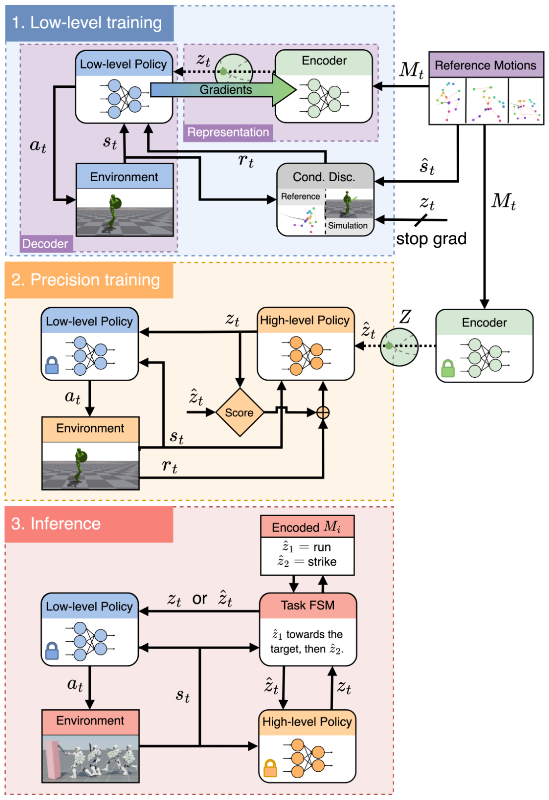

# CALM：面向可控虚拟角色的条件对抗潜变量模型

[论文](https://arxiv.org/abs/2305.02195) · [项目主页](https://research.nvidia.com/labs/par/calm/)

CALM针对潜变量与动作片段缺少稳定对应的问题，联合训练动作编码器、条件判别器和低层策略：参考动作先编码为潜变量，低层策略再生成与其内容对应的状态转移。由此，上层可更可靠地定向调用、插值和切换技能；这与ASE侧重无监督发现多样技能的目标不同。

> **主要方法图：** Figure 2，PDF第3页。第一阶段联合学习动作编码器和低层策略，第二阶段冻结它们并训练任务高层，推理时高层策略或人工FSM都可给出潜变量。来源：[原论文](https://arxiv.org/abs/2305.02195)。

## 条件对抗学习怎样形成动作空间

编码器读取参考动作片段并产生紧凑表示 `z`。条件判别器接收状态转移和 `z`，判断该转移是否既真实又与指定动作内容相符；低层策略则根据当前状态和 `z` 输出控制。由于正样本的 `z` 来自对应参考片段，策略不能只生成任意一种自然动作来骗过判别器，而要保留片段的主要行为特征。

预训练完成后，编码器和低层控制器被冻结。面对击打、移动或交互任务，高层策略只需在较低维潜空间中搜索；人工有限状态机也能在若干动作编码之间切换。潜变量插值可以形成过渡行为，但“平滑插值”只说明表示空间连续，不等于每条插值轨迹都满足复杂接触约束。

## CALM和ASE不要混为一谈

ASE用互信息目标让不同潜变量产生可区分技能，重点是无监督技能发现；CALM用参考动作条件化判别器，重点是让潜变量与动作内容对应并可被定向控制。二者都采用“低层预训练、高层复用”，但潜空间的训练监督不同，适合的上层接口也不同。

## 对机器人行为基座的启发与限制

这篇给出的关键启发是：行为基座不仅要覆盖很多动作，还要有稳定、可查询的控制接口。真正落到人形机器人时，还需要明确接口是根速度、关键点、关节目标、语言还是混合mask，并补上本体观测、执行器和安全约束。CALM本身面向虚拟角色，不能当作真机通用控制已经成立的证据。

## 条件判别器约束的是哪一层

正样本是带片段编码`z`的参考状态转移，负样本是低层策略在同一`z`下生成的转移。条件判别器同时检查动作自然度与片段对应关系；具体任务奖励则留到冻结底层后的高层策略或FSM阶段，分开表达“动作像什么”和“当前要完成什么”。论文面向虚拟角色，没有真实机器人观测或Sim2Real验证。
