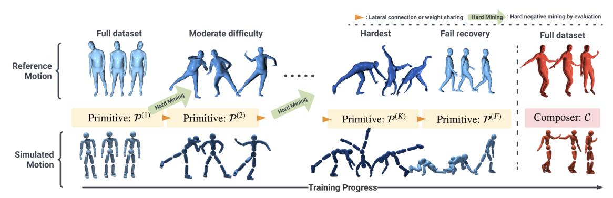

# PHC：面向实时仿真人的持续人形控制

[论文](https://arxiv.org/abs/2305.06456) · [项目主页](https://zhengyiluo.github.io/PHC-Site/) · [代码](https://github.com/ZhengyiLuo/PHC)

PHC以SMPL仿真人为对象，将人体姿态或三维关键点作为参考，由物理策略持续跟踪并生成满足接触与动力学的全身rollout。它把纯运动学人体动作转成经过物理执行检验的avatar动作，同时结合Motion Tracking、AMP和跌倒恢复训练。

> **主要方法图：** Figure 2，PDF第4页。训练从容易动作逐步扩展到困难动作，之后单独训练跌倒恢复primitive，并训练composer组合已冻结的primitive。来源：[原论文](https://arxiv.org/abs/2305.06456)。

## 输入、输出和数据关系

输入端是AMASS等人体动作中的SMPL姿态，或视觉系统提供的三维关键点/人体姿态目标；输出端不是离线IK文件，而是受物理引擎约束的仿真SMPL humanoid状态序列。控制策略每步读取当前avatar状态与参考目标，输出关节PD目标/控制动作，在接触、重力和碰撞下执行。根、关节、末端和速度的tracking reward保证语义动作不丢，AMP项约束恢复等非参考阶段仍保持自然。

因此PHC处在“人体动作恢复之后、真实机器人重定向/跟踪之前”的仿真人体跟踪环节：它能过滤纯运动学动作中不可持续的部分，产生有接触结果的avatar rollout；但这个SMPL avatar与Unitree G1、H1等机器人在自由度、质量、执行器和足底结构上不同，不能把输出直接当真机参考，也不能把仿真覆盖率当成机器人真机成功率。

## 逐级补长尾，而不是反复遗忘

第一阶段在全量动作中训练初始跟踪策略，并根据rollout识别失败片段。新增primitive主要学习这些失败样本，已有primitive冻结，避免为了补少数困难动作破坏已经学会的能力。多个primitive通过乘性组合和composer形成最终控制。作者还加入fail-recovery primitive，用较简单的站起和移动数据学习从偏离参考的状态回到可控区域；因此持续运行把跟踪失配后的恢复也作为正式能力，而非简单终止回合。

tracking奖励仍比较参考与角色的根、关节、末端等状态；AMP风格项用于让恢复过程更自然。论文报告在其仿真设置下对AMASS获得很高的动作覆盖率，并避免依赖外部稳定力。这一数字说明长尾分治有效，但它与数据预处理、成功阈值和虚拟角色模型绑定，不能直接当作真机成功率。

PHC中的humanoid是固定SMPL虚拟角色，不是真实机器人本体。其动作覆盖率和持续恢复能力是在该仿真模型与数据处理协议下得到的，不能当作机器人真机成功率；将rollout重定向到机器人时，还需重新处理关节拓扑、执行器和本体状态估计。
