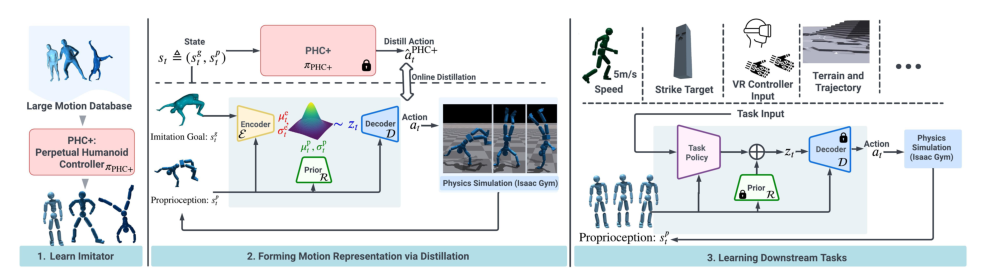

# PULSE：面向物理控制的通用人形运动表征

[论文](https://arxiv.org/abs/2310.04582) · [项目主页](https://zhengyiluo.github.io/PULSE-Site/) · [代码](https://github.com/ZhengyiLuo/PULSE)

PHC解决了大规模动作跟踪，却仍是一个以参考动作作为输入的复杂模仿系统。PULSE把预训练PHC当教师，用变分信息瓶颈把“当前身体状态下，下一步该怎么追参考”压缩为潜变量，再训练统一decoder把状态和潜变量还原成动作。下游任务不再输入整段参考轨迹，只需学习输出潜变量。

> **主要方法图：** Figure 2，PDF第4页。预训练模仿器提供监督，变分encoder把运动意图压入潜变量，decoder在本体状态条件下输出动作，prior约束潜空间可在没有参考动作时采样和控制。来源：[原论文](https://arxiv.org/abs/2310.04582)。

## 蒸馏的输入输出关系

训练时，posterior encoder能看到当前本体状态和未来参考信息，生成潜变量 `z`；decoder接收当前状态与 `z`，拟合教师动作。监督来自PHC在物理仿真中闭环执行动作形成的状态、参考与控制对，因此decoder学习到的动作包含平衡和接触响应，而不只是人体pose重建。另一个只依赖本体状态的prior学习posterior分布，KL约束使潜变量保持连续并可在下游使用。训练结束后冻结decoder和prior，下游策略根据任务目标产生 `z`，decoder再输出关节动作。

这里的关键不是普通动作自编码，而是decoder始终以当前物理状态为条件。相同潜变量在不同姿态下会给出不同纠偏动作，因此潜空间包含了教师已经学到的平衡和接触反馈，而不是纯运动学pose embedding。

## 下游为什么更容易学

直接RL必须同时发现“怎样保持人形稳定”和“怎样完成任务”；PULSE把前者的大部分搜索限制在教师覆盖的动作流形附近。论文在移动、目标到达和交互类仿真任务中展示了更自然的探索。代价是能力上限受教师和AMASS数据决定：如果任务需要训练库没有的接触、载荷或关节用法，潜空间可能成为约束而非帮助。

## 不要把Universal理解成跨机器人通用

这里的universal主要指同一虚拟humanoid上覆盖多类人体动作并服务多个下游任务，不代表一个decoder可直接迁移到不同关节拓扑或真机。用于机器人时还需处理重定向、动作尺度、本体差异、执行器动态和安全接口。评估也不能只看任务回报，应同时看潜变量使用范围、动作自然度和是否出现prior之外的失稳状态。
