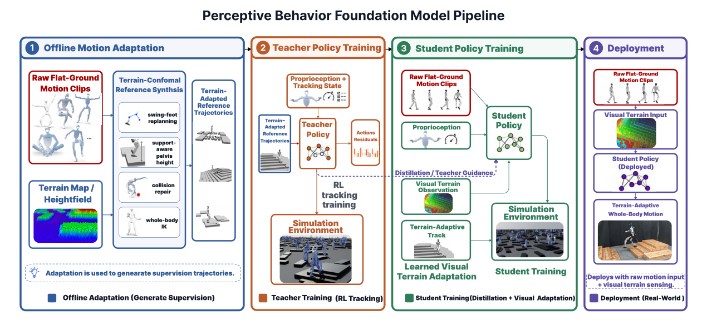

# Perceptive BFM：面向机器人中心地形的人体运动先验适配

[论文](https://arxiv.org/abs/2606.08059) · [项目主页](https://acodedog.github.io/perceptive-bfm/)

多数motion foundation policy默认参考动作已经适合当前环境。人在平地录制的行走若直接放到台阶，脚高、支撑点、根高度和接触时刻都会错。Perceptive BFM保留原始人体动作作为上层接口，同时让部署策略读取机器人局部地形，只在需要时产生接触和姿态修正。

> **主要方法图：** Figure 2，PDF第3页。TCRS只离线生成地形适配参考，blind teacher跟踪该参考；最终student接收原始参考与机器人中心地形扫描，通过残差通路学会局部修正。来源：[原论文](https://arxiv.org/abs/2606.08059)。

## TCRS先构造“应该怎样适应地形”的监督

Terrain-Conformal Reference Synthesis根据原动作的接触信息在目标地形上构造脚点，再考虑脚掌几何优化摆动轨迹，重建支撑一致的根轨迹，修复碰撞并通过多点IK得到完整参考。它是离线运动学合成器，不解完整接触动力学；作用是批量生成“同一动作意图在不同地形上的合理形态”。

blind teacher只跟踪适配后的参考，不看在线地形。随后student看到原始参考、机器人本体和局部高度扫描，通过target-frame action alignment向teacher学习。Identity-gated Transformer把地形特征接入残差路径，并从接近恒等映射初始化：平地或无需修正时尽量保留原tracker，遇到台阶、坡面和稀疏支撑时才调整落脚、根高度和时序。

## 这个设计解决了接口一致性

部署端不需要上层先生成terrain-conformal动作，遥操作员、动作库或生成模型仍发送原始运动；地形适配封装在低层。这比为每个环境重做参考更适合实时系统，也避免上层动作接口随感知方案变化。

## 论文主动暴露的边界

TCRS假设静态、刚性、可由高度场描述的地形，不覆盖松软、湿滑、可变形介质。适配主要围绕脚部，原始上身动作仍可能撞到障碍；官方页面也展示了这一失败类型。当前真机结果包含多类室内外地形，但长期成功率和动态障碍尚需量化。读者应把“地形感知动作跟踪”与完整环境碰撞规划分开。

## 部署接口与感知范围

student接收原始动作参考、本体状态和机器人中心的局部高度扫描，Identity-gated残差输出对参考的局部修正，再由PD执行。这里的感知只表达高度场几何，不含物体语义、摩擦或完整三维碰撞体；地图错误会直接影响地形修正，而参考本身的错误则沿identity通路保留。论文未给出上身障碍规避或动态场景恢复机制。
