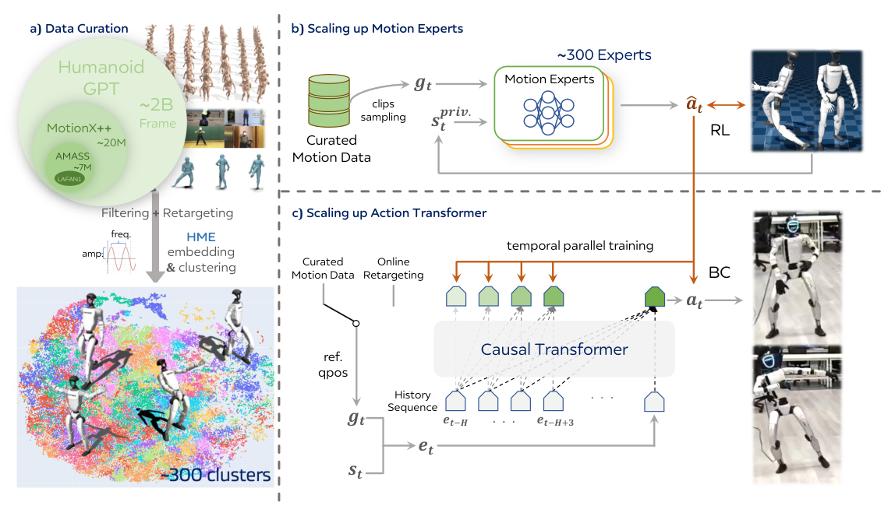

# Humanoid-GPT：面向零样本动作跟踪的数据与结构扩展

[论文](https://arxiv.org/abs/2606.03985) · [项目主页](https://qizekun.github.io/Humanoid-GPT/) · [代码](https://github.com/GalaxyGeneralRobotics/Humanoid-GPT)

Humanoid-GPT将多个动作簇上的PPO专家蒸馏进一个因果Transformer跟踪器。模型结合机器人历史状态与重定向后的参考动作，输出关节位置目标，用于跟踪未见动作和在线重定向轨迹。

> **主要方法图：** Figure 2，PDF第3页。动作数据经整理与聚类后分别训练PPO专家，再通过并行DAgger监督单个因果Transformer；部署模型接收未见或在线重定向动作。来源：[原论文](https://arxiv.org/abs/2606.03985)。

## 动作聚类与专家训练

作者汇集主要mocap与自有数据，形成约2B帧的G1重定向语料。动作分布极不均衡，普通步行会淹没高动态长尾，因此先用Harmonic Motion Embedding等表征和质量/多样性规则做整理与聚类。每个簇训练PPO tracking expert，让专家分别解决对应动作的接触和稳定问题。

## 并行DAgger与因果Transformer

通用跟踪器训练时运行学生自己的rollout，各专家在这些状态上给出动作标签，并行DAgger不断补充学生偏离后的纠正样本。因果Transformer用历史本体、目标关键点和过去动作预测当前PD目标，RoPE等序列结构支持可变长度上下文。与简单MLP相比，它能利用更长时间关系判断动作相位和恢复趋势。

目标关键点或机器人运动按时间形成序列，与历史本体状态和已执行动作一起进入因果上下文。模型据此判断运动趋势和动作相位，输出每个控制步的关节位置目标，再由PD控制器执行。专家标签来自各动作簇上的PPO闭环策略，因此DAgger能够学习学生偏离参考之后的纠正行为；离线参考关节角则主要描述希望执行的运动，两者在训练中承担不同角色。

## Zero-shot具体指什么

论文中的zero-shot是训练后直接跟踪未出现在训练集的机器人参考动作或在线重定向轨迹，不做该动作专属微调。它仍要求输入已被转换成模型接受的G1关键点/动作表示；视频恢复、人体到机器人重定向和任务规划不是Transformer自动完成的。

## 相关公司系统

[北京市科委转引的银河通用公司发布材料](https://kw.beijing.gov.cn/xwdt/kcyx/xwdtyqqy/202606/t20260624_4712945.html)将AstraBrain-WBC 0.5描述为人形机器人实时全身运动控制组件，并提及大规模动作数据、专家蒸馏与因果Transformer。该来源没有说明论文模型与产品版本完全相同，因此此处仅保留为公司对其系统的关联描述，不将产品能力归为论文实验结果。
