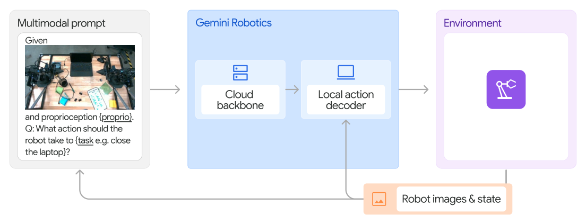

# Gemini Robotics：面向物理世界的通用机器人智能模型

[技术报告](https://deepmind.google/models/gemini-robotics/)

Gemini Robotics面向视觉与语言条件下的灵巧机器人操作：多视角图像、任务指令和本体状态进入云端VLA骨干，骨干生成语义条件，由机器人端解码器连续输出动作段。配套的Gemini Robotics-ER提供空间推理、目标检测、轨迹与抓取预测，为任务理解和动作条件提供具身表示。

> **主要方法图：** Figure 14，技术报告第14页。云端VLA backbone读多视角图像、本体状态与指令，本地action decoder把骨干输出转成可连续执行的动作段。来源：[官方技术报告页](https://deepmind.google/models/gemini-robotics/)。

## 云端推理与机器人端动作解码

云端骨干由Gemini Robotics-ER蒸馏而来，查询到响应延迟优化至160 ms以内；从原始观测到新action chunk约250 ms。为适配骨干响应周期，模型一次生成多个未来动作，本地decoder在下一次云端响应到达前继续以50 Hz输出，把语义层更新与高频动作执行分开。

输入包含多视角图像、自然语言和机器人本体状态；云端主干形成语义与空间表示，本地decoder结合当前状态生成目标本体的连续动作段。训练由大规模多模态预训练和机器人示范后训练组成，动作监督对应真实机器人交互。机器人端decoder与控制器负责把动作段接续为高频目标并执行。

## 机器人示范与本体适配

训练使用ALOHA 2机队一年内采集的数千小时真机示范，并混合网页、代码、图像、音频、视频和具身问答数据。基础模型按开放词汇指令执行双臂操作；新技能和新本体通过少量定向微调适配。报告展示的Apollo等新形态平台使用了专门适配数据，体现的是数据支持的跨本体迁移。

## 语义安全与机器人执行

Gemini Robotics-ER为动作链提供空间推理能力：从单张图像完成开放词汇目标检测与指点，预测2D运动轨迹和俯视抓取姿态，也可在多视角间对应空间点并预测度量3D框。配套ERQA包含400道多选题，覆盖空间、轨迹、动作、状态估计、指点、多视角和任务推理；报告中Gemini 2.0 Flash在该基准上由不带CoT的46.3%提升到带CoT的50.3%。这些输出把场景定位、动作意图和机器人执行连接到同一模型家族。

报告通过ASIMOV等语义安全问答和安全宪法后训练，评估模型识别伤害性指令与视觉风险的能力。机器人执行仍由本体控制器和物理保护机制约束；这与模型在语义层拒绝高风险请求是两种不同层次的结果。系统架构把云端任务理解、本地动作解码与机器人低层执行连接起来。
