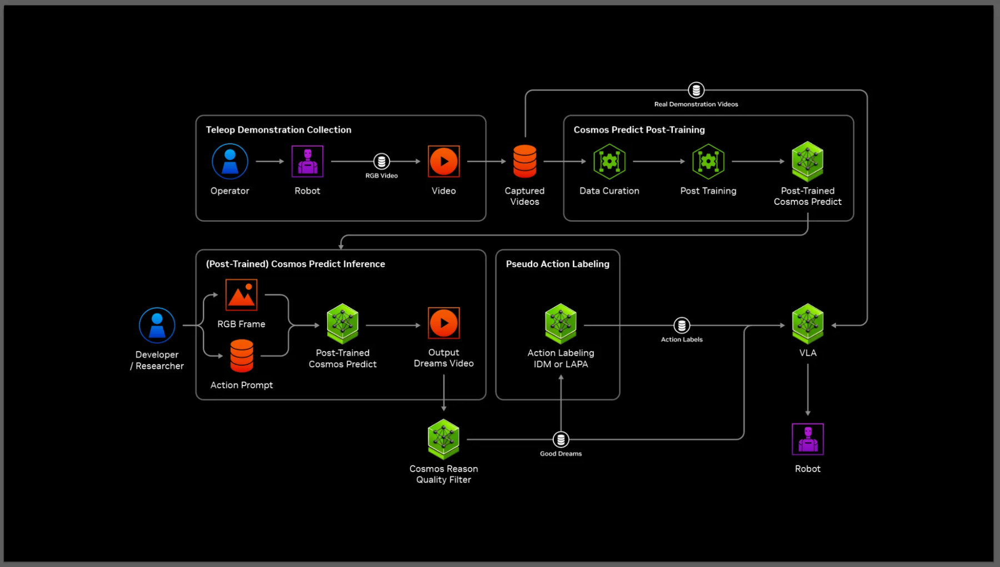

# GR00T-Dreams：面向人形机器人学习的合成轨迹生成

[技术报告](https://developer.nvidia.com/blog/enhance-robot-learning-with-synthetic-trajectory-data-generated-by-world-foundation-models/)

GR00T-Dreams是NVIDIA于2025年发布的合成轨迹参考工作流：少量特定本体的遥操作示范后训练Cosmos Predict-2，模型再根据初始图像和新指令生成未来操作视频；Cosmos Reason筛选片段，逆动力学模型将其转换为3D动作轨迹，供VLA共同训练或单独后训练。

> **主要方法图：** NVIDIA官方Figure 1，GR00T-Dreams blueprint architecture。链路包含真实遥操、世界模型后训练、视频生成、推理筛选、IDM动作标注和VLA后训练。来源：[NVIDIA技术博客](https://developer.nvidia.com/blog/enhance-robot-learning-with-synthetic-trajectory-data-generated-by-world-foundation-models/)。

## 从真机示范到神经轨迹

1. 先采集少量真实遥操轨迹，用来post-train Cosmos Predict-2，给世界模型注入目标机器人的外观、运动约束和环境。
2. 从一张初始图像和新语言指令生成大量2D视频“dreams”，扩展物体、背景和行为组合。
3. 用Cosmos Reason判断动作是否成功、场景是否合理，过滤明显失败或幻觉视频。
4. IDM读“前帧 + 后帧”，预测中间的3D动作段，把纯像素视频转成带动作标签的neural trajectory。
5. 将神经轨迹与真实数据共同训练或后训练VLA，再回到真机检验。

生成端由单一真实环境的pick-and-place等遥操作轨迹学习特定机器人的运动外观与功能约束；推理端组合初始画面和新语言指令，生成开合、整理、清洁、分类等未来操作场景。筛选后的前后帧输入IDM，恢复两帧之间的动作段，形成同时保留视频和3D动作监督的neural trajectory。VLA可将这些样本与真实数据共同训练，也可只用合成数据学习新行为和新环境。

## IDM动作恢复与闭环执行

IDM接收视频中的“前帧—后帧”并生成两帧间的3D动作轨迹，作为策略可学习的动作标签。该恢复由端点视觉约束，遇到遮挡、滑动或多种可行关节路径时，动作与接触历史仍可能不唯一；因此视频筛选与动作标签质量共同决定神经轨迹的监督质量。最后策略在目标机器人的控制接口上执行，NVIDIA展示了从合成轨迹到真机操作的real-to-real流程。

## GR00T N1.5与多本体演示

NVIDIA报告使用GR00T-Dreams在36小时内生成数据以支持GR00T N1.5开发，并以Fourier GR-1展示开笔记本、放置水果和锤击等操作，也展示Franka与SO-100上的操作样例。报告将收益描述为语言理解、对象与环境泛化、空间理解及制造任务成功率提升；这些实验对应合成轨迹参与模型开发后的整体结果。工作流的执行验证覆盖人形机器人和机械臂，并将接触丰富的折叠、工具使用纳入数据增广任务。
