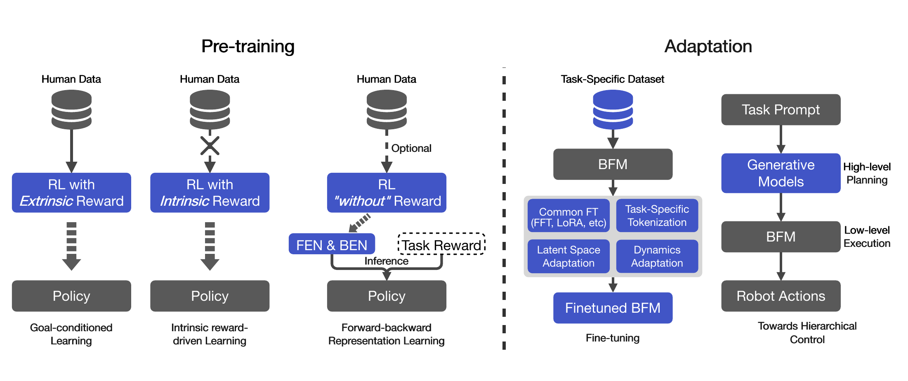

# BFM Survey：面向下一代人形全身控制的行为基座模型综述

[论文](https://arxiv.org/abs/2506.20487) · [Awesome BFM Papers](https://github.com/yuanmingqi/awesome-bfm-papers)

这篇综述将Behavior Foundation Model定义为从大规模、多样行为数据中学习可重用原子技能和行为先验，并通过目标、奖励、潜向量、少量微调或高层规划适配多个下游全身任务的策略基座。判断其是否形成基座能力，关键是适配新任务所需的数据和训练成本是否低于重新训练策略。

> **综述分类图：** Figure 3，PDF第4页。左侧将预训练分为目标条件、内在奖励与forward-backward表示三条路线；右侧将适配分为参数/潜空间微调与高层规划-低层执行的分层控制。来源：[原论文](https://arxiv.org/abs/2506.20487)。

## 三类预训练到底差在监督信号

目标条件学习直接告诉策略要跟哪段动作、到哪个目标或完成什么奖励，DeepMimic、ASE、CALM、PHC、HOVER、SONIC等工作都可沿这条线理解；优点是行为可控，代价是需大量人类动作或目标设计。内在奖励方法不给明确外部任务，鼓励新奇性、可区分技能或状态覆盖，能自主发现行为，但未必是人需要的行为。Forward-backward路线用无奖励转移学状态-动作的未来占据表示，测试时才将新奖励投影为任务向量，追求不重新RL就组成对应策略。

## 适配不只有“全量微调”

通用微调包括全参数更新和LoRA，适合目标数据明确、允许训练的场景；潜空间适配不改底层大量参数，通过寻找新的任务/奖励/潜技能向量调用已有行为先验，更能检验预训练的复用价值。分层控制则把BFM当作高频低层，由LLM、扩散规划器或其他高层模型产生子目标、接触链或潜技能。这时真正的瓶颈往往从“低层会不会动”转为“高层输出是否落在低层可达分布内”。

## 这个概念最需要防止被滥用

大数据、Transformer或一个漂亮的latent space都不足以证明是BFM。至少要检查：预训练行为是否跨任务/场景；新任务需要多少数据与梯度步；适配后是否仍保留原技能；未见扰动和实机误差下是否稳定；与同等预训练成本的多任务策略比是否真有优势。现有工作的本体、接触、安全和长时评测并不统一，因此“基座”应是待证明的能力结论，不是方法自报的产品名。

## 横向比较的关键差异

目标条件tracker通常用配对参考提供监督，AMP类判别器比较动作数据与策略转移，Forward-Backward路线则从无奖励交互估计未来占据；三类方法中的latent语义不同，不能只按维度比较。它们的复用能力还取决于部署时是否需要逐帧参考、视觉、世界状态、高层规划器或在线搜索，以及新任务适配后原有技能是否保留。
