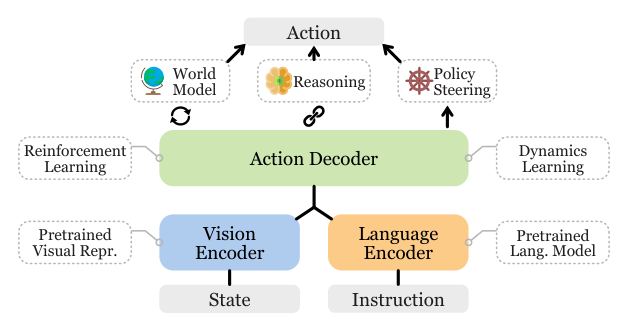

# VLA Survey：具身智能视觉语言动作模型综述

[论文](https://arxiv.org/abs/2405.14093) · [Awesome VLA](https://github.com/yueen-ma/Awesome-VLA)

这篇综述把视觉语言动作模型研究分成三条线：支撑VLA的组件，直接预测低层动作的control policy，以及把长指令拆成子任务的task planner。通过这三个层次，可以理解视觉与语言信息如何进入机器人动作生成，以及任务规划和低层策略如何组成执行系统。

> **综述总览图：** Figure 1，PDF第1页。实线主干是语言编码、视觉编码和动作解码；虚线框表示可用的预训练视觉表示、推理、世界模型、动力学学习、RL和policy steering等组件。来源：[原论文](https://arxiv.org/abs/2405.14093)。

## 基础组件在训练与执行中的作用

视觉基础表示可以来自CLIP、DINO等预训练，语言编码与多模态对齐给出语义条件；动力学学习、世界模型和RL可以为数据生成、策略预训练或在线规划提供信号；推理和policy steering可以约束动作或生成中间目标。有的方法训练时用世界模型，部署时只保留策略；有的方法每个控制步都用模型规划。因此分类时应标清组件位于训练链还是在线执行链，不能只列模块名字。

## Control Policy：从多模态输入到机器人动作

低层VLA可用非Transformer、自回归Transformer或扩散/flow matching生成动作，也可接入3D感知、点位动作或独立action expert。动作表示决定了模型与机器人之间的接口：末端目标交给下层控制器跟踪，关节目标进入对应关节控制环，技能token则调用已有技能。单步预测与action chunk在每次推理覆盖的时间范围上不同，因此动作生成方式要与观测更新、推理延迟和下层控制频率一起理解。

## Task Planner：从长指令到技能调用

高层规划可以端到端产生子任务，也可用模块化语言/代码规划器调技能库。语言模型给出语义上正确的步骤，不代表当前机器人能从所在状态完成它。可行的规划器必须读环境状态、技能前置/后置条件和失败反馈，并在技能执行后重新观测。对人形机器人，还需要一层明确的身体接口，把“拿起箱子”变成低层可跟踪、可中止、可恢复的条件，而不是让LLM直接跳到电机。

两类方法的区别也体现在训练信号上：策略可以通过行为克隆、扩散或flow matching学习示范动作，也可以使用RL优化执行结果；规划侧则组织子目标和技能调用，并利用新观测、记忆与失败反馈调整后续步骤。内部表示可以是动作token、连续潜变量或世界状态，最终仍需要通过明确的动作接口与下层控制器连接。

## 如何使用这套分类

这套分类适合定位工作位于训练链还是在线执行链，并检索相关数据集、仿真器与benchmark；其中的模型表格应作为综述发表时的索引，而非长期排名。分析具体系统时，需结合动作接口和控制频率判断VLA与底层Locomotion、Mimic或Loco-Manip控制器各自承担的工作。
