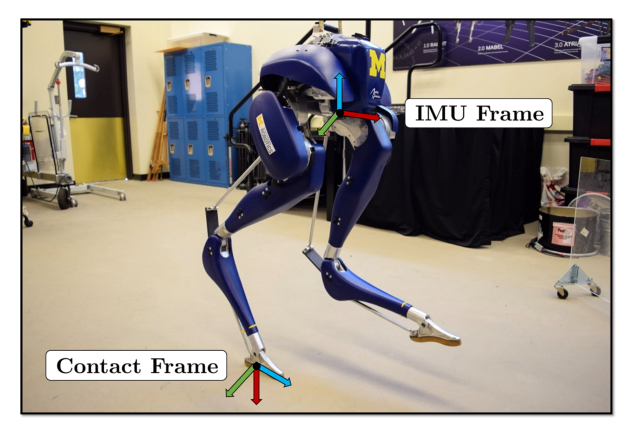

# Contact-Aided InEKF：面向腿式机器人状态估计的接触辅助不变扩展卡尔曼滤波

[论文](https://arxiv.org/abs/1805.10410) · [代码](https://github.com/RossHartley/invariant-ekf)

浮基腿式机器人没有固定在世界坐标系中的关节，编码器只能告诉你身体内部的相对姿态；IMU能传播姿态和速度，但积分会漂。本文利用一个非常物理的事实补观测：当脚可靠接触地面且没有滑动时，这个接触点在世界系里短时间近似静止，关节运动学因此能约束基座运动。

## 为什么不是普通EKF换个名字

普通EKF直接在欧氏坐标中对姿态、速度和位置线性化，误差动力学会随当前估计轨迹变化；大姿态误差下，一致性和收敛可能变差。InEKF把姿态、速度、位置以及接触点组织在矩阵Lie群上，采用与群结构匹配的左/右不变误差。对满足group-affine结构的系统，误差在对数坐标中具有更接近“与当前轨迹无关”的线性传播性质，这就是所谓log-linear error dynamics，而不是简单把四元数换成旋转矩阵。

IMU负责高频传播，足端正运动学在接触成立时提供更新。新脚落地时把接触状态增广进滤波器，离地时移除；接触切换因此不仅是控制状态机，也会改变估计器状态维度和观测模型。

滤波状态至少包含姿态、速度、位置、IMU偏置及当前接触点，输入是时间戳对齐的角速度、加速度与关节编码器。传播使用IMU，接触更新用正运动学构造足端相对基座观测；输出的基座姿态、速度和位置连同协方差交给WBC或RL策略。协方差不是附属数值，它告诉下游当前估计有多可信。

> **系统与坐标系图：** Figure 1，PDF第1页。论文没有独立流程总览，这张图标出Cassie上的IMU、接触和机器人坐标系，是理解传播与接触更新各使用什么量的必要上下文。来源：[原论文](https://arxiv.org/abs/1805.10410)。

## 接触辅助的前提一旦错了会怎样

滤波器把“接触点静止”当成可信约束；脚滑、柔软地面、脚尖滚动或接触误判时，这条伪观测会把错误信息强行灌进基座速度与位置。实机系统因此需要接触概率、迟滞、创新检验、噪声自适应或滑移检测，而不是一个固定力阈值。IMU偏置、运动学参数和足端柔顺也会决定长期漂移。

接触丢失或创新异常时，滤波器应提高观测噪声、拒绝更新或移除该接触状态，并将不确定度传给控制器；若继续把滑动脚当作世界锚点，基座速度估计可能反向偏移。起身、跳跃和双脚腾空时则依赖IMU传播，需关注无接触时长对漂移的影响，以及重新获得接触或外部里程计后的对齐。

控制器使用的基座速度、重力方向和接触状态都是带假设与延迟的估计量，而非仿真真值；状态估计误差因此会直接传入WBC或RL策略。
