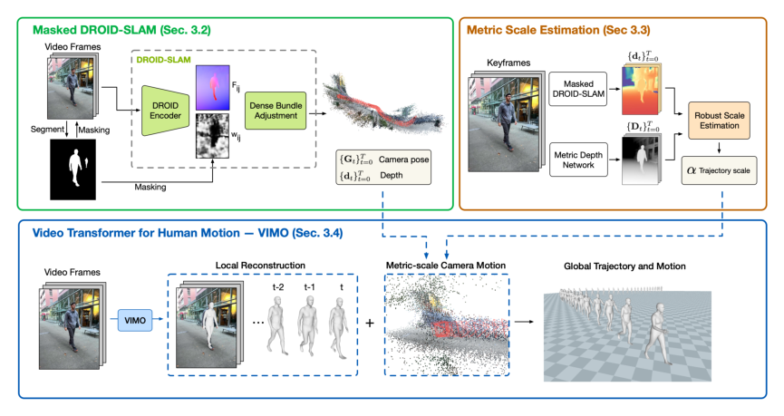

# TRAM：野外视频中的三维人体全局轨迹与动作恢复

[论文](https://arxiv.org/abs/2403.17346) · [项目主页](https://yufu-wang.github.io/tram4d/) · [代码](https://github.com/yufu-wang/tram)

野外视频中的人体全局运动同时受相机运动、单目尺度歧义和人体遮挡影响。TRAM分别估计相机、尺度与人体运动，再合成世界坐标下的全身轨迹，为后续机器人动作重定向提供视频数据入口。

> **主要方法图：** Figure 2，PDF第5页。上半部分用双重遮罩稳定DROID-SLAM，并以单目深度预测对齐公制尺度；下半部分用VIMO恢复相机坐标中的人体，再合成为世界轨迹。来源：[原论文](https://arxiv.org/abs/2403.17346)。

## 第一条链：别让运动的人破坏相机SLAM

TRAM以DROID-SLAM估计相机位姿和场景深度，但不是直接把原视频送进去。人体区域一方面从输入图像中遮掉，另一方面也从dense bundle adjustment的重投影误差中剔除。只做其中一步仍可能让动态人体进入特征或优化；双重遮罩的目标是让相机运动主要由静态背景决定。

单目SLAM得到的轨迹只有相对尺度。TRAM再用单目场景深度网络提供公制深度线索，在多个关键帧上用鲁棒最小二乘求SLAM深度到公制深度的比例，并取跨帧中位数。它刻意依靠背景而不是人体身高估尺度，因此对不同体型更稳，但也依赖背景深度质量和可见静态区域。

## 第二条链：VIMO恢复局部人体运动

VIMO建立在预训练HMR2.0之上。作者保留其强单帧人体表征，在图像token域和人体运动域各加入一个时间Transformer：前者让相同图像位置跨帧交换信息，后者让SMPL姿态序列保持时序一致。输出是SMPL局部姿态、形状以及人体相对相机的根位姿。最后使用已经恢复到公制尺度的相机轨迹，把人体从相机坐标变换到世界坐标。

VIMO以人体重建与时间一致性监督训练，输出SMPL局部姿态、形状及相对相机的根位姿；相机链与公制尺度对齐后，才能合成世界坐标中的人体运动。

## 与GVHMR的差别以及进入机器人前的检查

TRAM显式依赖SLAM、背景深度与尺度对齐，GVHMR则把重力对齐坐标和人体轨迹表示更多地放进一个时序网络。两者都属于“人体动作恢复”，不能仅凭最终有世界轨迹就归为机器人重定向。实际数据管线可按视频类型选择，并用同一段长视频比较相机漂移、脚部速度和全局尺度。

送入GMR、NMR或其他重定向模块前，应检查人物跟踪是否串ID、尺度是否突变、根轨迹是否穿地、脚接触段是否滑移、SMPL关节是否出现跳变。动态背景、低纹理环境、长期遮挡和错误深度预测仍会传导到全局轨迹；若这些错误不留置信度，后续RL会把视觉估计问题误当成控制问题。

## 输出与误差传播

TRAM交付逐帧SMPL参数和恢复到公制尺度的相机轨迹，二者合成世界坐标的人体运动；视频帧率、单位、旋转约定、世界原点和人物track ID需与轨迹保持对应。人体检测或VIMO误差会造成局部关节跳变，动态区域可能污染SLAM方向，背景深度偏差则会缩放全局轨迹。若视频包含手持物体或场景接触，还需另行恢复物体与场景，TRAM的人体输出本身不包含这些交互状态。
