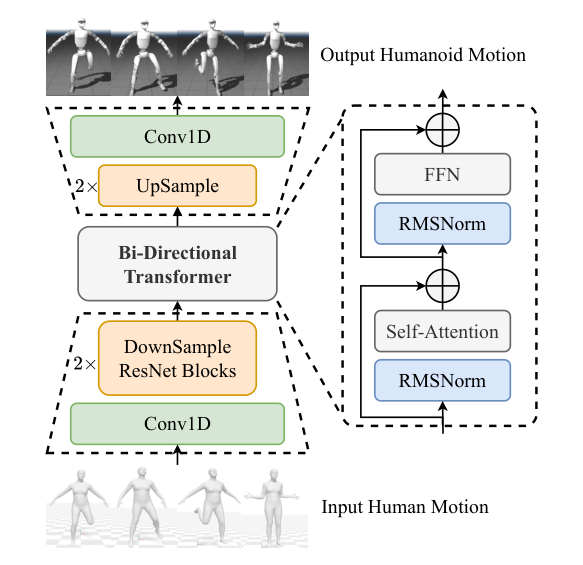

# NMR：面向人形全身控制的神经运动重定向

[论文](https://arxiv.org/abs/2603.22201) · [项目主页](https://github.com/NJU3DV-HumanoidGroup/MakeTrackingEasy)

逐帧IK每次都在解非凸问题，复杂姿态附近容易卡在关节限位、突然跳到另一组解，或者产生自碰撞。NMR没有让神经网络直接模仿这些带缺陷的优化结果，而是先构造“人体序列—物理一致机器人序列”配对数据，再学习时序分布映射。它属于神经重定向，不是一个普通motion tracker。

> **主要方法图：** Figure 2，PDF第5页。人体动作先经一维卷积/残差编码和双向时序建模，再由Transformer式主干一次性生成整段人形机器人动作。来源：[原论文](https://arxiv.org/abs/2603.22201)。

## CEPR数据不是“把GMR结果直接当标签”

数据构造先过滤人体动作中的过大jerk、质心明显离开支撑域以及悬空/穿地片段；随后用GMR得到初始G1动作，并按关节速度峰值、自碰撞比例和足部离地等硬条件继续筛除。剩余动作按运动语义与时序特征聚类，每个cluster训练一个并行RL跟踪专家。专家在物理引擎中的实际rollout，而不是原始IK轨迹，被记录为机器人侧标签，从而把动态不可行部分投影到策略真正能够执行的状态分布中。

这就是Clustered-Expert Physics Refinement：聚类减少“一个专家覆盖所有长尾动作”的训练压力，物理跟踪策略又补上了纯运动学无法保证的动态一致性。代价是数据构造很重，并且最终标签继承了专家策略、本体模型、奖励和仿真器的偏差。

## 网络输入、输出和两阶段训练

输入是整段人体运动表示，包含根运动、人体关节位置/速度等时序特征；输出是Unitree G1的机器人运动序列。网络用一维ResNet式编码器提取局部时间模式，以双向时序模块和非自回归Transformer建模长程关系，再解码机器人关节与根状态。一次看完整窗口能在抖动或短暂异常姿态出现时利用前后文平滑结果，避免逐帧优化的突然跳解。

训练目标首先让人体与机器人运动在跨模态潜空间中对齐，再用CEPR配对数据微调输出，使物理可行性被“烘焙”进映射。NMR网络本身是监督学习器，没有在线RL观测、动作和奖励；论文中的509维参考/本体观测、PPO tracking reward属于构造CEPR专家和评估下游tracker，不应写成NMR部署接口。

## 实验结果、部署位置与适配边界

论文比较关节跳变、自碰撞、限位接近、下游策略收敛速度和跟踪成功率，并给出G1上的定性硬件对照；主量化仍以仿真为主。NMR输出是离线机器人参考动作，之后仍需由全身跟踪策略执行。面对新本体，必须重新准备形态映射、物理专家数据和输出表示，不能把G1权重直接当跨本体模型。

## 映射与输出约束

NMR把人体到G1的形态映射编码在CEPR配对数据与网络参数中。更换本体、关节定义或人体表示通常需要重新生成物理专家数据并训练输出头，推理时则须保持训练所用的关节顺序、旋转表示、归一化和时间采样。网络输出G1浮动基座与关节运动序列；仿真跟踪专家提供的是训练标签，推理阶段并不显式求解摩擦锥、力矩界、自碰撞或接触力，因此输出仍由下游tracker执行。
