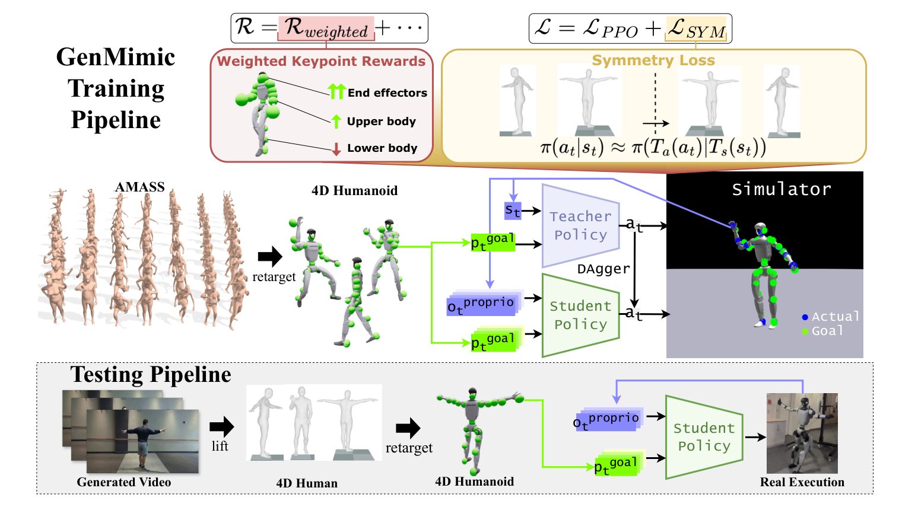

# GenMimic：从生成式人体视频到物理可行机器人轨迹

[论文](https://arxiv.org/abs/2512.05094) · [项目主页](https://genmimic.github.io/)

生成视频能低成本描述“人在某个场景里做什么”，却经常出现肢体形变、时序抖动和错误接触。GenMimic没有让机器人逐像素追视频，而是先把视频提升为4D人体运动、再重定向为机器人关键点目标，最后由物理策略负责把噪声参考变成稳定动作。

> **主要方法图：** Figure 3，PDF第5页。上半部分是AMASS重定向动作上的student-teacher训练，下半部分是生成视频经4D恢复、重定向后作为关键点目标输入真机策略。来源：[原论文](https://arxiv.org/abs/2512.05094)。

## 训练数据和测试输入故意不完全一致

训练阶段使用较干净的AMASS动作。人体动作先映射到G1，teacher在仿真中读取更完整状态，student学习在可部署观测下跟踪参考关键点。测试时输入换成生成视频恢复出的4D人体运动：形态、相机和动作噪声都与AMASS不同。这种设置实际上是在考验tracker能否跨越“高质量MoCap训练、低质量视频参考执行”的分布差异。

策略以3D关键点为条件。关键点跟踪奖励将手与头部端点、上身和下身的相对权重分别设为4、2、1；脚属于下身，另有独立足部安全惩罚。对称正则把左右镜像的状态与动作关系加入训练，给策略一个人体结构先验，降低生成视频某一侧畸变导致的偏置。

执行时，TRAM将视频恢复为4D人体动作，PHC把动作重定向为机器人关键点参考；student结合本体观测历史和未来关键点窗口输出关节位置动作。策略以50 Hz更新，仿真中的PD与物理步进为200 Hz；23自由度G1实机由笔记本运行50 Hz策略，经Unitree SDK 2向500 Hz板载PD控制器发送命令。论文未规定上游视频恢复模块的在线更新频率。

## 合成视频评测与G1执行

GenMimicBench包含Wan2.1与Cosmos-Predict2生成的428条视频。仿真中，特权teacher的成功率为86.77%，可部署student为29.78%；两者使用不同观测，分别与对应基线比较。成功要求机器人不跌倒，且全局位置偏离参考不超过0.5米。实机测试43个动作实例，各类别汇总每个动作2至6次试验的视觉成功率：原地动作表现较好，转身与步行组合仍有失败。部署前先在仿真中检查参考动作，真机测试使用安全吊架。

该链路把生成视频与低层控制连接起来：上游提供恢复后的人体时空轨迹，tracker将关键点参考转成物理动作；视频生成质量与机器人跟踪能力应分别解读。
