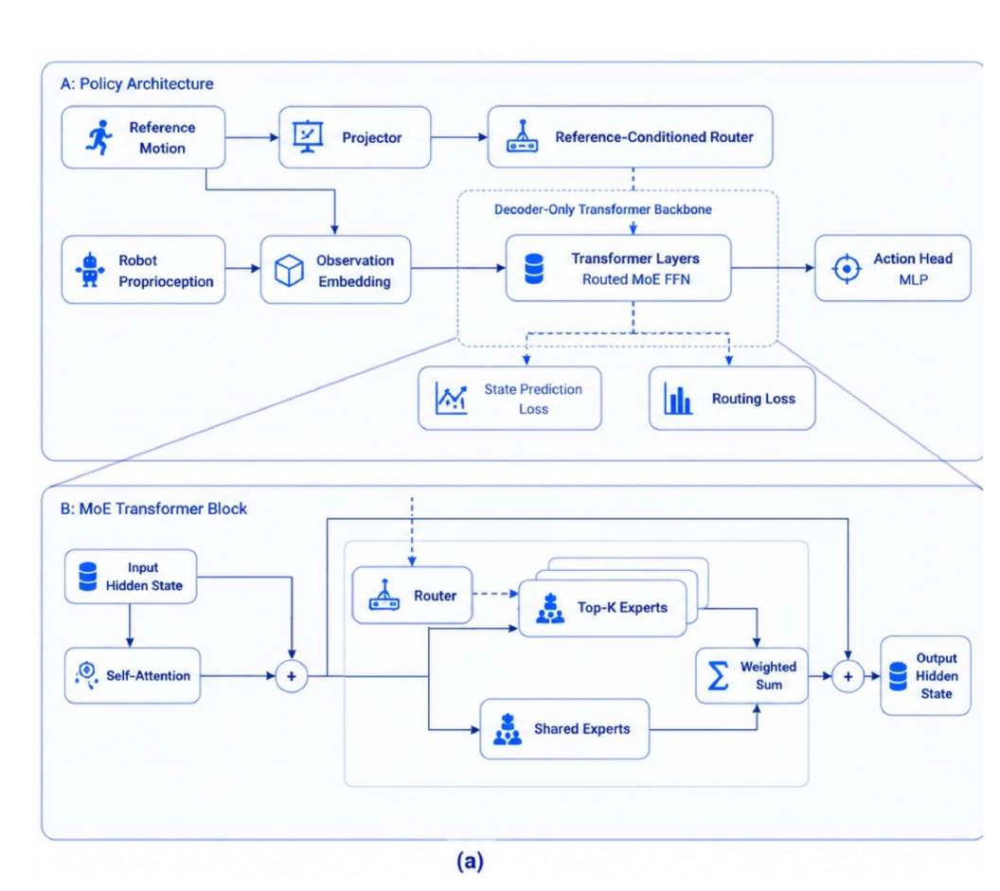

# HoloMotion-1：人形机器人运动基座模型技术报告

[技术报告](https://arxiv.org/abs/2605.15336) · [项目主页](https://horizonrobotics.github.io/robot_lab/holomotion) · [代码](https://github.com/HorizonRobotics/HoloMotion)

HoloMotion-1面向大规模参考动作跟踪：输入目标动作的未来窗口与机器人本体历史，稀疏MoE Transformer生成目标关节动作，并用KV cache降低在线重复计算。技术报告把约2000小时混合动作数据、sequence-level PPO训练和机载部署共同纳入运动基座设计。

> **主要方法图：** Figure 1(a)，PDF第1页。参考动作和机器人本体状态分别编码；reference-conditioned router选择MoE专家，Transformer隐状态再经action head输出动作，并由状态预测与routing loss辅助训练。来源：[技术报告](https://arxiv.org/abs/2605.15336)。

## 参考动作条件的稀疏MoE策略

每个控制周期有两组信息进入策略。本体观测包含投影重力、机身角速度、相对默认姿态的关节位置、关节速度和上一时刻动作；参考观测包含当前目标以及未来10个控制步的投影重力、根线速度与角速度、目标关节角和根高度。未来窗口让策略在动作真正发生前看到转身、腾空或落地趋势，否则只追当前帧会在高速转换时来不及准备支撑姿态。

本体与参考特征先拼接、归一化并由轻量MLP投影成一个512维token。因果decoder-only Transformer保留最近32个token，通过自注意力建立当前动作与过去身体响应的关系。例如同一段参考踢腿在不同支撑阶段需要不同关节输出，仅看当前目标姿态无法判断此前是否已经完成重心转移。训练使用8个query head、4个key/value head，并用RoPE记录时间顺序；推理时每个环境维护KV cache，只计算新token而不重复编码整个32步窗口，episode结束后清空缓存，避免上一段动作污染下一段。

Transformer的前馈部分采用稀疏MoE。网络包含1024个细粒度专家和一个共享专家，每个token只选择得分最高的2个细专家，再与共享专家输出加权合并。共享专家保留各类动作都需要的平衡与控制特征，细专家则提供更大的动作模式容量，因此模型总参数约400M，每步实际激活约7M。

图中参考动作还单独进入reference-conditioned router。路由器只看参考，不使用机器人本体状态：若专家选择依赖仿真中的细微动力学状态，真机噪声和模型误差可能让专家在相邻控制步频繁跳变，动作随之抖动；只按参考动作路由，同一动作在仿真与真机更容易选择一致的专家。最终隐藏状态进入动作头，形成对角高斯动作分布。归一化动作按关节尺度映射到默认姿态附近的目标关节角，PD控制器再根据位置与速度误差计算力矩，机器人执行后的状态构成下一时刻本体观测。

## PPO、辅助预测与连续序列训练

PPO根据参考跟踪和控制正则更新策略。跟踪项比较根与关键身体的位置、方向和速度，惩罚项约束力矩、动作变化、关节限位及不期望接触。actor接收加入噪声的可部署观测；价值网络读取无噪声观测以及anchor姿态差、精确link状态等仿真特权信息，使训练阶段的回报估计更准确。价值网络和特权信息都不会进入真机动作链。

MoE之前的隐藏特征还接四个辅助预测头，分别预测机体线速度、关键身体接触、参考关键身体相对根的位置，以及机器人关键身体相对根的位置。它们的作用不是替代PPO奖励，而是直接要求序列表示同时保留动力学、支撑相位、目标几何和机器人实际实现结果。路由侧另有dead-expert margin损失，把长期没有收到token的专家得分推向Top-K边界，避免大部分参数永远闲置。这些预测头和路由正则只用于训练，部署时只保留观测投影、Transformer、router、被选专家、动作头和KV cache。

普通PPO会把rollout打散成单步样本，Transformer则需要重新计算大量重叠历史。HoloMotion-1保留连续轨迹段，在一次前向中计算整段动作概率，再使用PPO clipped objective更新；这改变的是训练组织方式，不改变在线控制目标。报告在指定profiling配置下给出相对滑窗基线约22倍的训练吞吐提升，不能直接外推到任意显卡和实现。

## 混合数据与G1执行接口

训练数据以约2000小时视频恢复动作提供行为覆盖，再用AMASS等MoCap和内部采集补充较干净、与部署更接近的动作。视频数据扩展舞蹈和日常行为分布，同时带来抖动、脚滑及重建域误差；MoCap和内部数据规模较小，可用于校准动作质量。数据覆盖、运动学可行性、去重和参考质量共同影响跟踪策略。

策略未经真机微调部署到Unitree G1。论文使用的机载计算平台上，模型推理约为200至300 Hz，机器人控制环固定为50 Hz；每个控制周期由本体传感器与参考动作更新策略，再经低层PD接口执行关节目标。训练时的价值网络、仿真特权状态和辅助预测头不进入部署链路。

HoloMotion-1的输入接口是参考动作而非自然语言任务，输出是跟踪目标关节动作；任务选择和接触计划由上层提供。HoloRetarget、HoloSMPL与遥操作链路属于技术报告之后形成的工程扩展。迁移到新本体时，参考动作重定向、关节尺度和执行器参数需按目标平台适配。
