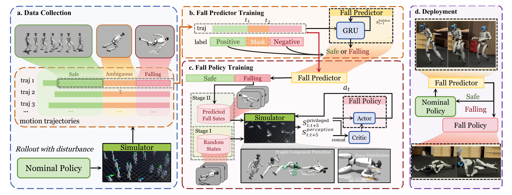

# SafeFall：人形机器人的保护性跌倒控制学习

[论文](https://arxiv.org/abs/2511.18509) · [项目主页](https://safefall.github.io/)

大多数locomotion策略把跌倒当episode终止，训练中不关心倒地过程；真实机器人却可能在这几百毫秒里撞坏头部、手部或电机。SafeFall不承诺挽救每次失稳，而是在判断跌倒已不可避免后，让保护策略接管并重新分配冲击。

> **主要方法图：** Figure 2，PDF第4页。扰动nominal policy采集跌倒数据，GRU预测器区分安全、模糊和跌倒阶段；保护策略从随机倒姿逐步训练，部署时只在预测不可恢复后接管。来源：[原论文](https://arxiv.org/abs/2511.18509)。

## 预测器和保护策略为什么必须分开

若保护策略一直运行，它会为了减少潜在冲击而让正常走路变得保守。SafeFall让轻量GRU持续读取机器人状态历史，输出是否即将进入不可恢复跌倒。训练数据来自nominal locomotion在不同扰动下的rollout，并按时间切成safe、ambiguous和falling阶段，使预测器学习跌倒前兆而不是只识别已经躺地的姿态。

只有触发后，damage-mitigation policy才获得控制权。课程从随机跌倒状态开始，让策略先学会保护脆弱部件，再逐渐收紧到真实预测器触发时的状态分布。奖励不仅惩罚峰值接触力和关节扭矩，还对头、手等脆弱部位碰撞设置更高代价，允许更结实的身体部位吸收能量。

## 实验结果与证据范围

论文在全尺寸G1上报告，相对无保护跌倒，峰值接触力降低68.3%，峰值关节扭矩降低78.4%，脆弱部件碰撞减少99.3%。这些结果支持“保护动作能改变损伤分布”，但不能直接换算为长期硬件寿命，也不等于预测器没有漏检和误触发。

SafeFall接在nominal controller外侧，由风险预测触发保护策略接管；报告中的受控跌倒结果不等于长期硬件寿命，也不能说明预测器没有漏检或误触发。

## 观测、动作与安全状态机

预测器从基座姿态与速度、关节运动及nominal action的短时响应判断风险阶段；它不产生关节命令。保护策略在接管后依据脆弱部件接触、峰值冲击、关节扭矩和动作可执行性调整全身姿态，并从随机倒姿逐步训练到nominal locomotion可能进入的失稳状态。部署时，预测窗口、触发阈值、连续确认帧数和退出条件共同决定接管时机：过早会打断可恢复步态，过晚则无法及时调整碰撞姿态。
