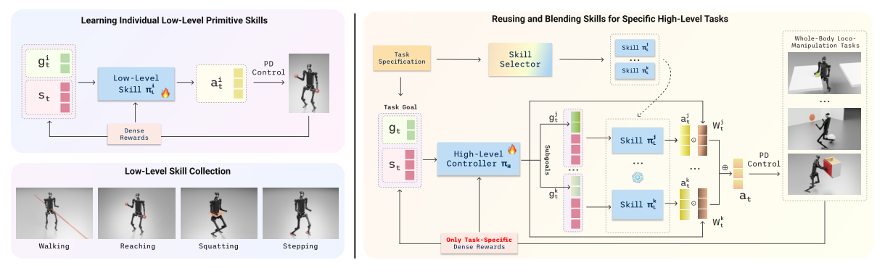

# SkillBlender：基于技能混合的通用人形全身移动操作

[论文](https://arxiv.org/abs/2506.09366) · [项目主页](https://usc-gvl.github.io/SkillBlender-web/) · [代码](https://github.com/Humanoid-SkillBlender/SkillBlender)

走路、伸手、下蹲和跨步分别容易训练，把它们硬切换却会在任务边界失去全身协调。SkillBlender先训练目标条件原语，再让high-level policy为每个原语生成subgoal和逐关节权重，用连续混合完成新LocoManip任务。

> **主要方法图：** Figure 2，PDF第4页。下层原语用密集奖励预训练；上层只依赖一两个任务奖励，输出原语子目标与per-joint blending weights，最终动作是多个全身动作的加权组合。来源：[原论文](https://arxiv.org/abs/2506.09366)。

## 原语仍然是全身policy

walking接收平面速度和yaw目标，reaching接收双腕相对目标，squatting和stepping也有各自物理目标。每个原语都读取本体状态并输出全身关节位置目标，经PD转为扭矩。它们不是只控制腿或手的局部模块，因此在预训练时已经学到维持平衡所需的身体补偿。

遇到新任务，先选择相关原语。high-level controller读取当前状态和任务目标，给每个原语生成新的subgoal，同时输出与动作维度同长的权重向量。比如搬箱时，腿部关节可以主要跟walking，手臂主要跟reaching，腰部则在两者间连续折中。逐关节权重比“整条动作选一个技能”更细，也比直接训练高维全身policy保留更多先验。

任务状态必须包含能判断交互进度的信息，例如目标末端位置、物体位姿或任务几何；高层据此更新subgoal，原语本身并不知道箱子是否已经抓牢。多个关节动作线性混合也不保证接触力或足底约束仍成立，真正可行性来自原语训练分布和高层在物理仿真中的闭环优化。抓取、推拉等任务应把物体终态和接触保持写进任务奖励，不能只奖励手接近目标。

## 少奖励不等于没有奖励工程

论文强调新任务只需一两个task-specific reward，但密集奖励并没有消失，而是被前置到原语训练。若原语库缺少关键接触方式，上层混合无法凭空产生新能力。手工或基础模型还需要先选出可用原语，技能数量继续扩大时，混合稳定性与冲突会再次出现。

失败恢复同样受原语库限制：若库中没有重新抓取或起身原语，上层无法仅靠重新调整混合权重生成这些行为。

线性混合还要求不同原语的动作尺度和PD语义一致，否则逐关节权重没有可比含义。

SkillBench覆盖三种Unitree本体、四种原语和八类任务，用准确性、姿态与可行性指标比较。完整LocoManip主结果以仿真为主，不能写成八项任务都已真机完成。

这篇在技术栈中位于“低层技能库”和“任务策略”之间，适合与HANDOFF的低维命令接口对照：前者组合已有policy，后者蒸馏多个teacher到单一接口。
