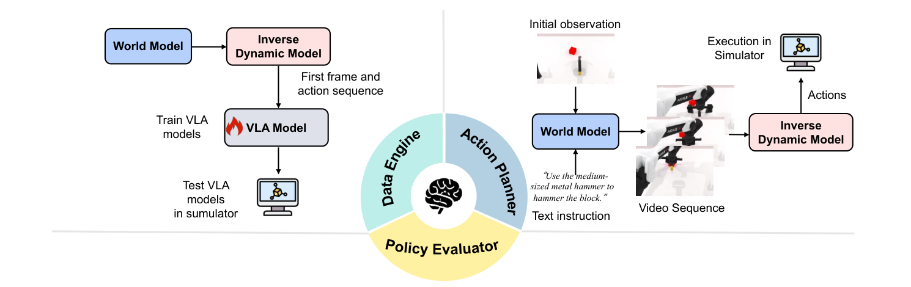

# WorldArena：具身世界模型感知与功能效用统一评测基准

[论文](https://arxiv.org/abs/2602.08971) · [项目主页](https://world-arena.ai/) · [代码](https://github.com/tsinghua-fib-lab/WorldArena) · [WorldArena 2.0](https://worldarena2.github.io/)

世界模型长期依赖清晰度、时序一致性和文本对齐等视频指标，但机器人真正关心的是：生成数据能否提高策略，模拟结果能否正确区分强弱策略，预测未来能否导出可执行动作。WorldArena把这三种功能单独做成闭环测试，专门检查感知质量与系统价值之间的缺口。

> **主要方法图：** Figure 3，PDF第6页。左侧把世界模型生成的数据交给VLA训练；中间让策略在世界模型中rollout并与模拟器真实结果比较；右侧用世界模型加逆动力学模型生成动作并回到RoboTwin执行。来源：[原论文](https://arxiv.org/abs/2602.08971)。

## 第一层：16个指标只回答“生成得怎么样”

WorldArena从视觉质量、运动质量、内容一致性、物理遵循、3D准确性和可控性六个维度汇总16项指标，并加入人工评分与两两偏好。EWMScore将归一化后的指标做综合，便于模型横向比较。这一层仍是开放环视频评价，即使包含接触合理性和轨迹准确性，也不能替代真实任务执行。

## 第二层：把世界模型放进三个实际岗位

**数据引擎：** 世界模型在RoboTwin 2.0数据上适配后生成视频，再由IDM恢复动作，形成视频—动作对用于训练π0.5策略；最终看下游策略成功率提升，而不是只看合成视频分数。

**策略评估器：** 多个能力不同的策略在可动作控制的世界模型中rollout，用VLM判断成功，再与RoboTwin中的真实评测排序和成功率比较。高相关性说明这个世界模型有资格充当低成本环境代理。

**动作规划器：** 世界模型从初始观测和指令生成未来序列，IDM将预测转成动作，动作进入RoboTwin闭环执行。最终以任务成功率判断“预测未来”是否真的产生了可执行计划。

三项测试对应三种不同接口：数据引擎离线产生视频—动作对；策略评估器在线接收策略动作并预测结果；动作规划器输出未来视觉，再由IDM转成机器人动作。世界模型本身通常不直接输出关节控制，IDM质量、动作schema和底层模拟器共同决定闭环结果，因此榜单必须同时保留各组件版本。

动作规划测试还取决于是否只执行预测前缀、再用新观测更新状态，以及世界模型滚动到多长时域后开始失真。

## 这个Benchmark真正揭示了什么

论文在50个RoboTwin 2.0任务、2500段视频上评测14类代表模型，结果显示视觉质量与功能能力存在明显缺口。通用视频模型可能更清晰，却不一定正确响应动作；机器人专用模型也可能在某一功能角色强、另一角色弱。因此以后看到“某世界模型SOTA”，必须继续问它是在生成指标、数据增益、策略排序还是闭环规划上领先。

原论文的功能评测主要在RoboTwin仿真中完成，VLM判定和IDM质量也会影响结果，不能替代真实机器人上的接触安全、延迟和故障评测。迁移到人形时，还需加入低层控制器、平衡、接触力、动作频率与跌倒恢复指标，将末端计划成功和全身执行成功分开。

## WorldArena 2.0增加了什么

WorldArena 2.0延续原论文的三类功能问题，并沿三个方向扩展评测：模态从纯视觉增加视觉—触觉预测，功能从离线打分增加把世界模型作为在线强化学习环境，平台从RoboTwin 2.0扩展到LIBERO和真实AgileX ALOHA。真实任务包括倒水、擦桌等操作，因此新版开始直接暴露跨平台和Sim2Real差距。

新版覆盖视觉—触觉预测、在线强化学习环境，以及RoboTwin、LIBERO和真实AgileX ALOHA，但仍未评估人形全身控制。在线RL、动作规划与任务判定分别受奖励、IDM和VLM影响，榜单分数需连同这些组件一起解释。
