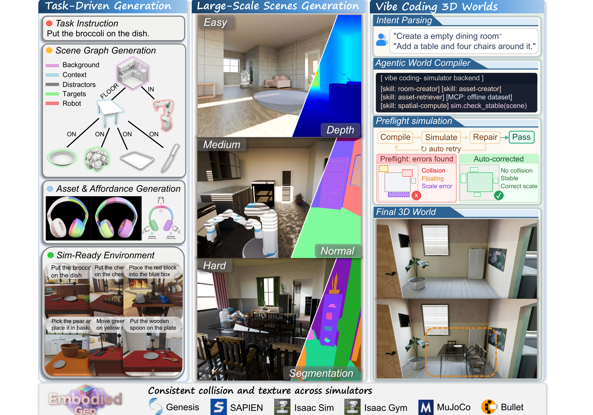

# EmbodiedGen V2：面向具身智能的智能体式仿真就绪三维世界引擎

[技术报告](https://arxiv.org/abs/2607.07459) · [项目主页](https://horizonrobotics.github.io/EmbodiedGen/) · [代码](https://github.com/HorizonRobotics/EmbodiedGen)

EmbodiedGen V2接收任务描述、图像或资产需求，生成带几何、碰撞、物理属性和部件级affordance的对象，再把场景关系编译为可在多种物理引擎中运行的`sim-ready world`。系统将3D生成、环境装配和仿真修复组织为一条agentic world compiler管线。

> **主要方法图：** Figure 1，PDF第1页。左侧把自然语言任务解析成Scene Graph，再生成带affordance的资产和可执行布局；中间构建可导航、多房间且实例可编辑的大场景；右侧由Agentic World Compiler执行“编译—仿真—修复”循环，最终通过统一表示进入Genesis、SAPIEN、Isaac Sim/Gym、MuJoCo和Bullet。来源：[原论文](https://arxiv.org/abs/2607.07459)。

## sim-ready对象与场景表示

对象层把纹理网格、碰撞几何、尺度、质量、摩擦系数和部件级affordance打包在一起；场景层用带类型的Scene Graph记录背景、上下文物体、操作目标、干扰物、机器人及`ON`、`IN`等空间关系。URDF作为主要中间表示，再转换为MJCF或USD，使同一资产能进入多种仿真器。

这层表示把生成器与机器人训练解耦。上游可以替换TRELLIS、SAM3D或Hunyuan3D，下游仍读取稳定的几何、物理和语义接口。它也暴露了真正的风险：VLM推断出的尺度、质量和摩擦只是估计，格式可加载不代表动力学参数足以支撑高精度Sim2Real。

## 从一张图到可碰撞资产，经过五道处理

文本先经文生图，普通或局部遮挡图像先做前景分割；图生3D后同时保留Gaussian和mesh表示。随后进行mesh修复、简化、纹理烘焙与凸分解，自动恢复尺度和物理属性，再执行语义外观、几何质量和跨模态一致性检查，失败样本触发重试。部件级affordance链会进一步做功能区域分割、语义标注、6-DoF抓取生成和仿真验证。

因此“能渲染”“能加载”“能稳定碰撞”“能完成操作”是四个不同门槛。论文在200个held-out资产上分别报告人工接受率、加载/碰撞、物理稳定性等指标，而不是只给FID或用户截图，这是它比一般3D资产生成更接近机器人基础设施的地方。

## 一条任务怎样变成完整环境

任务描述先被拆成Scene Graph，节点按背景、支撑物、目标、干扰物和机器人分工。系统为节点在线生成或从资产库检索实例，再按父子关系做广度优先放置、碰撞检查和物理settling，得到可直接加载的任务布局。大场景生成则额外保留房间拓扑、可通行开口和独立家具实例，避免V1把全景背景烘成单个不可编辑mesh后难以支持导航。

Agent把编辑意图映射到有类型的skill，harness维护Scene Graph、资产、6-DoF位姿和编辑历史。每个skill提交明确的状态增量，经参数检查、确定性后端和preflight simulation后写入场景；仿真诊断再用于修复和重试。

## 环境生成与下游训练结果

150个任务驱动环境的评测中，83.3%无需人工修改即可用于下游仿真，完整在线生成平均47.7分钟，其中背景生成占主要耗时。报告另引用生成环境上的VLA在线强化结果，展示仿真与真机任务成功率提升；这是环境用于策略训练后的下游结果，与资产生成的分阶段QA指标相互补充。
