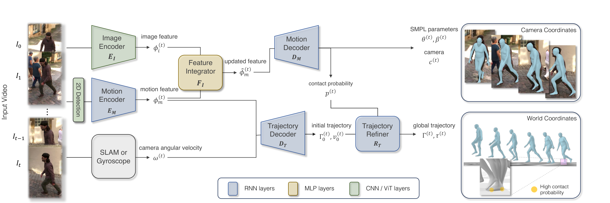

# WHAM：世界坐标下的高精度三维人体运动恢复

[论文](https://arxiv.org/abs/2312.07531) · [项目主页](https://wham.is.tue.mpg.de/) · [代码](https://github.com/yohanshin/WHAM)

单目视频的人体像素运动同时包含人体与相机位移。WHAM结合人体姿态、相机角速度和脚地接触，恢复世界坐标下的SMPL运动与根轨迹，为机器人重定向提供全局人体运动输入。

> **主要方法图：** Figure 2，PDF第4页。2D关键点与图像特征先恢复局部SMPL运动，SLAM或陀螺仪提供相机角速度，轨迹解码器和接触修正器再恢复世界坐标根轨迹。来源：[原论文](https://arxiv.org/abs/2312.07531)。

## 输入和输出到底是什么

输入是一段可能由移动相机拍摄的单目视频。预训练关键点检测器给出逐帧2D人体关键点，图像编码器提供像素级外观特征；相机角速度可以来自DPVO、DROID-SLAM一类SLAM系统，也可以直接来自相机陀螺仪。输出包含SMPL姿态与体型、弱透视相机参数、足地接触概率，以及世界坐标下的根部朝向、速度和全局平移轨迹。

输出可交给GMR、NMR等重定向器；其中SMPL人体比例与机器人关节、足底尺寸和执行器动力学不同，仍需经过本体转换。

## 为什么同时需要关键点和图像

WHAM先用AMASS合成大量“2D关键点序列到3D运动”的训练对，让单向RNN学习连续运动结构。关键点对遮挡和背景变化较稳，但相同2D投影可能对应多个3D姿态；图像特征能补充肢体朝向、深度和体型线索。Feature Integrator以残差方式把图像证据写回运动特征，Motion Decoder据此输出相机坐标下的SMPL运动和足地接触概率。

全局轨迹走另一条分支。Trajectory Decoder读取运动特征与相机角速度，递归估计根部朝向和自中心速度；Trajectory Refiner再利用脚接触和脚速度修正根轨迹。这个修正不是简单把脚钉在固定平面上，因此对楼梯和非平地比“平地假设 + 去脚滑”更合理。

## 训练数据、损失和可用边界

训练分两阶段：先在AMASS合成投影上学习2D到3D运动和轨迹，再用3DPW、Human3.6M、MPI-INF-3DHP、InstaVariety等视频数据微调图像融合。监督项覆盖SMPL参数、顶点、2D/3D关键点、根轨迹、相机、接触和脚滑。

论文证据集中在人体运动恢复Benchmark，没有真实机器人实验。方法仍依赖可靠的人体检测和相机运动估计，默认人体大部分时间在画面内；接触建模主要关注脚，骑车、滑板、手撑地或复杂人-物交互可能产生错误全局轨迹。因此本库把WHAM放在`视频人体运动恢复`：它把互联网视频变成可继续加工的人体时空轨迹，但后面仍需要目标本体重定向和物理控制。

## 从人体序列到机器人参考还要补什么

复用结果时需让局部SMPL姿态和世界根轨迹保持同一时间轴，并记录相机角速度来源、足地接触概率及人物track ID。二维关键点误差会改变局部姿态，相机角速度误差会污染全局方向，速度积分带来长时平移漂移，错误接触概率则可能把运动中的脚钉住；接入机器人还需处理rest pose、关节轴、比例缩放、关节限位与足底几何。
