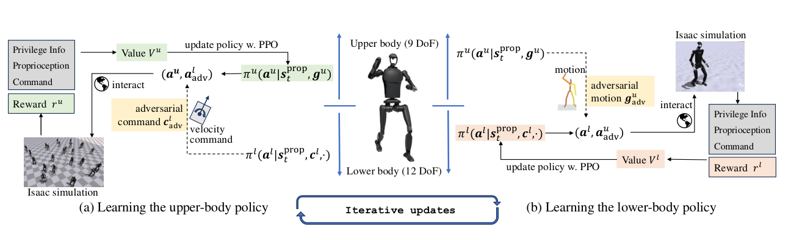

# ALMI：面向人形全身协调的上下肢对抗式运动学习

[论文](https://arxiv.org/abs/2504.14305) · [项目主页](https://almi-humanoid.github.io/) · [代码](https://github.com/TeleHuman/ALMI-Open)

全身策略最常见的冲突是：腿希望稳定跟速度，上肢希望尽量还原挥拍、弹琴或操作动作。上肢质量和惯量一大，精确跟踪本身就会持续扰动下肢；如果把所有自由度、奖励和动作一次性交给单策略，训练难、奖励多，真机还容易因为上肢动作失稳。ALMI把这个冲突直接建模成上下肢两个策略的交替博弈。

> **主要方法图：** Figure 1，PDF第4页。左侧训练上肢时，下肢速度命令形成扰动；右侧训练下肢时，上肢参考动作形成扰动，两边通过多轮交替更新逐渐兼容。来源：[原论文](https://arxiv.org/abs/2504.14305)。

## 上下肢策略如何交替适配

训练下肢策略时，上肢先用PD或当前上肢策略跟踪从AMASS经PHC流程重定向的动作，下肢则跟随速度命令。作者按机器人在每段上肢动作下的存活时间给动作排序，并用动作幅度和难度窗口构成双课程：下肢稳定后，才逐步暴露更剧烈的上肢扰动。训练上肢策略时，下肢策略固定，但速度命令作为对抗条件不断改变底座状态，上肢需要在走、转和停的过程中保持目标动作精度。

两套策略都用PPO更新，经过多轮互相“出题”后形成协同。下肢控制12个自由度，目标是速度跟踪、姿态、足端接触和能耗等Locomotion奖励；上肢控制9个自由度，主要看重定向关节目标与平滑性。部署时两部分动作拼接成完整关节目标，因此接口仍然是低层位置目标和PD控制，而不是高层语言或动作token。

两部分虽然分开输出动作，却通过同一个物理身体耦合：上肢策略读取底座运动和目标上肢参考，下肢策略读取本体状态与速度命令，上肢产生的角动量会立即进入下肢下一步观测。交替训练相当于反复更新对方造成的状态分布，而不是部署时两个完全独立的控制器。若上下肢控制频率、滤波或动作缩放不同步，拼接处仍会出现瞬时冲击，因此真机需要统一时间戳、PD增益和关节限位保护。

## 从控制器延伸到ALMI-X

论文不仅验证站立和移动中的上肢动作跟踪，还把上肢接口换成预录动作、ALMI策略或VR遥操作，展示搬箱、开门和清洁等移动操作。Unitree H1-2和G1上的结果说明，下肢确实能把上肢运动看成持续内扰并保持稳定。作者随后用控制器在MuJoCo中采集ALMI-X轨迹。

ALMI中的Adversarial指上下肢策略互相产生困难条件：一方的运动为另一方提供扰动，从而训练“下肢速度控制加上肢显式动作跟踪”的协调能力。这与AMP通过真假动作判别器构造风格奖励的机制不同。任务层的接触目标和手部操作仍由上层参考或遥操作接口提供，上下肢交替训练重点解决这些参考执行时的身体稳定与协调。

恢复能力主要来自下肢课程中见过的上肢扰动和速度变化；策略不在线估计载荷，也不会在上肢参考不可达时自动重写动作。
