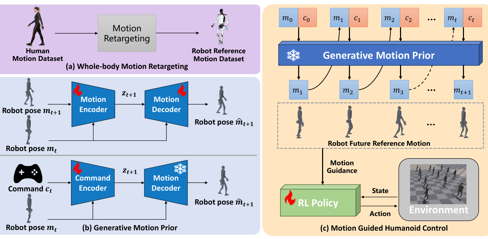

# GMP：用生成式运动先验监督自然人形行走

[论文](https://arxiv.org/abs/2503.09015) · [项目主页](https://sites.google.com/view/humanoid-gmp)

速度跟踪策略只要能到达目标速度，完全可能学出步幅僵硬、摆臂异常却奖励很高的走法；显式逐帧跟踪一条MoCap又会把策略锁在固定速度和相位上。GMP选择中间路线：先让生成模型根据当前机器人状态预测一段自然的未来参考，再把这段参考作为训练期的细粒度监督。运行目标仍是可调速度、方向和转向的Locomotion，而不是复现某一条指定动作。

> **主要方法图：** Figure 2，PDF第3页。图中完整连接了人体动作重定向、条件VAE先验训练、冻结先验在线生成和行走策略监督。来源：[原论文](https://arxiv.org/abs/2503.09015)。

## 先把人体动作变成机器人能学习的未来

原始自然动作先经过全身重定向形成机器人参考数据。条件VAE不是只重建当前帧，而是以当前运动状态为条件预测未来参考轨迹；潜变量承担动作变化，解码器给出后续关节角与关键点位置。训练完成后生成器被冻结，策略学习期间持续根据当前状态提供未来自然动作，不再和控制策略一起漂移。

这种设计把“自然”拆成可检查的目标：关节角监督约束局部姿态，关键点监督约束全身几何和摆动趋势，速度等任务奖励则保留命令可控性。和AMP判别器只返回一个分布相似度相比，GMP能指出身体哪一部分、未来哪一时刻偏离参考；和普通Mimic相比，参考又是随策略状态在线生成的，不要求锁定在数据中的单条时间序列。

## 策略学习的核心冲突

生成先验权重过高会使策略牺牲速度命令去追求自然度，权重过低则会让VAE监督失效。若策略进入先验训练分布外的状态，生成器给出的未来也未必合理；此时问题在于先验覆盖，而非只需调奖励权重。

论文报告了仿真和真实人形实验，说明冻结先验能够参与Sim2Real行走训练。观测维度、控制频率和硬件接口应以论文配置为准。真实部署仍依赖状态估计、关节PD、域随机化和安全保护；生成器并不会自动补偿模型误差。

## 它在知识栈中的位置

GMP以重定向动作作先验，下游训练速度可控的Locomotion策略；它与AMP都用动作分布约束策略，但将判别式风格奖励换成生成式未来参考。论文报告了仿真和真实人形实验，实际效果仍依赖状态估计、关节PD、域随机化与本体部署链。
