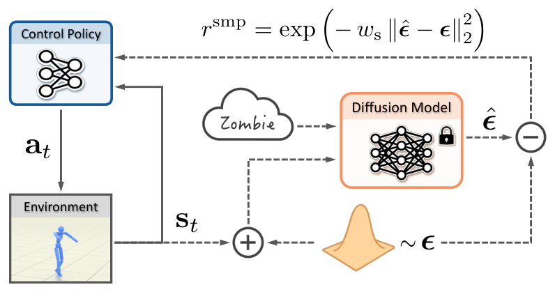

# SMP：把动作扩散模型变成可复用的运动奖励

[论文](https://arxiv.org/abs/2512.03028) · [项目主页](https://yxmu.foo/smp-page/) · [代码](https://github.com/xbpeng/MimicKit)

AMP的判别器通常跟着每个控制任务重新训练：换任务、换策略甚至换一组动作数据，都要再次进行对抗博弈。SMP把运动分布学习与控制策略训练拆开。它先在动作数据上训练扩散模型，之后冻结模型，用Score Distillation Sampling产生奖励；同一先验可以被多个任务重复调用，也不必在下游训练时继续保存和读取原始动作库。

> **主要方法图：** Figure 2，PDF第4页。虚线表示不参与下游更新的冻结扩散先验，策略轨迹加噪后由预测噪声残差形成SDS运动奖励。来源：[原论文](https://arxiv.org/abs/2512.03028)。

## 从“判别真假”改成“沿score回到动作流形”

扩散模型学习在不同噪声时刻恢复动作样本。策略产生一段运动 \(x\) 后先加噪，冻结模型预测噪声 \(\epsilon_\theta(x_t,t,c)\)，预测值与真实噪声的差异给出动作应朝数据高密度区域移动的方向。SDS把这个方向转成策略奖励或梯度，使RL同时优化任务目标与动作先验。这里不要求生成器在运行时采样完整动作，扩散模型承担的是评分器而非高频控制器。

论文针对不同噪声尺度使用ensemble score matching和自适应归一化，避免某些时间步梯度过大；生成式状态初始化从先验采样合理起点，减少策略早期只看到摔倒状态。通用先验还可用classifier-free guidance调出特定风格，并在噪声预测空间按身体部位混合多个style，组合出训练集没有直接提供的新风格。

SMP把动作先验预训练成本前置，换下游任务时复用冻结score，减少下游对抗训练和原始动作库访问。若策略频繁进入先验训练分布外的跌倒、滑动或物体接触状态，score未必指向可恢复动作，先验覆盖仍是其适用条件。

项目页展示了百余种风格、楼梯交互、少样本速度变化和Unitree G1真机。G1策略采用本体观测、非对称Actor-Critic和域随机化完成迁移，但SMP本身不提供状态估计、地形感知或安全层；不同任务若改变接触几何，冻结先验仍可能把策略拉向不适用的动作分布。

## 与AMP和Mimic的边界

SMP不接收逐帧跟踪参考；与AMP一样用动作分布塑造策略，但以冻结扩散score替代在线判别器，因此属于运动先验方法而非Mimic tracker。
