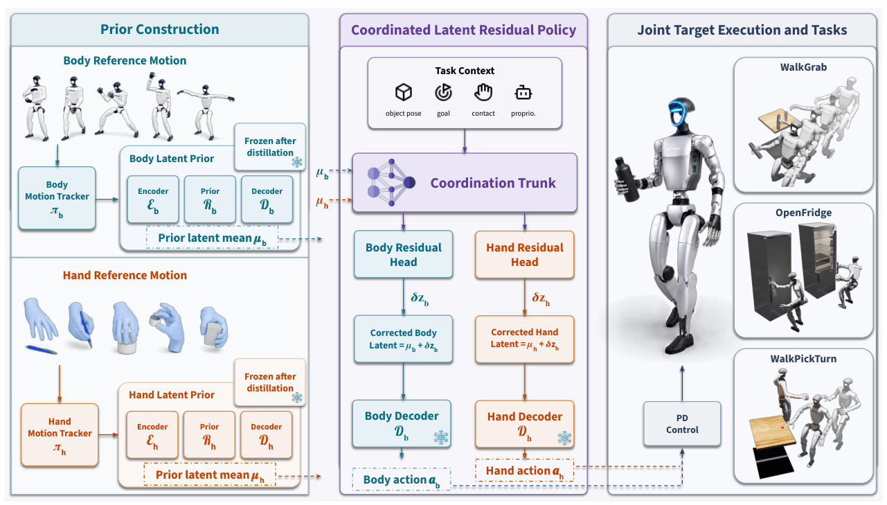

# CoorDex：用身体与手部先验降低连续灵巧移动操作难度

[论文](https://arxiv.org/abs/2606.23680) · [项目主页](https://skevinci.github.io/coordex/) · [代码](https://github.com/Skevinci/coordex)

很多人形操作流程是“先走到物体前、停住、再用低自由度夹爪操作”。CoorDex研究的是更难的一种状态：Unitree G1在移动中还要控制20自由度WUJI手完成抓取、开冰箱和拿起后旋转。若直接让PPO输出身体与手的全部关节，稀疏任务奖励很难同时学会平衡、接近和指尖接触；把所有动作压进一个latent，又会让身体和手互相干扰。

> **主要方法图：** Figure 2，PDF第4页。身体和手分别由特权跟踪教师学习并蒸馏为潜在先验，下游协同残差策略在冻结先验之上完成移动操作。来源：[原论文](https://arxiv.org/abs/2606.23680)。

## 两套先验先解决“会动”，残差策略再解决“怎样配合”

训练首先从仿真的全身与手部示范出发，分别得到能访问特权状态的身体教师和手教师。教师并不直接部署，而是蒸馏成只依赖本体感知的latent prior。下游阶段冻结两个先验，把它们的latent当作低维动作空间；协同策略读取共享任务上下文，但用分开的身体残差头与手部残差头修正各自先验。

这种结构的价值不在于简单地“多用两个VAE”，而是明确了高自由度策略的分工：先验负责维持自然、可执行的局部动作分布，残差负责根据物体、任务阶段和另一部分身体的状态做协调。论文的消融显示，在相同奖励预算下，直接关节空间PPO、直接控制手部关节以及单体latent预测都无法达到同等训练效果，说明动作接口本身就是主要变量。

## 输入输出与任务边界

论文的最终策略面向G1与WUJI灵巧手，输出身体/手先验的latent和协调残差，再由冻结解码器还原控制动作。任务包括不停步抓瓶并搬运、移动中开冰箱门以及走近方块后拾取旋转。物体和任务上下文进入策略以决定接近与接触，但公开证据尚不足以把它描述为依赖纯视觉的真实闭环。

论文主要提供仿真评测与定性真实轨迹回放；真实传感闭环和接触泛化尚未得到同等验证。
