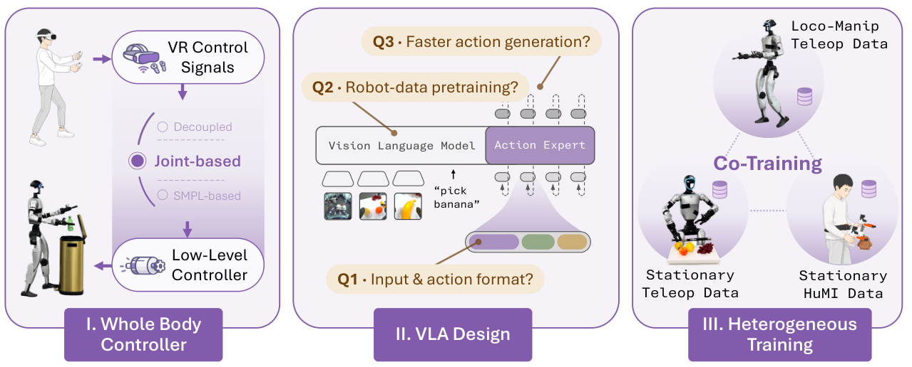

# OpenHLM：验证全身原生LocoManip的数据与训练配方

[论文](https://arxiv.org/abs/2606.22174) · [项目主页](https://openhlm-project.github.io/) · [项目资料](https://huggingface.co/OpenHLM)

OpenHLM把语言、相机像素和人形全部自由度接入同一策略，并通过受控实验比较遥操作方式、数据组成和共训练策略。其评测目标是全身移动操作，因此本库将其归入LocoManip；策略虽采用VLA形式，输出覆盖全身而非仅上肢。

> **主要方法图：** Figure 1，PDF第2页。三个阶段依次研究全身控制与遥操作接口、全身VLA的输入和动作格式及预训练与动作生成设计，以及移动操作、静止遥操作和HuMI示范的异构共同训练。来源：[原论文](https://arxiv.org/abs/2606.22174)。

## 先把“全身控制”定义清楚

OpenHLM采用关节级全身遥操作采集示范，策略输入包含语言和相机图像，输出直接覆盖人形全部自由度，而不是只给末端位姿或调用预定义行走技能。这个选择让脚步、躯干和手臂在同一动作序列中共同优化，但也显著增加数据维度和动作分布不平衡：手部细节变化多，腿部动作相对重复，简单地把所有轨迹混合可能让模型偏向静态操作。

关节级接口使移动、平衡和双手交互在同一条示范中协同变化，也让腿部和手部的动作分布失衡成为共训练设计必须处理的问题。

论文为此引入异构共训练，把全身遥操作数据与更易获取的固定式/上肢操作数据共同使用。后者补充视觉场景和手部交互，前者保留移动、平衡与全身动作接口。关键不是“数据越多越好”，而是不同数据源共享哪些视觉和动作表示、哪些自由度需要掩码或对齐，以及混合比例是否破坏全身动作分布。

## HLM-12检查的不是单一成功率

论文设置HLM-12基准，将任务分到多类全身能力中，分别观察移动、操作、身体协同和长程执行。除总成功率外，脚步距离、躯干姿态、手部接触和动作切换指标有助于区分移动与操作能力；评估结果需要结合这些分类指标理解，而不能只看整体得分。

## 可复用结论与边界

OpenHLM把全身原生控制与异构数据混合纳入受控比较。下游执行仍依赖本体接口和执行器控制；直接输出全部自由度本身不包含接触力约束或跌倒恢复能力。
