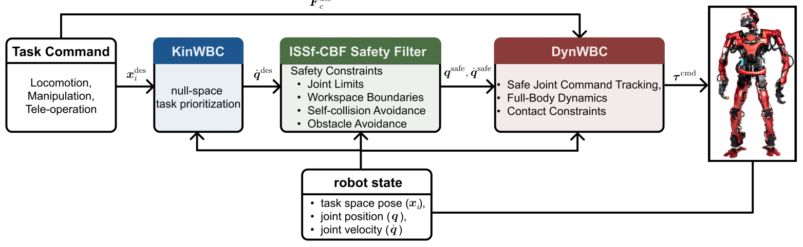

# SafeWBC：在运动学任务与动力学执行之间加入可证明安全过滤

[论文](https://arxiv.org/abs/2605.25546) · [项目主页](https://kwlee365.github.io/SafeWBC-Website/)

全身控制器可以按优先级完成手部、质心和姿态任务，却不天然保证关节限位、自碰撞、障碍距离和工作空间约束在模型误差与外力下仍然成立。SafeWBC没有让一个更复杂的优化器同时承担所有目标，而是把名义任务、运动学安全和动力学可行性拆成三层：KinWBC给动作意图，ISSf-CBF只做必要安全修正，DynWBC负责接触稳定和力矩执行。

> **主要方法图：** Figure 1，PDF第4页。名义关节参考先经过ISSf-CBF安全过滤，再由动力学WBC在接触约束下跟踪，机器人状态反馈同时进入三层。来源：[原论文](https://arxiv.org/abs/2605.25546)。

## 三层各自解决一类矛盾

KinWBC根据优先级任务生成名义关节运动参考，它关注“希望机器人怎样动”；安全过滤器在运动学模型上建立关节边界、自碰撞、外部障碍和工作区的barrier function，并求最小修正，使参考保持在安全集合附近；DynWBC再把过滤后的参考转换为满足全身动力学、接触和执行器约束的控制量。

跟踪误差和外力会使运动学模型与真实执行产生偏差。论文使用input-to-state safe CBF，在安全过滤条件中加入与barrier梯度有关的补偿项，并用扰动幅度描述可保持不变的集合：原集合为`h(x) ≥ 0`，扰动相关集合为`h(x) + γ(‖d‖∞) ≥ 0`。这里的集合扩张允许一定程度的原约束偏离，并不意味着扰动越大就自动获得更大的安全余量。过滤参数α、ε用于调节约束保守程度与任务执行之间的关系。

## 从关节参考到力矩执行

KinWBC通过分优先级的微分逆运动学生成关节速度，安全QP最小化过滤前后的速度差，并同时施加四类安全约束。过滤后的速度积分为关节位置参考，再经PD形式的跟踪律生成期望加速度；DynWBC通过动力学QP求解接触力和关节力矩。安全QP与动力学QP分线程运行，控制与力矩命令循环频率为2 kHz。与强化学习运动策略结合被列为后续研究方向。

## 仿真与真实机器人实验

实验平台为33自由度TOCABI。MuJoCo仿真包含手部圆轨迹与移动任务，并将仿真模型的连杆质量提高20%，对比无CBF、普通CBF、eCBF与ISSf-CBF。真实机器人实验包含单腿平衡的太极动作与PICO 4 Ultra遥操作搬运纸杯；控制模型质量为96 kg，实测机器人质量为102 kg。

障碍避让实验也展示了参数的影响：εAO设为30时，四次测试均未发生碰撞；设为50时，三次测试均出现barrier值为负的约束偏离，最大穿入距离为8 cm。这组结果说明安全过滤的具体效果与参数设置及下层执行误差有关。论文将分层过滤与接触力矩执行结合，展示了模型质量不匹配条件下的全身任务控制。
