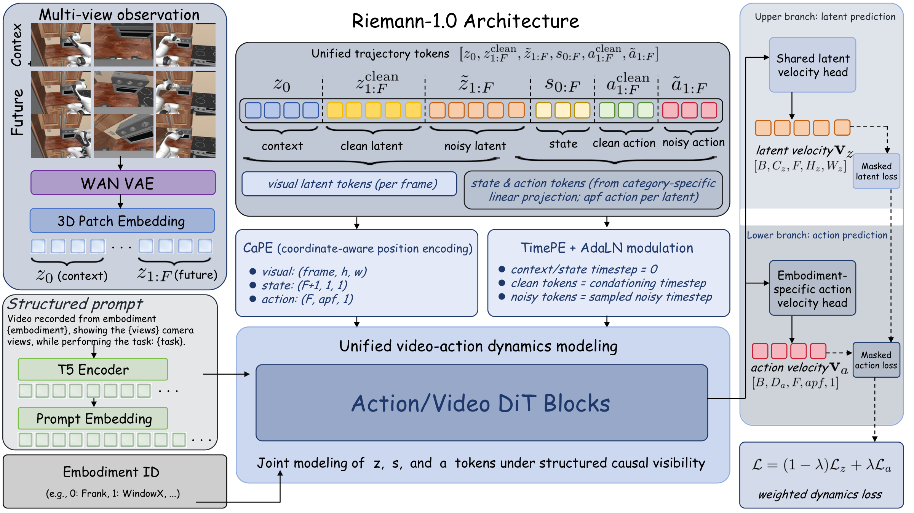

# Riemann-1.0：在同一因果模型中学习机器人动作与未来视觉

[技术报告](https://riemann-dynamics.github.io/Riemann-1.0-Website/paper/Riemann-1.0.pdf) · [项目主页](https://riemann-dynamics.github.io/Riemann-1.0-Website/) · [官方页面源码](https://github.com/Riemann-Dynamics/Riemann-1.0-Website)

Riemann-1.0把第一视角视频、UMI手持夹爪示范和异构机器人轨迹纳入渐进式具身预训练，学习共享的因果动作—视频序列。模型读取任务指令、视觉、本体状态与交互历史，按真实观察闭环生成机器人动作；给定外部动作时则预测未来视觉潜变量，兼作动作条件世界模拟器。

> **主要方法图：** 官方项目页Architecture figure。多视角图像、语言、本体标识和机器人状态被编码为统一Token，进入共享Action/Video DiT；视觉变化由共享头预测，机器人动作由本体专属动作头输出。来源：[官方技术报告](https://riemann-dynamics.github.io/Riemann-1.0-Website/paper/Riemann-1.0.pdf)。

## 两种推理模式共用一条历史上下文

策略模式下，模型读取任务指令、多视角相机、机器人状态和已经执行的动作，预测下一段动作。机器人执行这段动作后，真实相机与本体状态重新写入上下文，模型再生成下一段动作。因此闭环依赖真实观测刷新，不是一次性生成完整任务轨迹。

模拟模式下，输入历史保持不变，但动作由外部给定，模型预测执行后可能出现的未来视觉。两种模式共享对视觉变化和动作条件的表征，但用途不同：前者负责决定做什么，后者负责估计做完以后可能看到什么。公开材料没有说明它已经替代低层关节控制、碰撞检测或安全状态机，上层动作块仍需机器人执行系统落到具体关节和末端接口。

## 视觉、状态与动作怎样进入同一模型

多视角图像先经视频VAE和三维Patch编码形成视觉Token；语言指令由T5编码，同时加入机器人本体标识。机器人状态和历史动作也被投影到统一Token空间，再与视觉序列一起进入Action/Video DiT。

模型使用结构化因果可见性约束信息流：预测当前动作时只能看到已经发生的视觉、状态和动作，不能偷看未来相机帧；预测未来视觉时可以读取给定或已经生成的动作。这个顺序很重要，否则训练时看到了未来、部署时却只有当前观测，模型会形成无法在真机复现的信息依赖。

视觉变化由跨本体共享的潜变量头输出，因为不同机器人仍处在同一物理世界；动作则通过本体专属头生成，因为不同机器人的自由度、关节排列和动作尺度并不相同。这里的“统一”是共享世界变化与任务结构，不是强行把所有机器人压成完全相同的关节向量。

## 渐进式预训练逐步增强动作监督

第一阶段以无动作第一视角视频为主。冻结的潜在动作模型为视频变化生成伪动作，Action/Video DiT主要学习视觉动力学，动作损失权重较低。这个阶段提供场景、物体和人类操作变化的覆盖，但伪动作不能直接当作机器人控制信号。

第二阶段加入三维人手轨迹、UMI示范和机器人轨迹。模型开始把视觉变化与更明确的空间运动和动作表示对齐，动作监督权重提高。第三阶段只使用高质量机器人轨迹，进一步提高动作损失权重，把已经学到的世界变化收敛到目标本体可执行的动作空间。

这条顺序体现的是数据分工：大规模视频负责扩大视觉与物理变化覆盖，轨迹数据负责建立动作含义，机器人数据负责校准最终执行接口。它不能被简化成“视频越多，机器人动作自然就会变准”。

## 数据规模与机器人评测

官方报告称原始数据来源超过23.2万小时，并在真实机器人、LIBERO、RoboTwin 2.0和RoboCasa365中评估模型。项目展示多步骤操作与不同机器人平台上的执行过程，将联合动作与视频建模用于两种用途：根据真实观测生成策略动作，以及在给定动作后预测未来视觉。前者由机器人执行及任务评测检验，后者考察动作条件下的世界变化预测。
