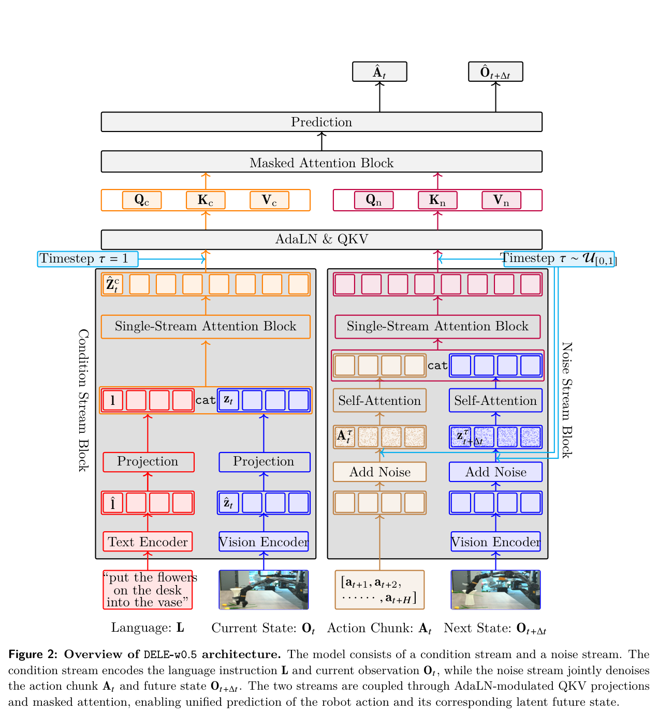

# DELE-w0.5：用未来状态辅助训练，部署时直接生成动作

[技术报告](https://arxiv.org/abs/2608.22067) · [项目主页](https://deepleap-x.com/research/dele-w0.5)

DELE-w0.5是深度跃迁发布的世界动作模型：训练时联合预测未来视觉潜变量与示范动作，部署时只将当前多视角观察和语言指令映射为动作块。未来状态作为训练监督参与优化，不进入执行时的输入链。

## 核心图与训练分工

[](论文原图/P193_figure.png)

> **主要方法图：** 官方研究页Figure 2，展示语言与当前观察组成的条件流，以及动作和未来视觉潜变量组成的噪声流。来源：[官方图源](https://deepleap-x.com/images/research/dele-w0.5/figures/figure-2-architecture-v4.png)。这是联合训练结构，不能直接当作部署结构。

方法把未来状态预测作为训练目标，与动作生成共同优化；注意力掩码不允许动作读取未来目标。部署时删除未来视觉token，保留当前观察到动作的生成路径。因此，“从未来潜在状态推断动作”的标题不能被简化为在线先生成未来、再根据未来规划。[官方方法说明](https://deepleap-x.com/research/dele-w0.5)

```text
训练：
语言 + 当前多视角观察 → 条件表示
动作示范 + 噪声 → 动作预测目标
未来观察编码 + 噪声 → 未来潜变量预测目标
共同训练；动作侧禁止读取未来目标

推理：
语言 + 当前多视角观察 → 动作块生成
                                      ↓
                              本体控制接口 → 执行反馈
未来视觉分支移除，不生成未来视频
```

训练样本把当前观察、示范动作与执行窗口之后的观察对应起来：动作分支学习从任务上下文预测示范，未来分支学习同一交互过程的视觉变化。两类目标共同优化表征，让动作学习利用后续场景变化提供的监督。推理保留语言和当前观察到动作块的路径，动作侧不读取未来目标；机器人执行后返回新的真实观察，再启动下一轮预测。未来监督与实时反馈因此分别承担训练表征和在线修正的作用。

## Astribot S1任务评测与推理延迟

以下采用论文v4，不混用早期摘要数字。实验在固定场景的Astribot S1上进行，包含开门、取饮料、加冰和微波炉任务。8种策略各做4项任务、每项20次，共640次；DELE自身为80次，其中50次成功，即62.5%，宏平均有序阶段进度81.3%。RTX 4090上的87.5毫秒是核心模型推理中位数，不包含网络、图像解码、IK及机器人执行。[论文v4实验与测时口径](https://arxiv.org/html/2608.22067v4)

论文的微波炉评测要求放入食物并启动加热，官网另展示微波炉取物。两项任务分别呈现模型在设备操作和物体取放中的执行过程；上述成功率对应论文四项任务的固定评测设置。[官方演示](https://deepleap-x.com/research/dele-w0.5)
