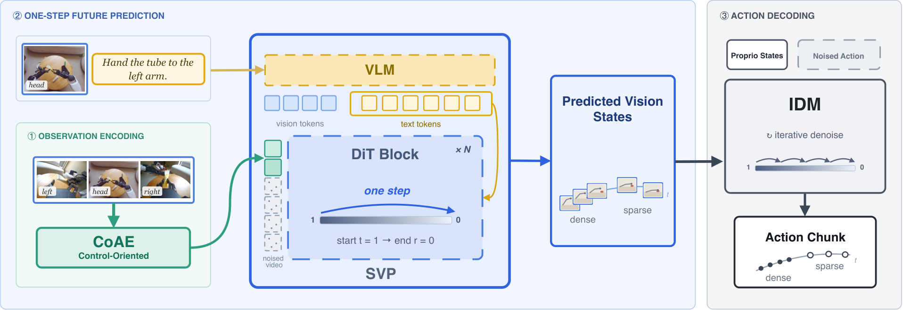

# GE-Act 2.0：用单步未来状态和行为兼容性训练WAM

[技术报告](https://arxiv.org/abs/2609.05588) · [项目主页](https://ge-act-v2.github.io/) · [论文HTML全文](https://arxiv.org/html/2609.05588v1) · [官方方法图](https://arxiv.org/html/2609.05588v1/fig_system_v04.png)

GE-Act 2.0由控制导向自编码器CoAE、单步视觉规划器SVP和逆动力学模型IDM组成。SVP通过一次流生成器前向预测未来视觉潜变量，IDM结合当前状态与预测状态解码动作；三个组件先用互补数据分开预训练，再由KASO筛选与记录动作行为兼容的预测未来，降低联合训练噪声。论文从头初始化可训练的生成与动作组件，并使用已有视觉表征作为输入编码。

## 核心图与输入输出

> **主要方法图：** arXiv HTML的Figure 1，展示三视角当前观察经CoAE压缩，语言与视觉条件进入SVP，一次前向产生稠密和稀疏未来视觉状态，随后IDM结合本体状态生成动作块。来源：[论文原图](https://arxiv.org/html/2609.05588v1/fig_system_v04.png)。

部署输入是多视角当前图像、自然语言指令和本体状态。CoAE把256×384视觉输入压缩成保留动作与指令信息的潜变量；SVP接收视觉与文本token，经一次从t=1到r=0的流生成输出未来时刻的稠密、稀疏视觉状态。IDM再接收当前与预测视觉潜变量、本体状态和带噪动作，经流匹配去噪输出动作序列。稠密动作覆盖当前执行窗口，稀疏状态提供更远时域的辅助监督，策略按动作块滚动执行。

## 训练分工与KASO

第一阶段训练CoAE，目标是在强压缩下保留影响动作、语言 grounding和视觉识别的信息，论文同时使用像素/LPIPS、对抗、冻结视觉表征对齐以及动作和描述探针检查信息是否被压掉。第二阶段单独训练SVP，让它从动作无关但带指令的视频中学习动作相关的未来状态；它的一次前向设计降低了视频规划的迭代成本。第三阶段单独训练IDM，使用带动作标签的机器人轨迹，学习从当前与未来状态反推出动作。两类预训练数据不必拥有完全相同的模态，但真正联合时必须对齐时间窗口和本体语义。

KASO是联合训练的关键。模型先无梯度地产生N个未来候选，再用IDM的行为兼容性评估选出与记录动作最一致的候选，随后对选中的噪声和动作路径进行联合反传。论文附录的一组设置是N=4、top-k=1，训练时SVP、IDM和端到端损失分别加权；联合数据还混合记录动作与生成未来对应的动作监督。这个选择器缓解了“看起来合理但不支持当前动作”的未来状态问题，却没有保证预测状态满足真实接触动力学，尤其不能把潜变量相似自动当成物理正确。

## 规模实验与运行条件

论文把协同训练规模从300小时扩展到30000小时，在G1-OP上成功率从17.1%升到44.1%，在G2-90D上从13.4%升到31.1%。G2-90D占联合训练数据不到2%，仍提升17.7个百分点；19/20和18/20技能组出现收益，技能覆盖与OOD成功率的相关性报告为Pearson r=0.80、Spearman rho=0.85。直接评测覆盖100个任务、20个操作技能组，并把场景、背景、光照和物体实例留作变化；对象、颜色、形状和位置指令的 grounding 在同一协议下至少达到90%。这些数字说明数据规模和技能覆盖很重要，但不等于任意数据加入都会产生相同收益。

实际推理中，论文的一组配置使用三路相机、256×384输入，SVP一次前向，IDM约5步Euler去噪，然后滚动执行动作块。附录还给出52个稠密动作token等实现设置；这些是可复现配置，不能替代不同控制频率或动作接口下的重新测量。跨硬件比较时，应优先以论文报告的测试硬件、计时范围和是否包含图像预处理为准。

## 推理接口与评测协议

SVP生成的未来状态是视觉latent，用作IDM解码当前动作的中间表征；策略按动作块执行并滚动获取新观测。论文分别报告预训练检查点的OOD直接评测，以及仿真基准上的SFT结果，后者对应任务微调条件。
