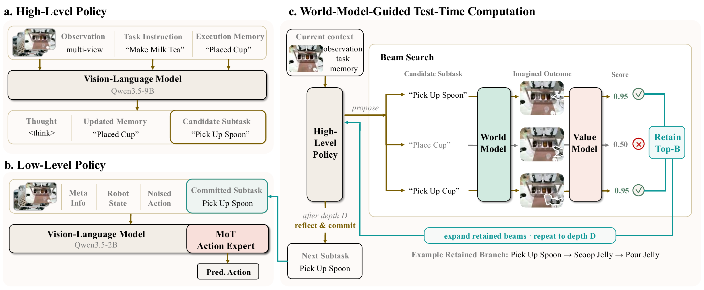

# τ₀-VLA：用世界模型搜索组织长任务与低层动作

[论文](https://arxiv.org/abs/2608.16885) · [项目主页](https://tau0-vla.github.io/) · [代码](https://github.com/sii-research/tau-0-vla) · [arXiv HTML 正文](https://arxiv.org/html/2608.16885v1)

> 论文原图：高层记忆与子任务策略、低层动作策略，以及由世界模型引导的测试时计算搜索。

## 核心问题

τ₀-VLA 试图处理长时域机器人任务中两个互相牵制的问题：高层模型需要根据任务进展决定下一步做什么，低层模型需要在不同本体上把这个决定转成连续动作。如果一次性规划完整任务，早期误差会积累；如果每一步都让大型视觉语言模型重新思考，推理成本和行为不稳定性又会增加。论文把系统拆成带执行记忆的高层策略和 40 维统一动作接口的低层策略，并在高层置信度不足时调用 World-Model-Guided Test-Time Computation，使用候选子任务、世界模型预测、价值评分和 beam search 进行有限深度的决策。

## 输入、输出与推理闭环

高层在逻辑步骤 t 接收任务语言 l、多视角观测 ot、持久执行记忆 Mt-1 和上一个已执行子任务，输出更新后的记忆 Mt 与直接子任务提议。置信度门控决定直接执行，还是让提议模型生成 N 个候选。TTC 对每个候选预测终止时刻的头戴相机图像，再由价值模型对任务、候选和预测图像打分；beam 保留累计得分最高的 B 条分支并展开到深度 D，反思模型最后提交子任务。分支内记忆不会覆盖持久记忆，真实执行后的新观测才会更新下一轮状态。

低层接收当前观测、机器人状态、选定子任务和本体元信息，由 Qwen3.5-2B 视觉语言骨干与 Mixture-of-Transformers 动作专家通过条件流匹配输出动作块。统一表示有 40 个槽位，覆盖左右末端位置/姿态、夹爪、腰部、平面底盘速度和每侧关节，使用相对末端/关节动作及本体 mask 适配不同平台。论文附录的动作块长度 H=30，采样包含 10 次 Euler 更新。这样，高层 TTC 负责“接下来执行哪个可操作子任务”，低层策略负责“在当前本体上怎样动”，不是让世界模型直接输出关节力矩。

## 训练数据与策略方法

低层策略在约 40,115 小时的异构真实机器人数据上预训练，混合固定底座、移动和双臂示范、自主 rollout、UMI 数据及多模态视觉语言数据。高层使用任务、阶段和可执行子任务标签，并对执行记忆做扰动训练：论文给出的比例包括子任务内扰动 58%、转移 15%、追赶 10%、回滚 12% 和错误思考 5%。世界模型使用与子任务对齐的起止帧，不依赖每个样本都提供额外密集标签。

## 实验条件与结果

真机平台包括 AGIBOT G1、ARX AC One 和双臂 Franka Research 3，任务覆盖 Clean Room、Prepare Ingredients、Tomato and Egg Stir Fry、Make Milk Tea、Collect Laundry、Book Organization 和 Tidy Makeup 等家庭操作。每个物理表格通常执行 10 次。高层比较中，TTC 相对于一次性计划在 Make Milk Tea 上为 7/10 对 5/10，在 Book Organization 上为 9/10 对 6/10，在 Clean Room 上为 7/10 对 5/10；开放环 next-subtask 准确率也从 Plan Once 的 50.0% 提高到 TTC 的 74.0%。这些结果支持“在长任务中有限测试时计算有帮助”，但不是任意任务上的通用规划保证。

低层直接评测与高层分解分开进行，不能将低层单项操作的完成率直接当成 TTC 的收益，因为这些评测没有经过完整高层搜索。另一个工程成本是 TTC 会增加候选分支的世界模型推理和价值打分，论文中的门控阈值依赖留出的校准数据。比较前应分别列出任务完成、阶段进度、执行时长与模型调用预算，避免把不同口径的百分比放在同一列。

## 边界与开发建议

世界模型在这里主要预测终止头戴相机图像，用于子任务价值判断，并不等同于包含接触力、摩擦、碰撞和详细物理状态的完整模拟器。跨本体 mask 和 40 维动作槽位并不能替代不同机器人各自的动力学、限位和安全控制。使用时应把高层的价值分数看作排序信号，给候选数量、搜索深度、超时和记忆回滚设置明确上限；低层输出仍需由本体控制器做碰撞、速度和力矩检查。
