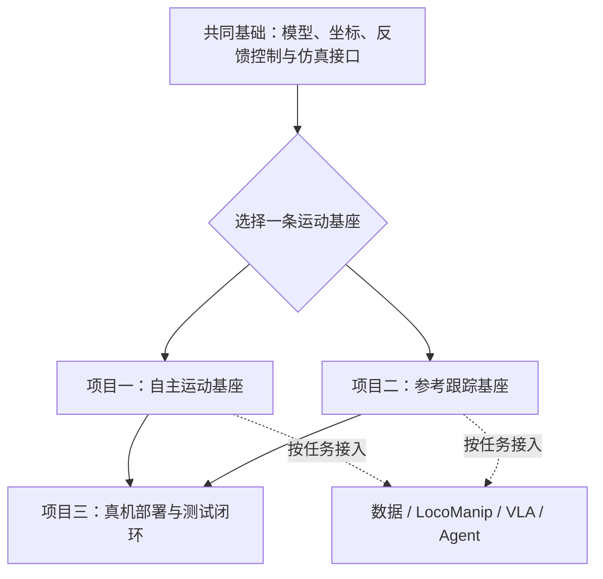

# 技术路线总览与新手学习路径

本页把人形机器人运动智能分成两个相互连接但不能混画的视角：在线运行时的系统能力栈，以及动作数据、训练和失败日志构成的更新闭环。

前半部分回答Loco-Manip任务由哪些能力共同完成，后半部分回答第一次学习时应该按什么顺序建立机器人模型、反馈控制、仿真训练和失败分析能力。

## 本页导航

[系统能力栈](#系统能力栈) · [训练与更新闭环](#训练与更新闭环) · [六条资料路线](#知识库中的六条路线) · [三条项目路线](#三条可执行项目路线) · [共同基础](#共同基础) · [最终作品验收](#最终作品验收) · [按起点进入](#根据自己的起点进入) · [继续查资料](#继续查资料)

## 系统能力栈

Loco-Manipulation位于任务能力层，目标是让机器人在移动中协调全身、改变物体状态并连续完成任务。现有系统大致采用三种组织方式，它们可以混合使用，不代表线性升级关系。

```text
                         Loco-Manipulation
              移动 · 全身协调 · 物体交互 · 连续任务
                                  |
            +---------------------+---------------------+
            |                     |                     |
         技能串联             统一全身策略          生成与规划式系统
     走路/抓取/搬运切换       腿腰手联合控制       生成目标、动作块或计划
            |                     |                     |
            +---------------------+---------------------+
                                  |
                       支撑能力（按系统组合）
            +---------------------+---------------------+
            |                     |                     |
     感知与状态估计        通用全身运动基座      高层任务规划与世界预测
 视觉/本体/物体/力触觉    平衡/跟踪/恢复/接触      任务规划/记忆/世界模型
        共同需要               共同需要                  按需接入
```

- **技能串联**复用独立的行走、抓取、搬运和恢复控制器，由状态机或任务规划器切换；它需要高层调度，但不必使用世界模型。
- **统一全身策略**把身体、物体和任务目标送入同一套腿腰手策略，直接处理身体耦合；它可以在没有世界模型的情况下运行。
- **生成与规划式系统**由轨迹优化、Diffusion、VLA或WAM产生轨迹、动作块、子目标或技能调用，再交给Tracker、WBC、MPC或其他身体控制器闭环执行。

感知与状态估计、通用全身运动基座是共同基础；高层任务规划与世界预测只在需要长时调度、未来预测或生成动作的系统中接入。

## 训练与更新闭环

**视频 / MoCap / 遥操作 / 真实日志 → 人体运动恢复 / 动作重定向 / 数据构建 → 训练专项控制器、统一全身策略或生成模型 → 真机执行 → 失败日志回流。**

动作数据与重定向属于训练侧入口，不是在线能力栈的最底层。仿真器、本体接口、PD/WBC/MPC、Sim2Real、安全评测、数据集和Benchmark横向支撑训练与部署全过程。

## 知识库中的六条路线

| 顺序 | 技术路线 | 核心问题 | 主要产物 |
| --- | --- | --- | --- |
| 1 | [动作数据与重定向](01_动作数据与重定向.md) | 人体、视频、MoCap或其他本体的运动，怎样变成目标机器人的可训练动作与交互数据？ | 世界坐标人体运动、目标本体参考轨迹、批量训练数据 |
| 2 | [Locomotion与运动先验](02_Locomotion与运动先验.md) | 机器人怎样获得基础移动、复杂地形适应，以及不依赖逐帧参考的动作分布与行为表示？ | 速度跟踪与地形策略、对抗运动先验、可提示行为模型 |
| 3 | [动作跟踪与全身控制](03_动作跟踪与全身控制.md) | 参考动作、关键点或人体实时信号，怎样稳定转换成机器人全身控制并处理失配与恢复？ | 通用Tracker、参考修正与恢复策略、人体驱动遥操作闭环 |
| 4 | [LocoManip](04_LocoManip.md) | 移动、平衡、接触和操作怎样在同一闭环中协同，并真正改变外部物体或场景状态？ | 搬运、推拉、开门、工具使用、柔顺接触与负载适应技能 |
| 5 | [世界模型、VLA与Agent](05_世界模型VLA与Agent.md) | 上层模型怎样理解视觉语言、预测环境变化、生成动作或调度技能，并与身体控制器形成闭环？ | 动作块、世界预测、技能图、空间记忆与重规划指令 |
| 6 | [工程与实机部署](06_工程与实机部署.md) | 算法怎样接入本体、估计状态、满足动力学与安全约束，并经过仿真、评测和部署进入真实机器人？ | 仿真训练环境、控制与优化模块、部署接口、数据集、Benchmark和测试标准 |

## 路线之间怎样连接

1. **动作数据与重定向**为专项控制器、统一全身策略和上层生成模型提供训练参考与交互数据。
2. **Locomotion与运动先验**和**动作跟踪与全身控制**共同构成身体运动基座：前者处理自主移动与动作分布，后者处理显式参考的稳定执行。
3. **LocoManip**位于任务能力层，以是否在移动和接触中改变物体或场景状态为验收标准。
4. **世界模型、VLA与Agent**属于可选的高层规划、预测和动作生成模块；它们不替代平衡、跟踪、接触保护和关节级执行。
5. **工程与实机部署**提供本体接口、状态估计、动力学控制、仿真、Sim2Real、安全评测和日志回归，使各层能够在真实机器人上闭环。


## 新手学习路线


这条学习路线不再把六条资料分类当成六门必须依次学完的课程。六条技术路线负责回答“资料在哪里、系统由什么组成”；实践只保留三条能够形成作品的项目路线：自主运动基座、参考跟踪基座和真机部署闭环。

第一次学习时，先补齐共同基础，再从前两条运动基座中选择一条做深，最后用第三条完成部署、测试和失败回归。动作数据、LocoManip、世界模型、VLA与Agent按项目需要接入，不单独变成新的入门主线。

### 完成这条路线后应该具备什么

你至少应该能够：

1. 画出“传感器观测 → 状态处理 → 策略或控制器 → 关节目标/力矩 → 机器人 → 下一时刻观测”的完整闭环；
2. 说清一个项目的机器人模型、观测、动作、奖励、控制频率、训练特权信息和部署接口；
3. 跑通一个公开基线，并通过固定条件下的对照实验说明自己的修改解决了什么问题；
4. 把失败定位到数据、模型、观测、策略、控制、仿真、硬件或时序中的具体环节；
5. 用代码、配置、日志、指标和失败案例证明结果，而不是只展示一段成功视频。

### 三条可执行项目路线



项目一和项目二不是难度递增关系，而是两种不同的执行接口。自主运动策略根据命令、地形或行为提示生成动作；参考跟踪策略根据逐帧参考、关键点或motion token执行动作。完成其中一条即可进入部署闭环。

### 共同基础

开始项目以前，只补与闭环直接相关的知识：

- Linux、Git、Python和阅读C++工程的能力；
- 向量、坐标变换、旋转矩阵、四元数、关节顺序和单位约定；
- URDF/MJCF中的连杆、关节、质量、惯量、碰撞体、执行器和传感器；
- FK/IK、雅可比、刚体动力学、接触、摩擦、PD、阻抗和力矩控制；
- 仿真步长、策略频率、通信频率和电机内环的区别。

先完成一个最小闭环：读取机器人模型和关节日志，在MuJoCo或其他刚体仿真器中完成单关节跟踪与静态姿态保持，记录目标、反馈和控制输出，再主动改变PD、控制频率或模型质量观察失稳。通过标准是遇到姿态旋转、动作反向、关节错位、抖动或迟滞时，先检查坐标、索引、单位、反馈和时序，而不是直接改网络或奖励。

[基础书籍与学习资料](基础书籍与学习资料.md)用于按当前故障补知识，不要求开始项目前读完整份书单。[工程与实机部署](06_工程与实机部署.md)可以帮助定位机器人模型、状态估计和控制工具在系统中的位置。

### 项目一：自主运动基座

**目标**：让机器人根据速度、方向、目标位置、地形或行为提示自主站立、移动、抗扰和恢复，不依赖完整逐帧参考动作。

**实现链路**：机器人与环境建模 → 观测、动作和PD接口 → PPO基础Locomotion → 固定测试基线 → 只选择地形感知、状态估计、AMP式先验或行为潜变量中的一个问题做改动。

建议从[Humanoid-Gym](../论文与项目/论文逐篇解读/P015.md)及其[开源实现](../论文与项目/开源项目主表.md#r033)建立训练、MuJoCo验证和部署接口，再按问题阅读[AMP](../论文与项目/论文逐篇解读/P022.md)、[DreamWaQ](../论文与项目/论文逐篇解读/P125.md)或[BFM-Zero](../论文与项目/论文逐篇解读/P080.md)。阅读时要分清任务奖励、感知表征、先验奖励和技能变量分别修改哪一层。

**最小交付**：保存机器人模型、训练配置、随机种子、观测与动作定义、奖励组成、模型检查点、训练曲线和评估视频；固定机器人与测试集，一次只改变一个主要变量。

**通过标准**：能够解释Actor、Critic、训练特权信息、关节目标和PD闭环，并用速度误差、摔倒率、通过率、能耗、保护触发和失败场景说明改动的独立收益。只跑通作者命令或展示最好的一段视频不算完成。

### 项目二：参考跟踪基座

**目标**：把MoCap、视频、关键点、动作轨迹或人体实时信号转换为目标机器人可执行的全身参考，并在动力学失配、碰撞扰动和参考不可达时保持跟踪或恢复。

**实现链路**：原始动作 → 帧率、坐标、根节点、旋转和接触处理 → 目标本体重定向 → 参考轨迹 → Tracker → 关节目标与PD → 反馈和失败恢复。

可先用[GMR](../论文与项目/论文逐篇解读/P077.md)理解跨本体重定向，再用[SONIC](../论文与项目/论文逐篇解读/P035.md)理解大规模动作库、统一运动表示与实时全身策略，之后进入[BeyondMimic](../论文与项目/论文逐篇解读/P034.md)等参考修正和失配恢复工作。

**最小交付**：保留动作来源与许可、坐标约定、重定向配置、参考轨迹、训练配置、跟踪指标和失败片段，完整跑通“原始动作 → 目标本体 → Tracker → 关节执行”。

**通过标准**：除了平均跟踪误差，还要报告足滑、碰撞、关节限位、未见动作、动力学失配、偏离参考后的恢复和实时输入延迟。换一段动作或更换本体参数后，仍能判断需要修改数据、重定向、策略还是控制接口。

### 项目三：真机部署与测试闭环

**目标**：把项目一或项目二的策略从训练环境送入可回滚、可保护、可记录和可复测的运行系统。没有真机时，可以完成Sim2Sim、模型导出一致性、延迟注入、参数扫描、故障回放和硬件在环方案，但必须明确这些证据不能替代真机测试。

**实现链路**：训练检查点 → 模型导出 → 运行时观测与归一化 → 关节映射和PD/WBC → 通信与电机接口 → 安全状态机 → 统一时钟日志 → 失败回放与回归测试。

**最小交付**：记录训练端、导出模型和运行时的关节顺序、零位、方向、单位、归一化、策略频率、通信频率、PD参数和超时处理；建立覆盖速度、地面、扰动、载荷、延迟和模型偏差的固定测试矩阵。

**通过标准**：每次失败都能关联到代码与模型版本、机器人或仿真模型、场景和时间窗口；每次修复都增加可以重新触发旧问题的回归用例。域随机化范围应来自辨识、个体差异或日志证据，而不是无边界扩大。

### 按目标扩展系统

三条项目路线形成的是身体控制和工程闭环。完成一条运动基座以后，再按目标选择扩展，不需要全部接入：

- **规模化动作与交互数据**：建设视频/MoCap恢复、跨本体重定向、遥操作、同步、质量筛选和训练数据管线，并验证下游策略是否受益；
- **LocoManip与物理交互**：把移动、平衡、视觉、物体状态、接触和负载放入同一任务闭环，明确身体基座接口、成功条件和失败恢复；
- **世界模型、VLA与Agent**：让上层模型输出关节动作、动作块、轨迹、末端目标或技能调用，再由运动基座执行并反馈，不能用生成视频代替控制证据。

接入扩展模块时，保留未接入该模块的运动基座作为基线，固定本体、任务和测试条件，检查新增系统是否真正改善数据覆盖、任务成功率、恢复或长时执行能力。

### 最终作品验收

一份完整作品不需要覆盖六条技术路线，但必须覆盖自己选择的问题：

1. **问题与边界**：机器人、任务、场景、输入输出和成功条件；
2. **可复现环境**：代码版本、依赖、模型、数据许可、配置和运行命令；
3. **控制闭环**：观测、动作、奖励、网络或优化器、PD/WBC接口与频率；
4. **基线与改动**：原始方法、自己的修改，以及为什么这样修改；
5. **实验与消融**：固定测试条件、多个随机种子或重复测试、关键指标；
6. **失败分析**：代表性失败、原因假设、验证实验和未解决问题；
7. **部署边界**：Sim2Sim、硬件在环、真机或仅仿真的明确说明；
8. **结果表达**：曲线、日志、视频和结论相互对应，不选择性展示单次成功。

完成标志不是“跑通某个开源项目”，而是换一段动作、一个机器人模型、一组控制参数或一个测试场景后，你仍然知道哪些部分需要修改、怎样验证，以及结果能支持什么结论。

### 根据自己的起点进入

- **没有强化学习和机器人基础**：先完成共同基础，再选择自主运动基座；
- **会深度学习但不懂机器人**：先补机器人模型、接触和控制接口，不从VLA或策略网络直接开始；
- **有经典控制或机器人背景**：直接选择一条运动基座，重点补PPO、训练数据分布和学习策略的失败分析；
- **已经跑过开源项目**：按对应项目路线的最小交付和通过标准补证据，缺哪一项就回到哪一层。

### 常见的无效学习方式

- 同时维护多个仿真器和多个代码库，最后无法判断问题来自哪里；
- 只运行作者命令，不追踪任务注册、观测、动作、奖励和部署入口；
- 把持续调奖励当成主要研究方法，却没有检查坐标、控制接口和数据分布；
- 直接追逐VLA、世界模型或新模型名称，没有先定义它与身体控制器的接口；
- 只保存成功视频，不保存配置、日志、失败样本和测试条件；
- 用一次仿真或真机成功声称稳定、通用或完成Sim2Real。

### 继续查资料

- 不清楚资料在系统中的位置：回到[本页技术总览](#系统能力栈)；
- 需要补坐标、动力学、规划、状态估计或强化学习基础：按当前问题查阅[基础书籍与学习资料](基础书籍与学习资料.md)；
- 已知论文名称或稳定ID：进入[论文总索引](../论文与项目/README.md)；
- 需要代码和复现入口：进入[开源项目主表](../论文与项目/开源项目主表.md)；
- 希望选择规模较小的入门项目：参考[【开源】小而美的运动控制项目（公开版）](https://my.feishu.cn/wiki/Q1jaw5rCliWddukCfYfcwjW0nJf)，并以项目官方仓库确认代码状态、依赖和许可证；
- 已经确定资料方向：进入[动作数据与重定向](01_动作数据与重定向.md)、[Locomotion与运动先验](02_Locomotion与运动先验.md)、[动作跟踪与全身控制](03_动作跟踪与全身控制.md)、[LocoManip](04_LocoManip.md)、[世界模型、VLA与Agent](05_世界模型VLA与Agent.md)或[工程与实机部署](06_工程与实机部署.md)。
