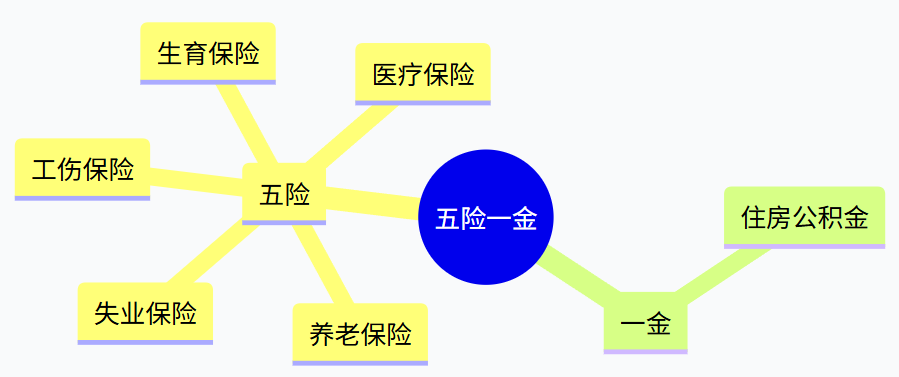
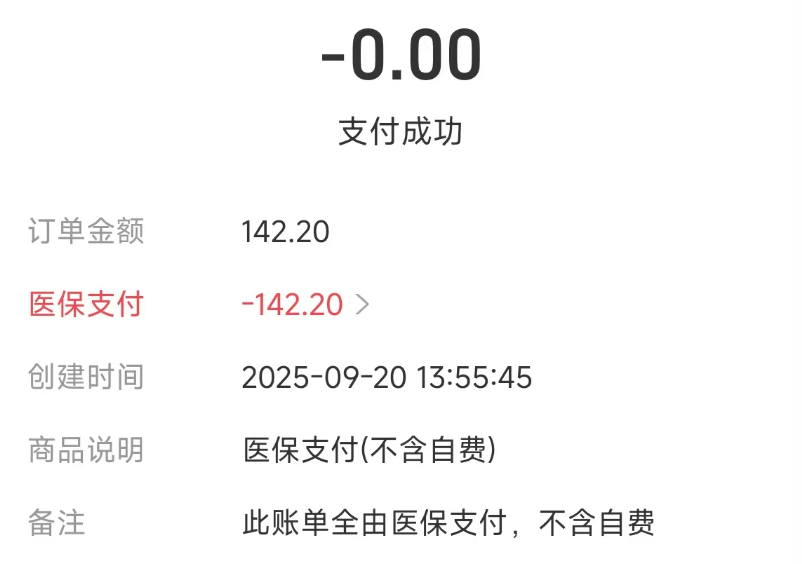
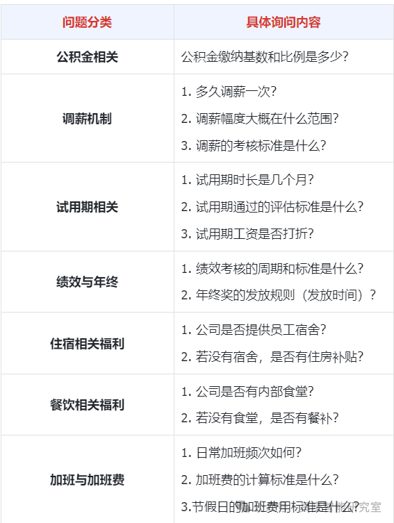
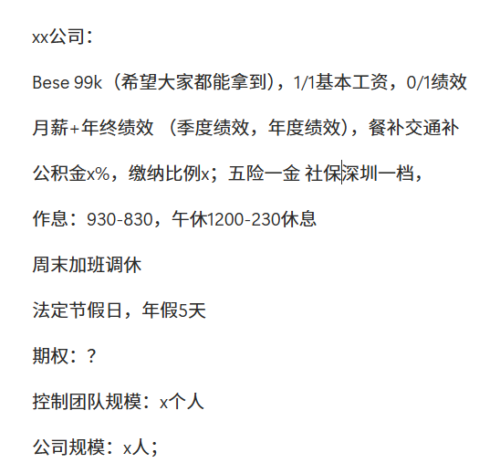
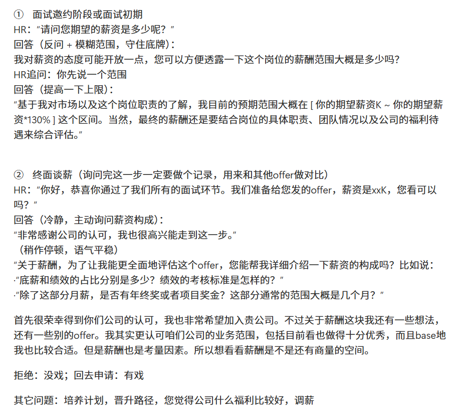

# 运动控制面经、谈薪技巧与薪资汇总

> 版本：2026年3月版  
> 定位：运动控制求职者的谈薪检查表、技术面试问题库与经验汇总。  
> 说明：本文来自个人经历和读者投稿，不构成劳动法律、税务、社保、公积金或投资建议。政策口径、缴费比例和招聘要求会随城市、年份、公司及个人情况变化，使用前请以政府部门、公司书面材料和最新招聘信息为准。

本文件保留2026年3月时的原始案例、政策示例和面经快照，便于追溯当时语境。

文中的五张配图保留自原始公开稿，点击图片可查看原尺寸。

## 共建与联系

欢迎补充真实、可核验的薪资信息和面试经验，共同完善这份资料。

- 交流、投稿与纠错统一见[联系方式与纠错](../README.md)
- [在线面经、谈薪总结与薪资汇总｜飞书文档](https://my.feishu.cn/wiki/JoR7wk3ZeiNVaEkbHo2c8euUn4f)
- [匿名薪资统计表｜腾讯文档](https://docs.qq.com/sheet/DRm1yV0dmTER2aHdL?tab=BB08J2)

飞书文档和腾讯表格属于持续更新的在线入口，本页保留2026年3月的整理快照。飞书入口在未登录环境下可能跳转到登录页，实际可见范围以文档权限为准。在线投稿内容、样本数量和薪资口径可能变化，引用时应重新检查日期、地区、岗位、学历与总包构成。

## 目录

- [一、谈薪技巧](#一谈薪技巧)
- [二、读者经验](#二读者经验)
- [三、机器人强化学习运动控制面经](#三机器人强化学习运动控制面经)
- [四、使用边界](#四使用边界)

## 一、谈薪技巧

### 1. 不要只看总包，要拆解月薪

很多人在交流 Offer 时只谈总包，不谈月薪，但总包中可能包含年终奖、绩效、期权、签字费等不确定部分。

例如，同样是30万元总包：

- 12薪对应月薪约25,000元；
- 16薪对应月薪约18,750元。

对于16薪或更高薪数，需要继续确认：

- 额外薪数是保底工资还是浮动年终奖；
- 发放时间是当年年底还是次年二季度；
- 是否乘以个人、部门或公司绩效系数；
- 离职、试用期或入职不满一年时如何折算；
- 相关承诺能否写入Offer或劳动合同。

因此，谈薪时至少要拆开看：**固定月薪、固定薪数、浮动奖金、绩效、期权、签字费、补贴和五险一金**。

### 2. 五险一金的基数是否重要

五险一金通常按以下方式计算：

> 缴费金额 = 缴费基数 x 缴费比例

下面沿用“月缴费基数20,000元、按北京示例比例计算”的原始案例。该表只用于理解计算方式，不代表2026年的最新政策。

| 险种 | 单位缴费比例 | 单位缴纳金额 | 个人缴费比例 | 个人缴纳金额 |
|---|---:|---:|---:|---:|
| 基本养老保险 | 16% | 3,200元 | 8% | 1,600元 |
| 失业保险 | 0.5% | 100元 | 0.5% | 100元 |
| 职工医疗保险 | 9.8% | 1,960元 | 2% | 400元 |
| 工伤保险 | 0.2% | 40元 | 0% | 0元 |
| 生育保险 | 已合并至医保 | 已合并至医保 | 0% | 0元 |

> 图片说明：五险与住房公积金的组成关系。

#### 2.1 医疗保险

个人缴费通常从月工资中扣除，其中符合当地政策的部分进入个人账户，可用于规定范围内的就医、购药等支出。单位缴费通常进入统筹基金，用于符合条件的医疗费用报销。

> 图片说明：使用医保个人账户支付、不含自费金额的账单示例。

具体个人账户划入规则、起付线、报销比例和异地使用方式，应以参保地最新政策为准。

#### 2.2 住房公积金

个人和公司通常按规定比例分别缴纳，并共同进入个人公积金账户。比较Offer时需要确认：

- 缴费基数是实际月薪、固定工资，还是当地最低基数；
- 公司和个人各自的缴费比例；
- 试用期与转正后的基数是否一致；
- 补充公积金或其他住房福利；
- 当地提取和贷款政策。

公积金比例和基数越高，并不等于当月现金到手越高，但会影响公司实际用工成本、个人长期账户积累和住房相关权益。

#### 2.3 工伤保险

文中记录了一个真实案例：某公司负责人在办公时因椅子损坏摔伤，之后休息期间的待遇和赔偿通过工伤相关流程得到落实。

这个案例说明，工伤保险不仅覆盖生产线和高风险岗位。是否属于工伤、如何申报以及需要哪些证据，应以实际发生地政策和正式认定为准。

#### 2.4 养老保险

养老保险涉及缴费年限、缴费基数、退休年龄、个人账户和统筹账户等因素。个人账户养老金的计发月数由政策表确定，不宜仅用简单的平均寿命公式推算。

对求职者来说，比较Offer时主要确认公司是否足额、按时缴纳，以及缴费基数是否与书面承诺一致。

#### 2.5 失业保险

需要关注参保条件、累计缴费时间、主动或非主动离职的差异，以及所在城市的申领流程。

#### 2.6 生育保险

国家层面的合并实施原则是“保留险种、保障待遇、统一管理”。参加职工基本医疗保险的在职职工同步参加生育保险；生育保险基金并入职工基本医疗保险基金统一征缴，个人不单独缴纳生育保险费；生育保险待遇仍包括生育医疗费用和生育津贴。合并的是参保、基金和经办管理，不是取消生育保险待遇。

比较Offer或准备申领时，应向参保地医保部门确认：

- 公司在哪个城市参保，是否按时、足额和连续缴费；
- 生育医疗费用的备案、定点、异地就医和结算方式；
- 生育津贴的享受条件、计发口径、申领主体和到账路径；
- 产假、奖励假与津贴支付期限如何衔接；
- 男职工、灵活就业人员及未就业配偶的适用规则。

这些条件和办理方式存在地区差异，不能只根据公司HR的口头说明判断。国家政策入口：[国务院办公厅关于全面推进生育保险和职工基本医疗保险合并实施的意见](https://www.nhc.gov.cn/bgt/gwywj2/201903/e903ad9786044f40a39d3bea5213b369.shtml)；政策解读：[国家医疗保障局例行吹风会](https://www.nhsa.gov.cn/art/2019/3/25/art_14_1030.html)。

### 3. 一个高公积金配置案例

文中给出了一种Offer结构：月薪40,000元，五险按10,000元基数缴纳，公积金按40,000元基数、12%比例缴纳。以下沿用“2025年深圳示例”的计算，仅用于展示比较方法。

| 对比项目 | 五险按40,000元基数 | 五险按10,000元基数 | 每月差额 |
|---|---:|---:|---:|
| 养老保险个人8% | 3,200元 | 800元 | 2,400元 |
| 失业保险个人0.5% | 200元 | 50元 | 150元 |
| 医疗保险个人2%+3元 | 803元 | 203元 | 600元 |
| 公积金个人12% | 4,800元 | 4,800元 | 0元 |
| 公积金公司12% | 4,800元 | 4,800元 | 0元 |
| 公积金账户月到账 | 9,600元 | 9,600元 | 0元 |
| 每月现金到手差异 | 较低 | 较高 | 约3,150元 |

这种结构会提高当月现金到手，但五险低基数也可能影响医保、养老、失业和其他权益。不能只看短期到手金额，需要结合当地政策和个人需求判断。

### 4. 谈薪时需要询问什么

> 图片说明：按公积金、调薪、试用期、绩效年终、住宿餐饮和加班规则分类的问题清单。

谈薪的核心是把模糊的“总包”拆成可以核验的项目。不要在听到初始报价后立即接受或拒绝，可以先完整记录，再基于岗位匹配度、其他Offer、工作强度和公司条件进行沟通。

建议确认：

1. 固定月薪、固定薪数、绩效工资和年终奖；
2. 年终奖发放时间、考核方式和历史兑现情况；
3. 五险一金缴费城市、基数和比例；
4. 试用期工资、试用期时长和转正条件；
5. 工作时间、加班频率、加班费或调休规则；
6. 调薪时间、次数和考核机制；
7. 年假、病假和其他假期；
8. 签字费、住房补贴、餐补、交通补贴、商业保险和地方人才补贴；
9. 期权数量、行权价、归属周期和离职处理方式；
10. 团队规模、直属负责人、业务方向、真机与算力资源。

谈薪和面试录音有助于复盘，但应以合法合规、尊重他人隐私并遵守公司保密要求为前提。更稳妥的方式是提前征得同意，并在整理后删除不再需要的敏感录音。

## 二、读者经验

### 路人甲：二十余次面试后的谈薪流程

一位投稿者在二十余次面试后总结了以下顺序：

1. 先听HR介绍薪资组成：底薪、绩效、固定奖金和年终奖；
2. 确认绩效考核方式、覆盖比例和年终奖档位；
3. 确认公积金比例、缴费基数、社保档位和缴费城市；
4. 了解正常作息、加班频率、餐补、打车和其他补贴；
5. 询问周末加班采用加班费还是调休；
6. 询问调薪时间、机制和次数；
7. 确认节假日、年假和病假；
8. 了解住房补贴、商业保险、地方补贴和签字费；
9. 进一步了解公司规模、控制团队规模、部门负责人和业务稳定性。

> 图片说明：统一记录保底工资、绩效、补贴、五险一金、作息、假期、期权和团队规模的示例。

> 图片说明：面试邀约、终面谈薪及外部平台询问薪资范围时的参考话术。

建议将每个Offer统一记录到同一张表中，不仅比较总包，还比较保底现金、工作时间、团队、技术方向、资源、城市和风险。

## 三、机器人强化学习运动控制面经

### 1. 自我介绍

建议控制在3分钟左右，重点包括：

- 学校、专业和当前阶段；
- 与岗位最匹配的项目经历；
- 自己负责的具体工作；
- 最有区分度的成果或能力；
- 为什么投递这家公司和团队。

#### 参考模板

> 前辈您好，我是`[姓名]`，目前是`[学校 / 专业 / 年级]`。  
> 我在人形机器人运动控制方向主要积累了三方面经验：算法开发、工程实践和系统集成。  
> 算法方面，我掌握`[PPO / SAC / TD3等]`的原理与实现，熟悉`[Isaac Gym / Isaac Lab / MuJoCo]`以及域随机化、系统辨识等Sim2Real方法。  
> 工程方面，我在`[项目名称]`中负责`[具体职责]`，解决了`[技术难点]`，最终实现了`[可量化成果]`。  
> 系统方面，我熟悉`[ROS / ROS 2 / 实机部署框架]`，具有`[仿真训练 / 模型适配 / 真机调试]`经验。  
> 我认为自己的主要优势是`[优势一]`和`[优势二]`。希望今天能进一步了解团队方向，也请您多多指教。

### 2. 强化学习基础问题

1. 在`rsl_rl`中，Actor和Critic联合计算、共同反向传播，与分别计算`actor_loss`和`critic_loss`有什么区别？
2. PPO的Clip参数和奖励函数通常如何调试？
3. MDP五元组包括哪些部分？
4. 如何推导Policy Gradient？
5. 正运动学、逆运动学分别解决什么问题？Pinocchio能提供哪些能力？
6. PPO损失函数由哪些部分组成？
7. PPO为什么需要计算新旧策略概率比？
8. GAE如何计算？它表达了什么？
9. 正奖励和负奖励在训练中有什么差异？
10. 雅可比矩阵在机器人控制中有什么作用？
11. 强化学习可以分为哪些类别？价值学习和策略学习有什么区别？
12. 什么是重要性采样？
13. PPO算法的核心设计理念是什么？
14. 什么是优先经验回放和事后经验回放？

### 3. 项目细节

面试的大部分时间通常会围绕候选人自己的项目展开。需要能够解释每个设计选择、实验结果、失败现象和排查过程。

#### 3.1 奖励函数

1. 奖励函数是如何设计的？
2. 哪些奖励已经成功部署到实机？实现思路是什么？
3. 为什么使用这些奖励项？权重如何确定？
4. 奖励之间是否存在冲突、投机行为或训练不稳定？

#### 3.2 PPO实现细节

1. 观测空间和特权观测空间分别包含什么？为什么这样设计？
2. 网络层数、隐藏维度和参数量是多少？
3. 最终策略模型多大，推理延迟是多少？
4. 其他算法相对于PPO可能有哪些优势？

#### 3.3 Sim2Real与Sim2Sim

1. 如何缩小Sim2Real Gap？
   - 域随机化；
   - 随机外力扰动；
   - 观测噪声和延迟随机化；
   - 系统辨识；
   - 跨仿真器Sim2Sim验证。
2. 实机抖动可能有哪些非训练原因？
   - 电机响应滞后、空转、异常力矩或保持抖动；
   - IMU零偏、噪声、时间同步或连接不稳定；
   - 螺丝松动、限位块变形、结构间隙；
   - 供电、电机通信和连接问题。
3. 控制频率和策略推理频率是多少？是否有实时性问题？
4. 实机部署框架如何组织？使用什么算力平台？遇到过哪些问题？
5. 为什么某些机器人平台的Sim2Real Gap相对较小？
6. 脚踝是串联还是并联结构？并联结构如何完成控制映射？
7. 有哪些电机调试经验？
8. Policy训练完成后，部署架构需要做哪些适配？
9. URDF、MJCF/XML分别包含哪些信息？二者有什么差异？

#### 3.4 方向扩展

1. DeepMimic和AMP的主要思想是什么？AMP判别器观测通常包含哪些信息？
2. 最近的人形机器人运动控制研究有哪些值得关注的方法？
3. 对模仿学习了解多少？能否比较几个代表项目？
4. 完整训练流程是什么？底层使用位置控制、力矩控制还是混合接口？
5. Isaac Lab与Isaac Gym相比有哪些变化和优势？

### 4. 反问环节

可以向面试官了解：

- 团队人员和职责分配；
- 产品应用场景和技术路线；
- 运动控制与上层模型的接口；
- 真机数量、算力和仿真资源；
- 新人入职后的工作边界；
- 当前最难解决的工程问题；
- 未来半年到一年的方向。

根据已有样本，运动控制面试未必设置独立Coding环节，但会深入追问项目、强化学习基础、Sim2Real和实机排障。具体流程仍以目标公司的最新安排为准。

## 四、使用边界

- 薪资数据来自个人分享和匿名汇总，不代表公司正式报价；
- 面试问题用于学习和复盘，不应传播公司保密内容；
- 公司、政策和薪资信息具有时效性，引用时应标注版本日期；
- 投稿内容应去除姓名、电话、Offer编号和其他可识别个人的信息；
- 不承诺内推、Offer、薪资结果或求职成功率。
