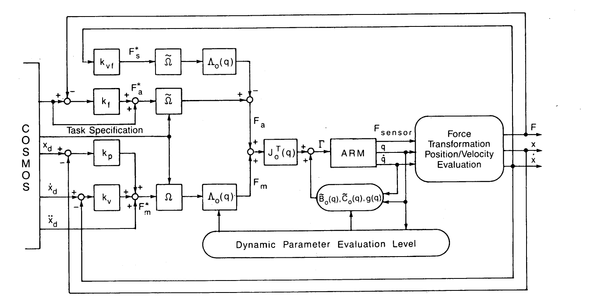

# Operational Space Formulation：机器人操作器运动与力控制的统一操作空间表述

这篇论文真正改变的不是一个控制增益，而是控制问题的表达方式。传统关节控制先给每个关节一个目标，再希望末端得到想要的运动；Khatib反过来问：如果任务本来就是“手沿某方向运动并在另一方向施力”，为什么不直接在末端任务空间定义动力学，再把结果映射成关节力矩？后来的操作空间控制、任务优先级和Whole-Body Control都继承了这个出发点。

## 从关节动力学得到任务空间动力学

机器人关节动力学给出质量矩阵、科氏/离心项、重力和关节力矩之间的关系，末端速度则由雅可比把关节速度映射到任务空间。关键不是简单使用雅可比转置，而是把关节空间惯量也一起映射过去，得到任务空间等效惯量 `Lambda`。这样，期望的任务空间加速度或力可以经过动态一致的映射变成关节力矩；控制器知道机器人沿不同方向“有多重”，而不是把所有方向当成同一种运动学误差。

冗余自由度也因此有了明确去处：主任务占用的方向由任务控制，剩余自由度通过动态一致零空间完成姿态、避限位等次任务，并尽量不扰动主任务。这里的“动态一致”很重要，普通伪逆只保证速度层面的投影，未必保证施加次任务力矩后主任务加速度不受影响。

## 运动与力为什么能放进同一框架

接触任务通常不是所有方向都做位置控制。例如末端沿平面切向移动，同时在法向维持接触力。论文用选择矩阵把任务空间分成互补的运动方向和力方向，两部分最后都通过同一套任务空间动力学进入关节力矩。它并不是让位置环和力环互相“抢控制权”，而是先规定各自负责哪些方向。

> **主要方法图：** Figure 3，PDF第7页，原图注为“Operational space control system architecture”。图中从任务空间运动/力目标出发，经过任务空间动力学补偿与坐标映射，最终形成关节力矩闭环。来源：[原论文](https://doi.org/10.1109/JRA.1987.1087068)。

## 放到人形机器人里还缺什么

论文以机械臂为主要背景，现代浮基人形还要显式加入基座欠驱动、多接触约束、摩擦锥、接触切换、力矩和关节限位。任务一多，单纯零空间投影也会遇到奇异、不可行和软硬优先级问题，因此后来出现层级QP、逆动力学和MPC。但这些方法仍在回答同一个问题：任务定义在哪个空间，动力学怎样映射，主任务与剩余自由度怎样分工。

复现时最先核对的不是增益，而是坐标系、雅可比参考点、质量矩阵、重力项和外力符号。模型不准、雅可比接近奇异或接触方向划分错误时，公式仍然成立，机器人却可能抖动、力失控或次任务反过来破坏主任务。

工程记录还应包含任务空间误差、估计外力、零空间力矩、奇异值和最终关节力矩饱和；只有这些量齐全，才能判断问题发生在任务定义、动力学映射还是执行器环。

## 原文

[论文原文](https://doi.org/10.1109/JRA.1987.1087068)
