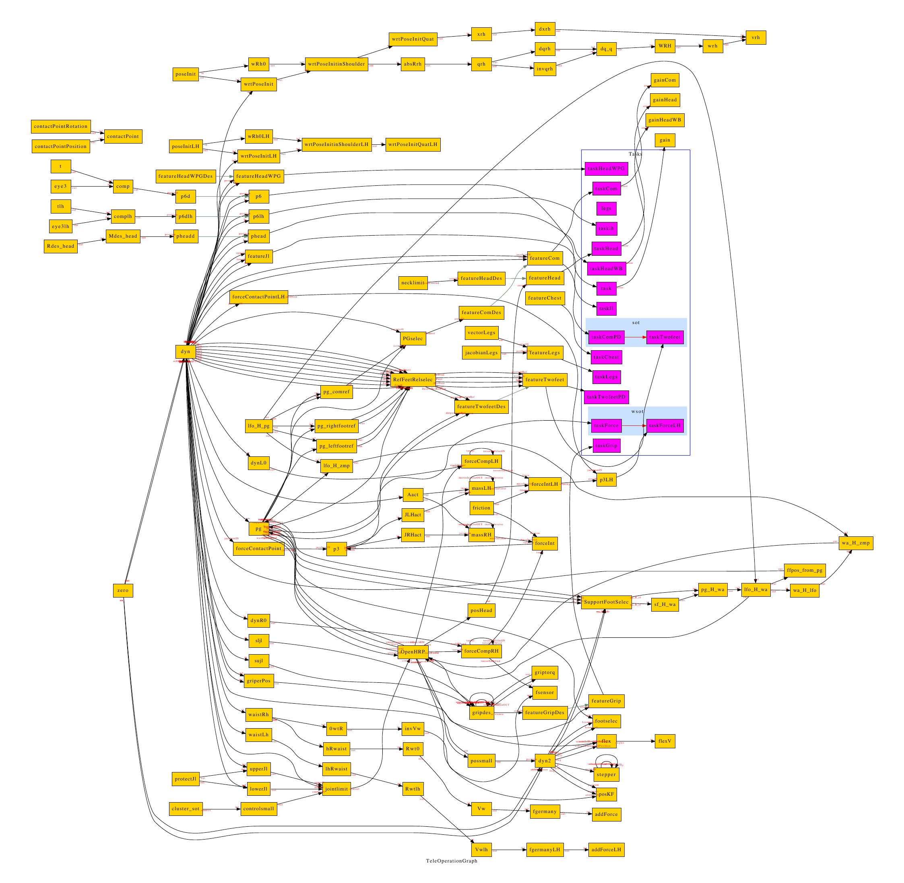

# Stack of Tasks：面向协作人形机器人的通用广义逆运动学任务栈

很多人第一次接触Stack of Tasks，会把它理解成“按顺序解几个逆运动学”。这篇论文更重要的地方，是把任务、约束、雅可比、数值求解和机器人状态组织成可动态组合的软件实体，让复杂人形行为不必写成一个不可维护的大控制器。

## 速度层的递归求解

每个任务提供当前误差、期望变化和对应雅可比。最高优先级任务先求一个关节速度解；下一任务只在前一任务雅可比的零空间里修正，依次向下堆叠。若低优先级目标与高优先级目标冲突，它只能完成可兼容的部分。关节限位、可视性、避碰等约束可以通过任务激活和不等式处理加入栈中，任务也能随行为阶段插入、删除或改变优先级。

求解器输入是当前广义位置、任务参考和各feature计算出的几何量，输出是广义速度或其积分后的姿态命令。任务对象将误差、雅可比、增益和激活条件封装在一起，solver只处理层级组合；这一软件边界使“看目标”“双手抓取”“保持质心”可以独立测试。它没有读取物体力或执行器状态，因此若接触任务需要力控，还要接操作空间/逆动力学层。

它解决的是广义逆运动学，不是完整逆动力学。输出首先是满足几何和速度任务的广义速度/轨迹，接触力、力矩饱和、浮基动力学和执行器带宽仍需要下游控制器处理。把SoT生成的可行姿态目标直接等同于真实机器人可执行动作，是常见误用。

在线运行时任务参考每个周期更新，求解出的速度经限幅积分后送给下游；环境变化通过feature误差进入下一次求解。若物体或接触状态改变，行为层必须更新任务栈，SoT不会自己推断“抓取已经失败”。任务依赖图还应避免循环，并确保所有feature使用同一时间戳状态。

> **系统结构图：** Figure 1，PDF第3页。图中不是神经网络，而是控制时刻内的实体图：机器人动态量、feature、task、solver以及它们的依赖关系。读图重点是一个任务怎样从当前状态计算误差和雅可比，再被栈式求解器组合。来源：[作者论文页](https://homepages.laas.fr/ostasse/hugo/fr/publication/int_conf/mansard-icar-09/)。

## 真正难的是任务切换和数值边界

任务接近奇异、雅可比秩变化或某个不等式刚刚激活时，伪逆和投影可能突变；动态插入任务也可能让关节命令不连续。实际系统需要阻尼伪逆、激活函数、速度/加速度限幅和一致的积分方式，并记录每层残差、有效秩和约束状态。否则“求解成功”不代表动作平滑。

复现可用固定姿态、接近奇异、任务冲突和动态插拔四组单元测试，记录关节速度连续性与高优先级残差，先验证求解器再上真机。

这篇适合与操作空间控制和层级逆动力学连读：P001说明任务空间力学怎样映射，本文说明任务怎样软件化并严格排序，后续WBC再把动力学、接触力和不等式约束统一进优化。

## 原文与实现

[作者论文页](https://homepages.laas.fr/ostasse/hugo/fr/publication/int_conf/mansard-icar-09/) · [Stack of Tasks代码组织](https://github.com/stack-of-tasks)
