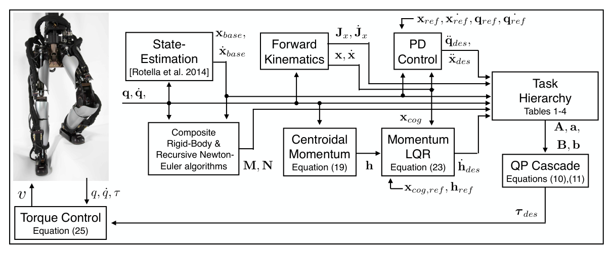

# Momentum Control：面向力矩控制人形机器人的分层逆动力学动量控制

力矩控制人形的难点不是算出一个好看的关节轨迹，而是同时满足浮基动力学、接触约束和任务优先级。本文把质心线动量与全身角动量作为高层平衡目标，再用层级逆动力学求关节加速度、接触力和力矩，让“机器人整体怎样运动”先于局部关节姿态。

## 决策变量怎样穿过动力学

控制器根据估计状态、接触集合和任务参考建立一组约束。浮基刚体动力学保证求得的加速度、接触力与关节力矩彼此一致；接触加速度约束让支撑点不随意滑动；摩擦和单边接触限制接触力；力矩与关节约束限制硬件可执行范围。在这些硬约束内，第一层跟踪期望质心/角动量变化，后续层再处理摆动脚、躯干、手和姿态。

决策量不是一条抽象“全身动作”，而是广义加速度、接触力与关节力矩的动力学一致组合。输入来自状态估计器、接触计划和各任务参考，输出最终力矩给真实执行器。动量目标通常由质心/姿态误差和期望外力形成，摆动脚与手等局部任务只能在高优先级动力学和接触可行域内优化。

论文使用层级逆动力学，而不是把所有任务塞进一个加权目标。这样平衡任务不会因为手部或姿态权重过大而被牺牲。代价是求解器必须可靠处理多层可行域，接触计划错了或上层任务本身不可行时，下层再聪明也救不回来。

接触切换是最关键的系统事件：新脚落地前后，约束集合、允许接触力和动量参考都会变化。控制器应依据接触检测修正计划，并对意外提前/延后接触设置过渡；若继续按错误支撑集合求力，优化器可能数学可行但真实脚已经滑动。

> **控制架构图：** Figure 4，PDF第9页。它展示状态估计、运动/动量参考、层级逆动力学和力矩接口怎样闭环。读图时要区分由规划器给出的参考、优化器内部求得的接触量，以及最终发送到真实关节的命令。来源：[原论文](https://doi.org/10.1007/s10514-015-9476-6)。

## 动量控制为什么适合全身任务

只跟踪质心位置可能忽略上身和四肢甩动带来的角动量；只跟踪关节姿态又很难直接表达外部接触对整体平衡的影响。Centroidal momentum把质量分布、关节运动和外力统一到一个全身量上，因此手臂补偿、受扰恢复和多接触任务有了共同接口。但它不是完整稳定性证明：状态估计误差、接触滑移、模型不准、通信和力矩内环都会破坏理论闭环。

复现时应同步记录任务残差、每层松弛、接触力、摩擦锥裕度、力矩饱和和求解时间。只看机器人站住，无法判断是动量目标真正被满足，还是低层阻尼和结构摩擦掩盖了问题。

还要与状态估计时间戳对齐，并在求解超时或不可行时定义保持、降级姿态或急停，不能把上一帧力矩无限复用。

## 原文

[论文原文](https://doi.org/10.1007/s10514-015-9476-6)
