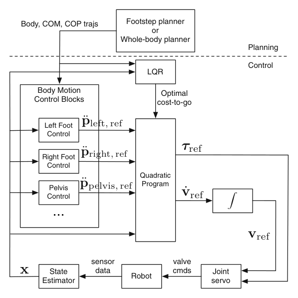

# Atlas Locomotion：面向Atlas人形机器人的优化式运动规划、估计与控制

动态人形系统常见的问题是每个模块单独看都合理：足步规划能给路线，轨迹优化能给全身动作，状态估计能给姿态，控制器能跟踪。但只要坐标系、频率、状态定义或延迟没有统一，整机仍然走不起来。本文的价值正是把规划、估计和控制放进同一条Atlas闭环，而不是只报告一个局部算法。

## 两类规划器给控制器什么

系统可以由足步规划器先决定接触位置和时序，再生成行走参考；也可以由全身运动规划器处理更复杂的身体与环境约束。规划结果不是直接发给电机，而是形成名义状态和输入轨迹。控制层围绕这条轨迹使用时变LQR等反馈，根据实时状态偏差修正动作；必要时LQR解可在线重新计算，降低真实机器人偏离名义轨迹后的敏感性。

状态估计与控制在高频闭环运行，融合机器人传感信息并给控制器提供浮基状态。规划线程和控制线程时间尺度不同：前者可以较慢地解决未来接触和轨迹，后者必须持续吸收估计误差与扰动。系统设计的关键是明确每一层消费什么状态、输出什么参考，以及旧计划在新状态下是否仍然有效。

计划的接口应包含接触位置/时序、名义状态和控制轨迹以及有效时间窗；估计器输出基座、速度和接触状态；反馈控制器再给关节执行命令。新估计与名义轨迹偏差超过阈值时，系统需要从当前状态重新规划，而不是继续沿旧轨迹加大反馈。不同线程应使用统一时钟并标记计划版本，防止控制器拿到一半新、一半旧的数据。

> **系统信号流：** Figure 6，PDF第14页。足步/全身规划器提供期望轨迹，控制器与状态估计器约以800 Hz闭环；LQR可在独立线程根据当前状态重算。图中不同频率和线程比具体模块名称更值得注意。来源：[原论文](https://doi.org/10.1007/s10514-015-9479-3)。

## 为什么这是“系统论文”而不是算法拼盘

每个模块的误差都会向下游传播：足步计划与实际接触不一致，名义轨迹就失效；估计漂移会让LQR围绕错误状态修正；控制饱和又会让真实状态进一步偏离。一个可运行系统必须提供重规划、状态重置、接触检测、饱和和故障处理，而不能假设所有模块总在设计点。

测试不应只跑完整行走演示，还要注入计划延迟、接触提前/延后、状态跳变和执行器饱和，记录重规划触发到新轨迹生效的时间。规划成功率、估计误差、轨迹跟踪与硬件保护应分别归因。

这篇没有证明优化方法天然优于学习方法，也不能直接代表现代Atlas版本。它提供的是长期有效的工程框架：计划、估计、反馈和硬件接口要在统一时序下接受测试。今天把RL策略放进系统，也仍应回答它替代了哪一层、下游谁保证约束、失败后由谁恢复。

这篇更适合作为系统集成基线：评估任何“端到端”方法时，都应先画出实际运行中仍存在的状态估计、低层伺服、保护和重置接口，再比较它究竟减少了哪些模块。

## 原文与相关代码

[论文原文](https://doi.org/10.1007/s10514-015-9479-3) · [Drake](https://github.com/RobotLocomotion/drake)
