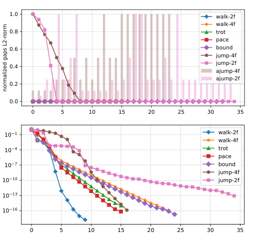

# Crocoddyl：面向多接触最优控制的高效通用框架

把人形或四足的动作写成最优控制问题并不难：状态沿动力学演化，控制有代价，接触会切换。真正难的是在高维、强非线性和接触不连续条件下尽快得到一条可执行轨迹。Crocoddyl的贡献不是一个任务策略，而是一套围绕机器人动力学导数、接触action model和DDP/FDDP求解器组织的开源框架。

## 从shooting到允许“有缝”的轨迹

单重射法只优化控制并从初态一路积分，长时域问题对初值非常敏感；多重射法把中间状态也作为变量，各段轨迹一开始可以不连续，这些不连续就是shooting gaps。求解过程中既降低任务代价，也逐步收紧各段之间的动力学缺口。

每个时间节点的action model定义状态、控制、接触动力学、残差代价和导数；free、contact与impact节点可组成一条完整多接触轨迹。求解器输入初态、接触序列与参考，输出状态和控制序列以及局部反馈增益。它生成的是模型上的名义计划，真机仍需MPC滚动更新或下游WBC跟踪。

FDDP的关键策略是不会在第一步就强迫高动态轨迹完全可行。对于跳跃等差初值问题，暂时保留部分gap可以获得更有用的下降方向，随后再把轨迹拉回动力学一致。框架还利用Pinocchio等工具高效计算刚体动力学和解析导数，并用不同action model表示自由运动、不同接触集合与冲击阶段。

在线使用时通常执行最前端控制，再从新估计状态移动时域并热启动下一次求解。模型误差、接触提前或目标变化可以通过重优化修正，但求解时间若超过控制预算，系统必须有上次反馈策略或安全控制器托底。Crocoddyl自身不负责感知对象、选择技能或判定任务完成。

> **关键机制图：** Figure 2，PDF第5页。论文没有一张完整系统总览，这张图直接显示不同动作中shooting gaps、步长和收敛率如何变化。简单步态很快闭合gap，高动态跳跃会在前几次迭代保留缺口，这是FDDP与“每步必须完全可行”直觉的差别。来源：[原论文](https://arxiv.org/abs/1909.04947)。

## 接触序列仍然是上游假设

Crocoddyl擅长在给定模型、代价和接触阶段下优化状态与控制，但它不自动解决开放世界里的接触发现。脚什么时候离地、手何时触物、碰撞模式如何切换，通常仍由任务设计、接触规划或外层搜索提供。错误接触序列可能让优化问题无解，或者得到数学可行但实际不鲁棒的轨迹。

工程上应保存初值、每轮代价、gap范数、KKT/停止条件、正则化、求解时间和最终约束裕度。只展示最后动作会掩盖最关键的问题：求解是否稳定、是否能在控制周期内更新、模型误差和接触偏差出现后怎样重规划。

复现还应报告导数检查、碰撞/摩擦参数、接触切换时刻和热启动来源，并对离线规划与在线MPC分别给出时延统计。

求解失败时的降级控制器也必须记录。

## 原文与代码

[论文原文](https://arxiv.org/abs/1909.04947) · [Crocoddyl代码](https://github.com/loco-3d/crocoddyl)
