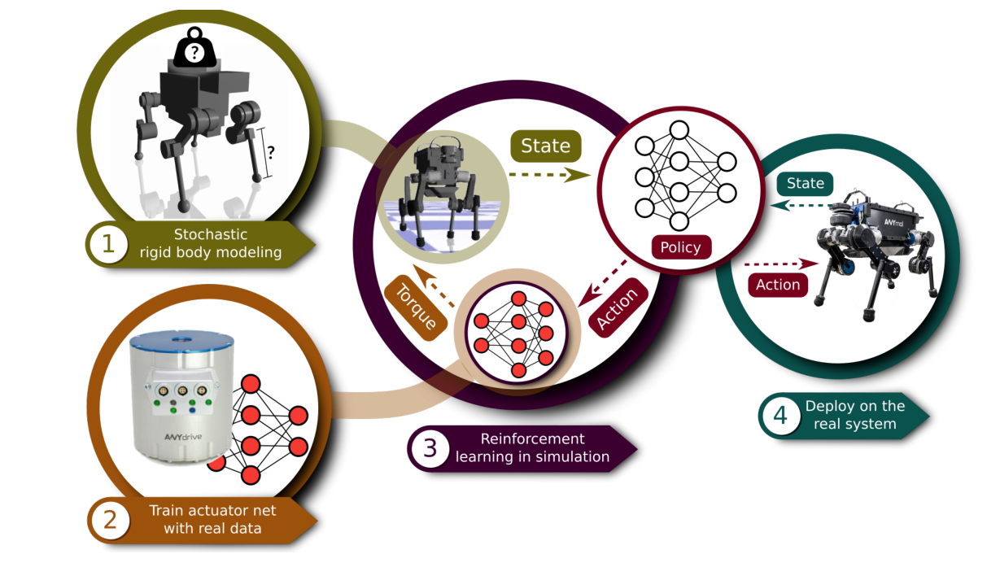

# Agile Motor Skills：面向腿式机器人的敏捷动态运动技能学习

这篇论文经常被概括成“PPO让ANYmal学会跑步和起身”，但PPO并不是最值得记的部分。作者真正建立的是一条可落地的训练链：先辨识刚体参数及其不确定范围，再用真实执行器数据训练一个执行器网络，把电机、传动和底层软件造成的非理想响应放回仿真，最后才在这个仿真中训练策略并直接下发到真机。它把策略学习与硬件建模放进了同一个Sim2Real问题里。

## 为什么仅靠刚体仿真不够

ANYmal的关节并不是“给多少目标力矩就立刻产生多少力矩”。命令会经过通信、驱动器、弹性元件和底层控制环，输出还与一段关节位置、速度和命令历史有关。如果仿真把执行器当成理想力矩源，策略会利用现实中不存在的瞬时带宽；随机质量和摩擦也补不回这类结构性误差。

作者先在真实机器人上采集关节响应，用监督学习训练Actuator Net，让它根据关节状态历史和控制命令预测实际关节力矩。策略在仿真中输出低阻抗关节位置目标，执行器网络再把这些目标转成更接近真机的力矩响应。刚体参数辨识解决“机器人主体大致是什么”，执行器网络解决“命令究竟怎样变成力”，两者角色不同。

> **主要方法图：** Figure 1，PDF第3页。四步依次是物理参数与不确定性辨识、执行器网络训练、控制策略训练和真机直接部署。来源：[原论文](https://doi.org/10.1126/scirobotics.aau5872)。

## 论文框架：从系统辨识到真机控制

图中第一步不是直接训练策略，而是先确定仿真中哪些物理量可信、哪些只能给出范围。作者围绕标称CAD模型辨识惯量和执行器相关参数，并采样30套随机ANYmal模型；质心位置、连杆质量等量在辨识结果附近变化。这样得到的不是一台“绝对准确”的虚拟机器人，而是一组可能的机器人。后续策略必须在整组模型上都能完成任务，才不会把某一个误差很小的仿真模型当成真机。

第二步专门处理刚体参数无法解释的执行器动态。作者让真机足端按5至10厘米幅值、1至25 Hz频率的正弦轨迹运动，并人工施加扰动，以400 Hz记录关节位置误差、关节速度和测得力矩；不到4分钟便从12个同构执行器获得超过100万组样本。三层、每层32个单元的执行器网络读取当前时刻以及前0.01秒、0.02秒的位置误差和速度，预测实际关节力矩。引入历史是因为通信延迟、串联弹性和内部电机控制状态不能由单帧误差确定。验证集上，该网络的力矩均方根误差为0.740 Nm，而把执行器视作无限带宽理想力矩源时为3.55 Nm。

第三步才是策略学习。每个控制周期，策略读取重力方向、基座高度和速度、机体角速度、12个关节的位置与速度、稀疏关节历史、上一动作和任务命令，输出12个关节位置目标。跌倒恢复策略会去掉无法可靠获得的基座高度。位置目标与实际关节状态形成误差历史，执行器网络把它转换成12维力矩，刚体仿真器再根据力矩和接触求出下一时刻状态。新状态重新进入策略，形成“观测、位置目标、预测力矩、刚体与接触、下一观测”的闭环。关节历史既帮助策略补偿执行器时延，也让它从关节受阻和速度变化中隐式判断接触。

任务奖励决定策略要形成哪种技能，力矩、速度和动作变化惩罚限制策略使用不可部署的高频动作；训练课程先让任务收益占主导，再逐渐加入扰动和正则约束。TRPO在约四小时内处理约2.5亿个状态转移。系统辨识给出中心模型，参数随机化给出可信邻域，执行器网络补上命令到力矩之间的结构性动态，三者不能互相替代。

部署时只保留本体状态估计、策略和真实机器人的底层关节控制链。执行器网络不会在真机上再次计算力矩，它只在仿真训练中代替真实执行器；真机自身的PD、PID、电流控制和机械传动自然产生训练时被拟合的响应。论文将命令跟踪和高速策略以200 Hz运行，跌倒恢复策略以100 Hz运行。环境反馈经IMU和关节编码器回到下一次策略推理，网络权重不在线更新。

真机结果说明这套链路能让ANYmal执行速度跟踪、快速奔跑和多姿态起身，并不意味着任意机器人套同一组随机化范围就会成功。执行器数据采集方式、位置目标缩放、策略频率、低层PD增益和真机安全限幅都是迁移合同的一部分。

## 对现在的人形运控仍然有用的判断

当策略在仿真很好、真机一落脚就高频抖动时，应先检查执行器与时序，而不是继续堆环境随机化：命令延迟是否一致，速度估计是否同相位，力矩饱和是否被建模，PD环是否与训练一致，关节摩擦和弹性是否遗漏。本文最长期的价值不是某个网络结构，而是告诉我们Sim2Real不能只做“世界参数随机化”，还要建模从策略动作到真实关节力的完整接口。

## 控制接口不能和策略权重分开

部署侧真正形成闭环的是“本体状态与短时历史 → 关节位置目标 → 低阻抗PD → 执行器真实力矩”。策略还接收任务指令，用不同奖励组合训练速度跟踪、姿态稳定、动作平滑、能耗和接触行为；起身等技能则使用与行走不同的初始状态和任务目标。论文没有把相机、高度图或显式地形模型放进策略，因此它依靠本体反馈处理扰动，而不是提前规划落脚点。

复现时应把状态估计来源、观测滤波、历史长度、动作缩放、策略与PD频率、增益、力矩限幅和执行器网络版本一起保存。域随机化只应覆盖经过辨识后仍合理的不确定范围；若训练范围远超硬件可能状态，策略可能用保守动作换鲁棒性。真机验收除速度和成功视频外，还应记录足端滑移、力矩饱和、峰值电流、温升、控制延迟和跌倒触发原因。

## 原文

[论文原文](https://doi.org/10.1126/scirobotics.aau5872)
