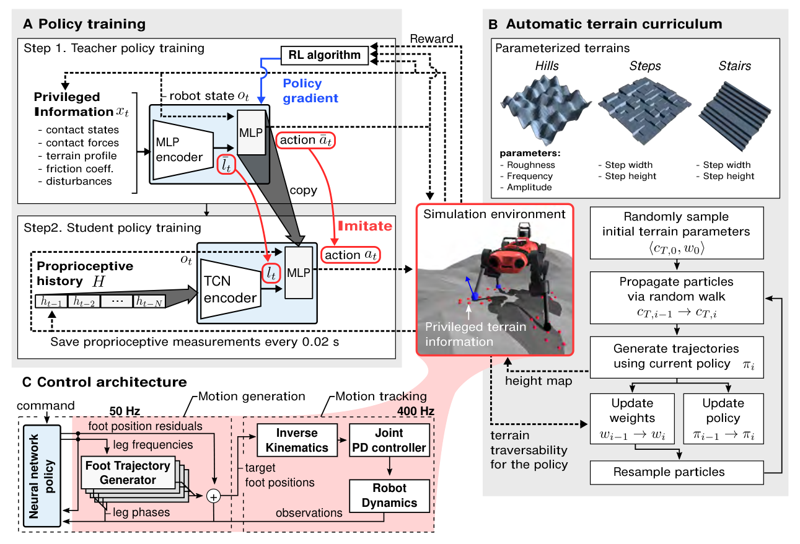

# Challenging Terrain Locomotion：复杂地形四足运动控制学习

这项工作的反直觉之处是：机器人走过泥、雪、碎石、植被和流水时，部署策略没有使用相机或激光雷达，而只依赖关节编码器和IMU。作者并不是认为外感知没有用，而是指出摩擦、松软、塌陷和脚下滑动很难从远距离视觉直接测准，身体与地面接触后的高速本体感觉反而是最可靠的反馈。

## 三个环节缺一不可

第一阶段训练特权教师。教师在仿真中能看到真实地形、接触和环境参数，因此容易学会跨越不同地形。第二阶段训练学生：学生只能看到一段本体感觉历史，用TCN同时模仿教师的动作和内部表征。历史窗口让网络从“命令与实际运动的差”中隐式判断落脚、打滑和地面形变，不再依赖显式接触阈值或滑移状态机。

第三个环节是自适应地形课程。作者不是均匀采样大量简单或根本过不去的地形，而用粒子式分布持续保留“当前策略有挑战但还能学”的参数区域。这样训练信号集中在能力边界附近，教师和学生都能随能力增长看到更难的地形。

> **主要方法图：** Figure 4，PDF第7页。A是特权教师到本体感觉学生的两阶段训练，B是自适应地形课程，C是学生通过运动基元的运动学残差形成控制命令，并用经验PD模型连接真机。来源：[原论文](https://doi.org/10.1126/scirobotics.abc5986)。

## 论文框架：特权教师、学生策略与真机闭环

教师训练阶段，速度和转向命令与可部署的本体观测一起进入策略，仿真器还额外提供足端周围的真实地形高度、接触状态与接触力、地面法向、摩擦系数、腿部碰撞和施加在机身上的外力。教师先把这些特权量编码成环境latent，再与本体状态共同生成动作。这个latent回答的不是“地形叫什么”，而是当前接触和地面属性会怎样改变身体运动；教师之所以需要它，是为了在早期探索时不必仅凭打滑或碰撞后果猜测环境。

下半部分的学生不能读取上述真值。它把最近一段命令、IMU、基座状态、关节状态、步态相位和历史目标送入时间卷积网络。论文使用的TCN-100覆盖100个按0.02秒间隔保存的历史测量，即约2秒本体历史；控制网络本身以400 Hz运行。时间卷积能在固定窗口中定位“哪条腿何时受阻、命令发出后关节是否按预期运动”，因此前脚碰到台阶后，即使该台阶已经离开直接接触，后腿仍可根据历史调整。学生同时拟合教师的16维动作和教师环境latent；只模仿动作会丢失教师用来区分摩擦、扰动与地形的中间信息。训练轨迹由学生实际执行，再由教师给当前状态标注动作和latent，这是DAgger避免学生一犯错便离开教师数据分布的原因。

训练地形由参数化课程产生。每种山坡、台阶或楼梯都由一组连续参数描述，粒子滤波器保留通过率处于0.5至0.9之间的参数区域：过于简单的地形不能提供新信号，几乎无法通过的地形又只会产生失败。策略能力提高后，粒子向更难区域迁移；历史中有价值的地形还会少量回放。该课程在教师和学生训练中都使用，改变的是训练样本分布，不改变部署控制器。

控制输出最终要落到电机。学生网络输出四条腿的相位频率修正和12维足端位置残差，共16维动作。四个足端轨迹生成器先按周期相位给出名义摆动轨迹，残差再修正抬脚高度和落脚位置；解析逆运动学把足端目标转换成关节位置目标。仿真训练时，经验关节PD模型根据位置误差历史预测力矩并驱动刚体；真机部署时，这个经验模型由真实关节PD和执行器取代。下一时刻的IMU与关节编码器读数重新进入TCN，闭合控制环。

因此这不是毫无结构的端到端力矩策略。周期运动基元提供稳定、计算量低的步态骨架，学习残差处理接触后的修正，时间卷积从本体历史恢复不可见环境影响。部署中教师、特权编码器、地形真值和训练奖励全部删除，只保留命令、本体历史、TCN学生、轨迹生成器、逆运动学与关节PD。论文没有使用相机、深度或触觉传感器；沟壑边缘和需要提前绕行的障碍仍不属于这套盲走闭环的能力范围。

同一策略在两代ANYmal和多种自然环境上零样本部署，说明本体感觉历史、特权蒸馏与课程学习可以覆盖多种接触后变化。它没有证明盲走可以替代所有外感知：沟壑边缘、落脚区域选择和需要提前绕障的任务仍需要视觉或地图。更准确的结论是，外感知负责提前判断可通行区域，本体感觉闭环负责接触发生后的快速适应，两者不应互相替代。

## 从特权地形到本体闭环的接口

教师训练时能够读取地形形状、接触和随机化参数，任务命令定义期望速度与转向；学生部署时只保留IMU、关节状态、上一动作及其历史。TCN既要逼近教师动作，也要恢复教师内部环境表征，因此隐变量更像“当前身体怎样受地面影响”，而不是一张可读高程图。策略输出对周期运动基元的关节残差，再由经验PD模型和真机PD执行，这条结构决定了动作范围与频率不能脱离基元和增益单独复用。

奖励与课程的作用也要分开：速度、姿态、接触、能耗和平滑奖励定义可用步态，地形课程只把样本集中到当前能力边界，动力学与执行器随机化才负责Sim2Real。复现应按地形材料分别记录速度误差、足端滑移、姿态偏差、恢复时间和失败前本体历史；若只看总通过率，就无法判断策略是在识别地面变化，还是用一种极保守步态覆盖全部地形。

## 原文

[论文原文](https://doi.org/10.1126/scirobotics.abc5986)
