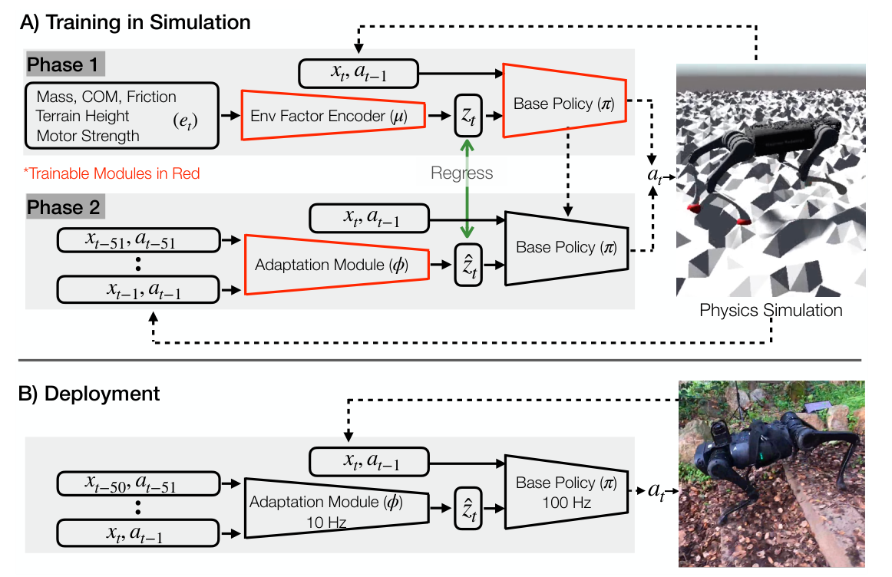

# RMA：面向腿式机器人的快速运动适应

RMA解决的是一个部署时问题：地面摩擦、负载、关节强弱和外部扰动会变化，但机器人不可能每换一块地面就重新做系统辨识、微调策略。作者把控制拆成高速Base Policy和低频Adaptation Module，让机器人从最近半秒左右的状态-动作历史里推断一个低维“外部条件”向量，再据此改变下一步动作。

## 先用真值教会策略如何适应

训练第一阶段，环境质量、摩擦、电机强度和负载等仿真真值先经过编码器压成8维latent `z`。Base Policy接收当前30维状态、上一动作和`z`，输出12个关节位置目标，并用PPO学习。此时策略学到的是：如果外部条件已知，什么反馈动作更合适。

第二阶段冻结这套控制能力，再训练Adaptation Module。它不再读取环境真值，而根据最近50步状态与动作预测同一个`z`。训练数据由学生预测参与滚动并由教师latent监督，目的是覆盖部署时自身预测误差造成的状态分布，而不只是拟合完美教师轨迹。

> **主要方法图：** Figure 2，PDF第2页。上半部分是两阶段训练，下半部分是部署：适应模块约10 Hz更新latent，基础策略约100 Hz输出关节位置目标，PD控制器再转成力矩。来源：[原论文](https://arxiv.org/abs/2107.04034)。

## 论文框架：快速策略与在线适应模块

第一阶段的输入分成两路。一路是30维当前状态：12个关节位置、12个关节速度、躯干横滚与俯仰，以及四个足端接触标记；再加上一时刻的12维动作。另一路是仿真器才能直接给出的17维环境因素，包括负载质量及其位置、电机强度、地面摩擦和足下局部地形高度。环境编码器用三层MLP把17维真值压成8维latent，基础策略再把当前状态、上一动作和latent映射成12个目标关节角。固定增益PD控制器以这些目标角计算力矩，机器人运动后产生下一组状态和奖励，PPO据此同时更新环境编码器与基础策略。

作者没有让策略直接读取17个物理参数，是因为多个环境因素可能产生相似的身体响应，而且控制并不需要逐项恢复真实数值。8维latent只保留“为了选动作必须知道的外部影响”，也让后续历史网络要预测的目标更小。如果直接把50步历史交给一个低频大策略，板载计算只能约10 Hz运行且容易出现不自然步态；把基础策略单独保留在100 Hz，快速平衡反馈不会被较慢的环境推断拖住。

第二阶段冻结已经学会控制的基础策略。适应模块读取最近50步状态与动作，先逐时刻编码，再用一维卷积提取“发出何种关节目标、身体实际如何响应”的时间关系，预测同一个8维latent。监督信号来自第一阶段的特权环境编码器，损失是预测latent与教师latent之间的均方误差。训练滚动使用适应模块自己的预测，而不是始终喂入完美latent，因此网络会见到预测偏差造成的状态，这一点避免了部署后误差连续累积。

实机只保留可部署的控制闭环。适应模块约每0.1秒更新一次latent，基础策略每0.01秒读取最新latent、当前状态和上一动作，输出新的目标关节角；PD控制器产生力矩，关节编码器和IMU返回下一时刻状态。17维环境真值、特权编码器、critic和奖励计算全部只存在于仿真训练，真机不做梯度更新。异步设计允许突然扰动先由100 Hz基础反馈处理，再由10 Hz latent逐步改变后续步态。

## 这个latent不是可解释参数估计

RMA并不要求预测“摩擦系数等于0.37”或“负载增加5 kg”。`z`只需让Base Policy产生正确动作，因此它可以混合表示多种不可辨识因素。论文中latent随打滑或突然负载发生变化，能说明适应模块捕捉到了影响控制的变化，但不能把每一维直接解释成某个物理参数。

异步设计也不是实现细节。低成本板载计算无法让较大的历史编码器与控制策略都以100 Hz运行，所以适应模块低频更新，控制策略始终使用最近一次latent。部署时要检查latent更新时间、历史缓存、线程延迟和时间戳；把两模块强行放进一个同步循环，反而可能改变论文成立的时序条件。

## 适合怎样用到人形机器人

当同一策略需要跨地面、负载或机器个体工作时，RMA提供了“特权训练、历史推断、快速反馈”的通用范式。但它能适应的变化仍受训练分布限制，突然硬件故障也不能只靠latent兜底。工程系统仍需电流、温度、接触和安全状态机监控，并把适应模块当作控制增强器，而不是故障诊断与安全保护的替代品。

## 任务奖励、随机化与状态估计的分工

Base Policy仍由速度指令驱动，任务奖励负责线速度/角速度跟踪，姿态、足端、能耗和动作变化等项抑制不可用步态；环境编码器并不替代这些目标。训练随机化构造摩擦、质量、载荷、电机强度和外力等条件，特权编码器把这些真值压入latent，适应模块只负责在部署历史中恢复对控制有用的等价表示。若随机化里没有某种变化，历史网络不会因为“会适应”就自动掌握它。

部署观测来自关节编码器、IMU和上一动作等本体信号，仍依赖可靠的姿态与角速度估计；论文没有视觉地形输入，也不显式预测接触力。复现应分别记录指令跟踪误差、latent更新时间、扰动后恢复时间和超出训练范围时的失败方式。特别要避免把适应模块预测误差与主策略缺陷混在一个总体成功率里，否则很难判断该扩大随机化、改历史表示还是重新设计基础步态。

## 原文与项目

[论文原文](https://arxiv.org/abs/2107.04034) · [项目页](https://ashish-kmr.github.io/rma-legged-robots/)
