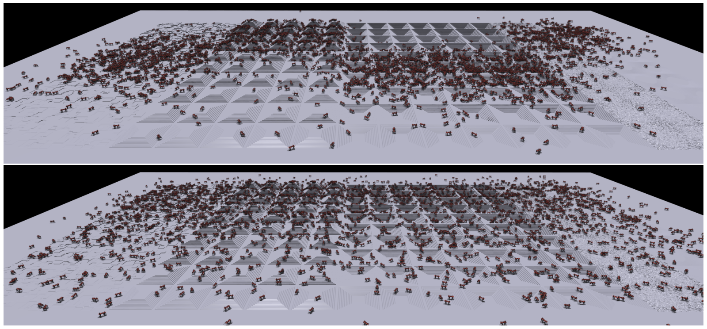

# Learning to Walk in Minutes：基于大规模并行深度强化学习的快速行走训练

这篇论文的贡献不是发明了新的腿式控制器，而是把仿真、观测与奖励计算、策略推理和梯度更新都留在GPU上，使数千台机器人并行采样不再被CPU-GPU数据搬运卡住。ANYmal策略能在单张GPU上不到20分钟训练完成，重要的结果是“迭代一次策略的成本”被压低，奖励、随机化和本体改动可以真正做快速实验。

## 整体思路

作者把训练系统组织成一个完全驻留在GPU上的闭环。4096个环境各自连续采样24步，形成98,304条转移后直接进行一次PPO更新。仿真状态不必逐帧搬到CPU，策略推理、奖励计算和轨迹缓存也都在同一设备完成，因此1500次更新可以压缩到20分钟以内。这里仍然是标准的on-policy PPO，论文改变的是采样和计算方式，而不是策略梯度原理。

策略读取速度命令、本体状态、上一动作和机器人周围108个地形高度点，输出关节位置目标，再由PD与执行器模型产生力矩。奖励同时约束速度跟踪、非目标方向运动、力矩、关节加速度、动作变化和碰撞。并行环境让这些设计能够快速反复验证，但不会自动替代奖励判断。

另一个关键设计是地形课程。训练场按平地、坡面、粗糙面、离散障碍和楼梯等类型划分，每种地形内部再从易到难排列。机器人完成当前地块就进入更难一级，失败则回退，使样本长期集中在策略刚好有机会学会的能力边界。

> **地形课程示意：** Figure 3，PDF第5页。上下两幅分别显示训练500次和1000次更新后，机器人在不同地形难度上的分布。它直观说明成功升级、失败回退怎样让课程随策略能力推进。来源：[原论文](https://arxiv.org/abs/2109.11978)。

## 从训练到真机

策略以50 Hz输出关节位置目标，真机从激光雷达高程图中查询与训练一致的108个局部高度点。部署时只保留观测构造、策略、动作缩放和低层PD，critic、奖励、课程等级及仿真真值全部退出。训练中还随机化地面摩擦并施加外部扰动，用于覆盖部分接触和模型误差。

这条迁移链最依赖的不是PPO参数，而是机器人模型、状态估计、高程图坐标、控制周期、动作缩放和PD增益是否一致。论文没有在策略后增加独立滤波器或约束求解器，接口错位会直接反映成真机动作偏差。

## 这篇工作真正留下了什么

Legged Gym留下的是高吞吐训练范式、地形课程和一套可复用的腿式强化学习接口。环境更多并不必然更好：rollout太短会削弱时间连续性，batch过大又会增加优化成本；达到时长上限的episode也必须与真正跌倒区分处理。它最适合作为快速做奖励消融、随机化实验和模型回归的工程基线，而不是“训练时间短就等于运动能力强”的证据。

## 原文与代码

[论文原文](https://arxiv.org/abs/2109.11978) · [legged_gym](https://github.com/leggedrobotics/legged_gym)
