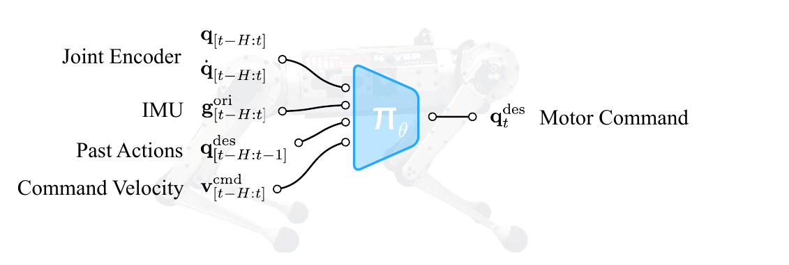

# Rapid Locomotion：基于强化学习的高速运动控制

Mini Cheetah跑到高速度时，线速度和转向速度不是两个可以独立拉满的旋钮：高速急转可能超出摩擦、支撑和执行器能力。如果训练一开始就在整个命令空间均匀采样，大量命令不可完成，策略最容易学到的是原地抖动或保守步态。本文的主线因此是“怎样自动扩展可学习的速度命令空间”，并把在线系统辨识一起放入高速控制器。

## 整体思路

第一部分是Grid Adaptive Curriculum。作者把前向速度与偏航角速度组成的二维命令空间划成网格，只在策略已经能够稳定跟踪的格子周围扩展采样。这样学到的是机器人的真实联合能力边界，例如高速直行可行，但相同线速度下高速急转可能不可行；普通矩形课程无法表达这种关系。

第二部分是在线动力学适应。训练时，特权编码器把摩擦、负载、质心偏移和电机强度等随机化参数压成8维latent，策略据此学习不同动力学下应当怎样执行同一个速度命令。部署时这些参数无法测得，适应模块改用最近15步观测与动作估计latent，再交给同一个策略主体。

> **部署策略结构：** Figure 2，PDF第2页。网络接收当前本体观测和适应模块给出的动力学表示，输出12个期望关节位置。该图说明在线控制接口，论文更关键的贡献仍是命令课程与动力学适应的组合。来源：[原论文](https://arxiv.org/abs/2205.02824)。

## 控制闭环怎样运行

Mini Cheetah的当前输入共42维，包括关节位置与速度、机体系重力方向、上一动作以及前向、横向和偏航速度命令。策略以50 Hz输出12个期望关节位置，固定增益PD根据关节误差产生力矩。适应模块同步读取15步历史，用命令发出后的真实身体响应判断当前动力学是否发生变化。

训练时，PPO同时优化速度跟踪、姿态、接触和动作质量，适应损失则让历史估计的latent接近特权编码器结果。部署时删除特权编码器、critic与奖励，只保留历史缓存、适应模块、策略和PD。论文报告最高3.9 m/s直线速度；在6 m/s命令下，加入适应模块后平均实机速度由2.49 m/s提高到3.81 m/s。

## 应当怎样理解这项结果

课程解决“哪些命令值得继续训练”，适应模块解决“相同命令在当前动力学下怎样执行”，两者处理的是不同问题。论文没有视觉或高度图，室外表现来自本体反馈和动力学适应，而不是提前识别地形。

复现时最有价值的结果不是单次最高速度，而是整个速度-转向网格上的跟踪误差、跌倒率、电机饱和和温升。迁移到人形机器人时也不能照搬Mini Cheetah的命令范围，应根据执行器峰值、支撑结构、腿长和跌倒代价重新建立可行边界。

## 原文与项目

[论文原文](https://arxiv.org/abs/2205.02824) · [项目页](https://agility.csail.mit.edu/)
