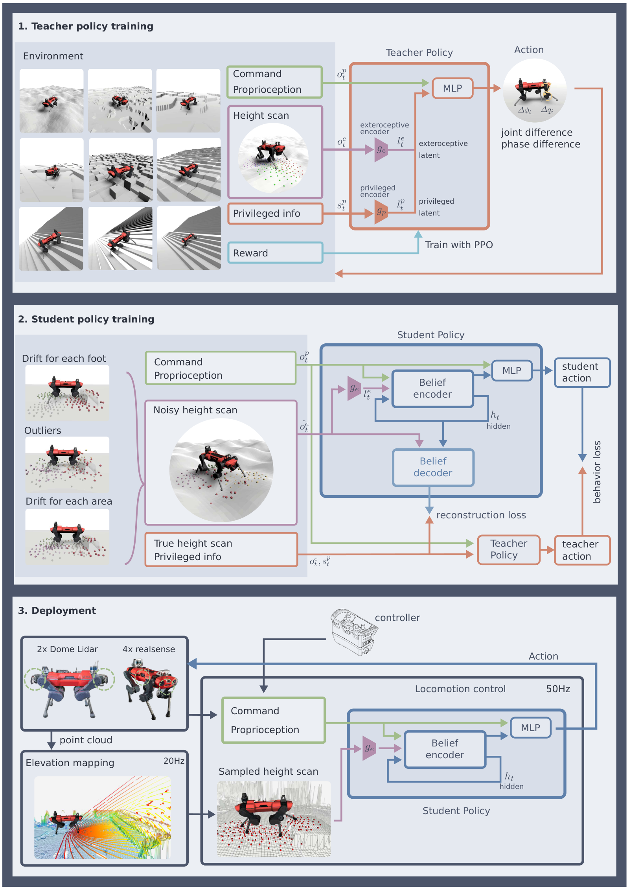

# Robust Perceptive Locomotion：面向野外四足机器人的鲁棒感知运动控制

常见感知运动管线把点云融合成2.5D高程图，再把地图高度送给控制器。问题是雪、植被、反光、遮挡、位姿漂移和视野外区域都会让地图出现假台阶或空洞。本文没有假设地图总是正确，而是让一个循环Belief Encoder把带噪地形观测与本体感觉历史融合成信念状态，控制器可以在外感知可靠时提前调整，在外感知异常时退回身体反馈。

## 教师知道真相，学生学习处理不完整观测

第一阶段的教师在仿真中能看到无噪地形、接触和环境参数，用PPO得到高性能策略。第二阶段学生接收真机可得的本体感觉和被系统性破坏的高度采样：随机偏移模拟里程计漂移，大噪声和遮挡模拟传感器失效，局部错误模拟地图异常。循环编码器从历史构造belief，策略模仿教师动作；同时解码器要求belief重建无噪高度与特权状态。

行为克隆损失回答“下一步动作是否像教师”，重建损失回答“中间表示是否保留了与控制有关的环境信息”。编码器中的门控决定多少外感知进入belief，因此策略不必在每一帧都同等相信地图。

> **训练与部署图：** Figure 5，PDF第10页。教师用特权真值训练；学生在模仿动作的同时重建真实环境状态；部署时输入来自机器人中心高程图的高度采样。来源：[原论文](https://arxiv.org/abs/2201.08117)。

## 论文框架：特权教师、环境重建与真机部署

图的第一层是教师策略。仿真器向教师提供三类输入：速度命令；本体观测，包括机体速度与姿态、关节位置和速度历史、动作历史及四条腿的相位；以及每只脚周围五个半径上的208个无噪高度样本。教师还可以读取足端接触状态、接触力与法向、摩擦系数、腿部碰撞、外力和摆动时间等特权量。高度编码器把四只脚附近的几何压成96维地形latent，特权编码器再生成24维接触与动力学latent，主MLP据此输出16维动作：四条腿的相位修正和12个关节位置残差。PPO奖励让动作跟踪目标速度，同时约束足端净空、碰撞、滑移、力矩和目标平滑。

学生训练位于图的中间。它看到的高度样本会被整体偏移、分脚偏移、局部异常值和噪声破坏，模拟定位漂移、点云空洞和植被反射。两层、每层50个隐藏单元的GRU把带噪高度与本体历史压成120维belief，其中96维对应地形，24维对应接触和环境影响。额外的96维门控向量决定当前时刻应相信多少外感知：连续几帧地形与足端反馈一致时保留高度信息，碰撞、打滑或整图漂移使两者矛盾时降低其权重。GRU必须保留此前的落脚、碰撞和地图变化，因为相机遮挡或姿态估计错误可能持续多个控制周期，单帧MLP无法判断这是一处真实台阶还是短时测量错误。

学生有两类训练信号。行为克隆损失让学生动作接近教师动作，保证它先获得可行步态；belief解码器则尝试从120维表示重建无噪的208个高度样本和24维特权状态，迫使中间表示保留“地形实际在哪里、当前是否打滑或受外力”而不是只记住动作捷径。训练轨迹由学生执行，教师对学生访问到的状态给动作标签。解码器和特权真值只负责训练，部署时不参与控制。

真机链路从机载感知开始。两台圆顶激光雷达或四台RealSense相机先输出点云，定位与GPU高程建图以20 Hz把它融合成机器人中心2.5D地图，策略从最新地图按相同模式采样208个高度。速度命令、本体状态和高度样本进入学生belief与MLP，控制器以50 Hz输出相位修正和关节位置残差；周期足端轨迹与解析逆运动学形成最终关节目标，关节PD执行后，新的接触、IMU和编码器数据返回下一周期。真实地形、摩擦、外力、教师、critic和解码器全部删除。

这条闭环也解释了能力边界。门控可以在短时错误时退回本体感觉，却不能恢复高程图从未表示的悬空结构，也不能修正长期错误的世界坐标。真机盲住传感器后仍能碰撞式上楼，说明接触反馈可以补救已经发生的误判，不等于机器人能够提前看见台阶。

## 控制器看到的不是原始点云

真机上，深度数据先经过机器人中心高程地图，再按固定模式采样高度。策略动作是步态相位差与关节位置残差，而不是直接规划每个足端接触点。地图构建、状态估计和控制策略仍是三个接口，只是belief让最后一层对上游误差更鲁棒。

论文在ANYmal野外部署中展示了楼梯、岩石、雪地等场景，并通过内部belief可视化说明传感失效时策略会调整依赖程度。但它没有解决2.5D地图不能表示悬空结构的问题，也不能从视觉直接判断所有材料属性。工程复现应人为注入整图偏移、局部坑洞、冻结帧、延迟和完全失明，分别测成功率，而不只在干净仿真高度图上评估。

## 地图、belief和动作之间的边界

深度传感器、定位与高程图模块先把环境变成机器人中心的高度采样；Belief Encoder再把该采样与关节、IMU、命令和动作历史融合。学生并不输出地形，而是输出步态相位与关节位置残差，底层PD负责执行。训练时无噪高度和物理参数只进入教师与辅助重建目标，不能在真机偷偷补给actor。这个信息边界是判断论文是否真正可部署的关键。

上游误差应按类型评测：位姿漂移会让整张地图相对机器人平移或旋转，深度空洞制造虚假坑洞，时延让障碍位置落后于当前身体，视野遮挡则让局部区域完全缺失。Belief能利用历史降低短时错误，却无法纠正长期错误坐标系或未见悬空几何。复现日志应同步保存原始深度、地图切片、belief输入、动作和足端接触，才能区分地图失败、融合失败和低层控制失败。

## 原文

[论文原文](https://arxiv.org/abs/2201.08117)
