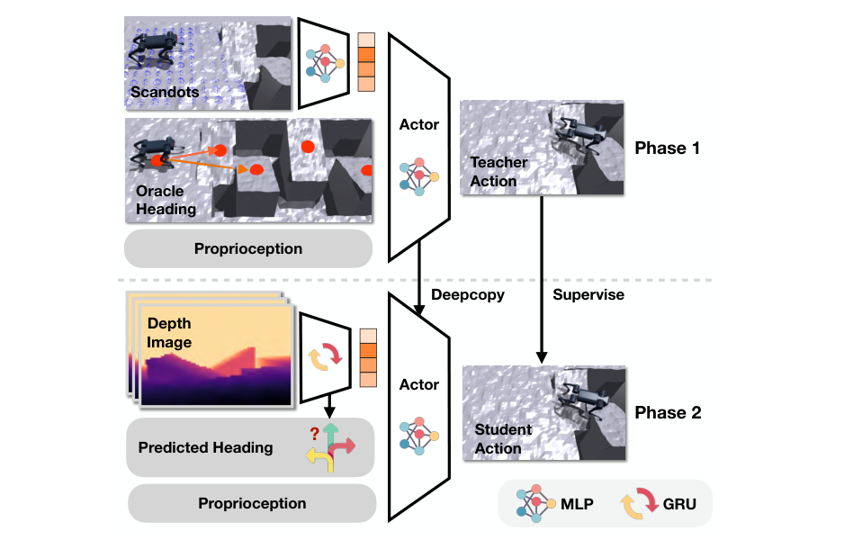

# Extreme Parkour：面向腿式机器人的极限跑酷控制

高动态跑酷和普通越障的差别在于，机器人必须在到达障碍前就积累正确动量；起跳时再纠正方向已经来不及。本文用一张前视深度图和本体感觉，让同一个Unitree A1策略完成高跳、远跳、斜坡跳跃和前腿倒立。核心不是给每种技能单独训练一个专家，而是同时解决动作、地形和航向三个变量。

## 第一阶段：在仿真真值里把动作学会

策略先接收本体感觉、环境参数、scandots地形采样、速度命令和由人工布置waypoint给出的目标航向。PPO负责学习动作，ROA从观测历史估计环境信息。作者使用基于向量内积的统一进度奖励：只有沿目标方向前进才得到有效收益，并配合清障和安全项，让不同障碍共享一套目标表达，而不是给“跳高、跨沟、倒立”分别写完整奖励表。

## 第二阶段：把两个不可部署输入一起替换

真机既拿不到scandots，也没有专家实时给最佳航向。学生用CNN-GRU把深度图变成地形表示，同时预测下一步航向，并通过DAgger模仿第一阶段教师动作。航向预测从未预训练的视觉分支开始，若一上来完全闭环会造成严重分布漂移，因此训练中逐步把教师航向切换为学生预测航向。

> **主要方法图：** Figure 2，PDF第5页。Phase 1用scandots、环境真值和waypoint航向训练；Phase 2把地形输入蒸馏到机载深度，并让网络自动决定yaw方向。来源：[原论文](https://arxiv.org/abs/2309.14341)。

## 论文框架：从特权地形输入到机载深度控制

Phase 1先在仿真真值上把跑酷动作学出来。教师接收Unitree A1的关节、IMU、上一动作等本体观测，地形表面采样得到的scandots，用户给出的速度和手倒立开关，以及由场景waypoint计算的目标航向。scandots直接告诉策略障碍几何，waypoint告诉它应该以什么角度接近斜坡或沟壑；这两类输入在真机都不能直接获得，但它们把“动作没学会”和“视觉没看懂”两个问题暂时分开。策略输出12个关节角命令，由低层关节控制器执行。

图中ROA从本体历史估计仿真环境参数。它关注的是质量、摩擦、执行器误差和扰动怎样改变身体响应，不负责理解障碍外形。地形scandots与环境latent一同进入动作网络，PPO用沿目标航向的世界坐标进度作为统一任务信号，再加入边缘净空、姿态、碰撞、能耗和动作正则。世界坐标进度避免机器人通过绕着障碍转身来刷取机体系速度奖励；waypoint则给倾斜跳台提供精确进场方向。

Phase 2同时替换两个不可部署接口。深度图先进入卷积网络提取障碍边缘与距离，再由GRU整合连续帧，输出可替代scandots的地形latent；同一视觉分支还预测目标偏航角，替代人工waypoint。卷积层回答当前画面“哪里有台阶、缺口或斜坡”，GRU记录障碍靠近和离开视野的过程，防止机器人起跳后因为边缘不再可见而丢失目标。DAgger让学生动作真正推进仿真，再由Phase 1教师为学生访问到的状态标注动作，因此视觉误差引发的偏航或提前起跳也会进入训练集。

航向分支一开始没有预训练，若立即把错误预测送回动作网络，学生会进入教师从未覆盖的姿态，教师标签也不再有意义。论文的MTS规则只在预测航向与教师航向相差小于0.6弧度时采用学生结果，否则继续使用教师方向；随着预测变准，闭环自然转向学生。这个门控解决的是训练分布漂移，部署时没有waypoint兜底。

实机上RealSense D435约以10±2 Hz采集深度，裁掉无效像素后缩放到58×87；视觉骨干以10 Hz更新地形latent和航向，基础策略以50 Hz读取最新结果。作者把视觉链路延迟固定为0.08秒、本体链路固定为0.016秒，避免可变抖动改变起跳时刻。教师scandots、waypoint、环境真值、ROA监督、critic和奖励均退出，只保留深度CNN-GRU、本体策略、关节目标接口与低层控制。环境执行后的新深度和本体状态再次进入网络，形成视觉与动作闭环。

## 时序接口决定视觉策略是否真能跑

部署中深度相机约10 Hz，基础策略约50 Hz，两者通过异步通信连接；作者还把深度总延迟固定在约0.08秒，避免处理时间抖动。动态技能对“看到障碍的时间”和“动作实际执行的时间”非常敏感，所以相机帧率、时间戳、缓存与固定延迟建模和网络结构同样重要。

论文证明了单策略可以从自视角深度选择并执行多种四足跑酷行为，但障碍类型、尺寸和测试平台仍受训练设计约束。“端到端”也不意味着没有人工结构：waypoint教师、统一奖励、课程、ROA、DAgger和深度预处理共同组成了系统。

## 命令、奖励和真机闭环

部署策略看到的是深度帧、本体状态与用户速度/目标方向，输出关节位置目标并由PD执行；训练教师额外看到scandots、环境参数和理想航向。进度奖励只在机器人沿目标方向运动时给收益，清障、安全、姿态、能耗和动作平滑项防止策略用碰撞或失控换进度。ROA从状态历史估计不可见环境因素，视觉分支则负责障碍几何与航向，两者不能混成一个“感知latent”来解释。

真机时应把10 Hz深度、50 Hz策略与更高频关节环的时间戳分别记录，并验证固定延迟与实际相机处理延迟是否一致。跑酷失败常由起跳时刻而非最终姿态造成，所以除成功率外还要测障碍边缘估计误差、起跳距离、落脚位置、峰值关节命令和碰撞部位。论文没有提供语义避障或未知技能规划，训练外障碍仍可能使网络选择错误动作。

## 原文与项目

[论文原文](https://arxiv.org/abs/2309.14341) · [项目页](https://extreme-parkour.github.io/)
