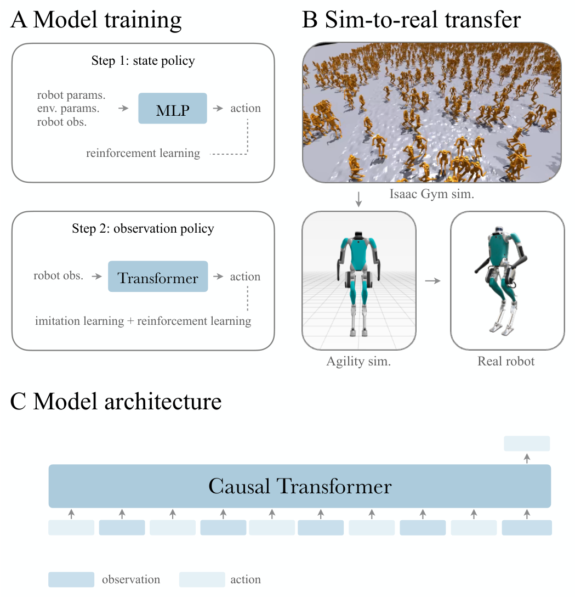

# Real-World Humanoid Locomotion：基于强化学习的真实世界人形运动控制

这篇工作的实机是Agility Robotics的Digit，不是Berkeley Humanoid。作者让一个因果Transformer读取过去的本体观测与动作，为16个主动关节预测下一组PD位置设定值，并为其中8个腿部关节预测PD增益；策略只依赖本体感觉，没有相机或显式地形参数。它想验证的是：历史里包含“命令发出后机器人实际怎样响应”，序列模型能否据此在不更新权重的情况下调整步态。

## 为什么先训练特权教师

直接在带噪部分观测上用RL训练Transformer，探索慢且资源消耗大。作者先在完全可观测状态上训练MLP教师，再训练观测策略。学生目标由两部分组成：一部分通过KL约束模仿教师分布，另一部分直接优化环境奖励；教师约束在训练过程中逐渐衰减，让学生先获得可行行为，再有机会适应自己的观测空间并超过纯模仿上限。

每个时间步的观测-动作对被编码成token，因果注意力只能读取当前与过去，输出下一动作。仿真中随机化动力学、观测噪声和延迟，先在Isaac Gym大规模训练，再在厂商高保真仿真中做迁移检查，最后零样本上Digit。

> **主要方法图：** Figure 7，PDF第17页。A是状态教师到观测学生，B是GPU仿真、厂商仿真到真机的验证链，C是因果Transformer按历史自回归预测动作。来源：[原论文](https://doi.org/10.1126/scirobotics.adi9579)。

## 论文框架：特权教师、因果Transformer与Digit部署

论文框架先训练状态教师。仿真器把机器人观测、机器人动力学参数和环境参数交给MLP教师，教师用PPO输出动作。这里的参数包括真机无法直接读取的质量、接触和地形等训练状态，它们让教师在探索阶段明确知道“为什么相同关节命令产生了不同响应”，因而能较快形成可行步态。教师由四层MLP组成，隐藏层为512、512、256和128；它只负责提供训练起点，不进入最终真机控制。

第二步训练观测学生。学生不再读取机器人与环境参数，而把最近16个观测-动作对组成上下文。每一对先经MLP投影成token并加入位置编码，四个因果Transformer块再用四头注意力比较不同时刻的token。192维隐藏表示可以把“上一时刻要求腿抬起、当前关节却受阻”“速度命令不变、机身实际速度却下降”之类的命令-响应关系联系起来，从历史中隐式识别接触、负载、坡度和延迟。因果掩码禁止网络读取未来信息，保证训练推理与50 Hz在线控制使用同一种信息边界。最终的256、128单元动作头根据最新token预测下一动作；完整模型约140万参数。

学生目标不是单纯复制教师。训练初期，KL散度约束学生动作分布接近状态教师，避免部分观测下从零探索导致频繁跌倒；同时PPO继续根据真实环境奖励更新学生，使它能在自身观测空间里修正教师不适用的动作。教师约束权重逐步衰减，并通常在训练中点降为零。这样，模仿负责把学生带入可行步态区域，强化学习负责处理“教师看到真值、学生只能看到历史”造成的策略差异。训练数据来自当前策略的在线仿真滚动，不依赖预先录制的动作轨迹或步态库。

动作端也不是简单的16维位置输出。策略给Digit的16个主动关节生成PD位置设定值，并为8个腿部主动关节预测PD增益；四个脚趾电机不由策略控制，而使用默认位置和固定增益。可变腿部增益使策略能在支撑、摆动和碰撞后调整关节刚度，位置目标和增益一起交给1 kHz关节PD环。电机作用于机器人后，关节编码器和IMU产生下一观测，再与上一动作一同追加到16步上下文。论文公开正文没有逐项披露学生单帧观测的完整维度，因此不能从相邻工作推测其每个向量长度。

方法中包含两次目的不同的迁移。训练在四张A100上的数千个Isaac Gym随机环境中进行；由于Isaac Gym不能准确表示Digit膝部、胫骨、跗骨和脚趾形成的欠驱动闭链，作者用高刚度虚拟弹簧和交替子步近似连杆约束。训练完成后，权重原样进入Agility提供的高保真仿真，该仿真准确实现闭链与实机传感噪声，只用于淘汰危险策略，不继续训练。最后相同网络以50 Hz部署到Digit，底层PD为1 kHz。真机只保留关节编码器、IMU、16步缓存、Transformer、动作头和PD；教师、特权参数、critic、奖励和Isaac Gym虚拟弹簧全部退出。

这也限定了“上下文适应”的含义：Transformer不会在线更新权重，而是根据上下文改变当前动作。脚被台阶卡住后，期望与实际关节响应的差异进入后续token，网络才提高抬腿或调整步态；没有相机时，它不能在接触前看见沟壑或规划落脚点。

## “In-context adaptation”应怎样理解

论文中的in-context不是语言模型式任务推理，也不是部署时梯度更新。机器人脚碰到未见过的台阶后，后续观测显示实际关节运动没有按命令发生；Transformer利用这段误差历史提高抬脚动作。斜坡、负载和外力下的步态变化也属于同类反馈适应。它仍受历史窗口和训练随机化覆盖限制，不能把任何新环境都推断成正确控制规律。

真机测试展示了户外地面、扰动、负载和脚部卡碰恢复，论文还比较了Transformer、历史长度以及“模仿+RL”的作用。由于策略没有外感知，它可能撞上台阶后再反应，不能提前选择落脚点；因此这项工作更像强本体闭环底座，而不是完整自主导航系统。

## Digit上的观测、动作和训练目标

策略接收速度类任务命令以及关节编码器、IMU、身体状态和上一动作形成的因果历史，输出Digit的16个主动关节PD位置设定值和8个腿部关节PD增益。教师使用完整仿真状态，学生只能使用部署时可获得的观测；KL项先把学生拉到教师附近，环境奖励继续优化速度跟踪、稳定、能耗和动作质量。历史Transformer隐式吸收延迟、负载和接触后的响应差异，但没有显式输出摩擦、质量或地形参数。

Sim2Real链路包含GPU训练仿真、厂商高保真仿真和真实Digit三道环境，动力学、观测噪声、时延和扰动随机化都必须与动作频率、PD增益及状态估计一起版本化。论文展示的碰撞后适应依赖碰撞已经反映到本体历史；面对深坑、悬崖或高速障碍，安全系统不能等待策略“碰一下再学会”。实机复现应记录指令范围、历史窗口、端到端延迟、外部保护与人工接管条件，而不只报告能否走过某段地面。

## 原文与项目

[论文原文](https://doi.org/10.1126/scirobotics.adi9579) · [项目页](https://learning-humanoid-locomotion.github.io/)
