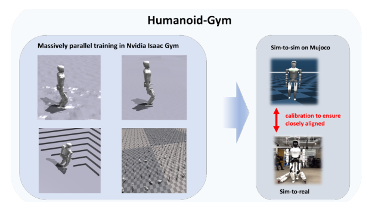

# Humanoid-Gym：面向人形机器人的零样本Sim2Real强化学习框架

Humanoid-Gym并没有提出全新的RL算法，它的价值是把人形PPO训练、模型标定、domain randomization、MuJoCo sim-to-sim和XBot真机部署放进一个公开管线。对刚进入人形运控的人，这比只给一段训练代码更有用，因为很多迁移问题并不出现在PPO loss里，而出现在URDF、关节方向、PD参数、动作缩放和控制频率的接口上。

> **系统管线图：** Figure 2，PDF第2页。策略先在Isaac Gym的大规模并行环境中训练，再转到MuJoCo检查跨物理引擎行为，最后部署到真实XBot-S/XBot-L。来源：[原论文](https://arxiv.org/abs/2404.05695)。

## 整体思路

第一步是在Isaac Gym中用8192个并行环境训练PPO策略。Actor每帧读取步态时钟、速度命令、关节状态、机体角速度、欧拉角和上一动作，共47维，并使用最近15帧历史；它输出12个关节位置目标，以100 Hz运行，底层PD以1000 Hz产生力矩。Critic训练时可以额外读取摩擦、质量、真实基座速度、外力和足端接触等仿真真值，但这些信息不会进入真机Actor。

步态时钟为左右腿提供周期参考，奖励则同时约束速度跟踪、身体姿态、周期接触、关节姿态、能耗、动作平滑和过大接触力。随机化覆盖观测噪声、0至10毫秒延迟、0.1至2.0摩擦、电机强度和附加载荷，使策略在训练阶段经历一部分真实偏差。

第二步不是直接上机，而是把同一策略无训练地放入MuJoCo。作者还让MuJoCo与真机执行相同的正弦关节轨迹，根据膝和踝的响应校准模型。这一步用于检查策略是否依赖Isaac Gym特有的接触或数值误差，并提前暴露关节轴、惯量、碰撞体、PD和时间步不一致。

第三步才是部署到XBot-S和XBot-L。真机只保留47维观测构造、15帧缓存、Actor、关节目标和高频PD；Critic、奖励、随机化真值、并行环境和MuJoCo全部退出。

## 为什么这条管线有参考价值

Humanoid-Gym把训练、第二物理引擎验证和真机部署连成了可检查的工程流程。它提醒开发者，所谓zero-shot并不是拿到checkpoint便能直接运行，而是机器人模型、观测顺序、归一化统计、动作缩放、关节方向、控制频率和PD参数必须保持一致。

Sim-to-sim也不是“通过后一定安全”，而是一道成本较低的回归门。真正上机仍需独立验证关节限位、跌倒保护、急停、足端打滑、电机饱和和温升。论文没有完整披露通信总线、状态估计器和安全状态机，因此这些部分不能根据框架名称自行补全。

## 原文、项目与代码

[论文原文](https://arxiv.org/abs/2404.05695) · [项目页](https://sites.google.com/view/humanoid-gym/) · [代码](https://github.com/roboterax/humanoid-gym)
