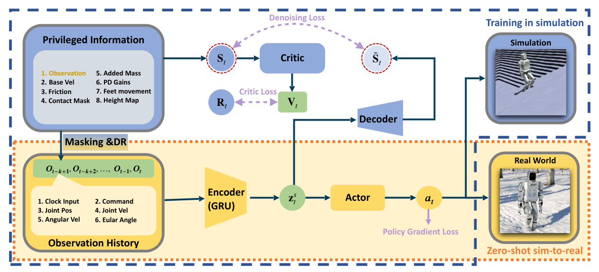

# Denoising World Model Locomotion：基于去噪世界模型的复杂地形人形运动控制

标题里的World Model很容易让人联想到根据动作预测未来视频或潜在轨迹，但本文的方法并不是这类规划模型。DWL的核心是一个循环编码器-解码器：把加入遮挡、mask和domain randomization噪声的观测历史编码为latent，再重建训练时可见的真实状态；策略直接从这个latent输出关节目标，并与PPO联合训练。

## 从不完整观测恢复控制所需状态

仿真先从特权状态构造受污染观测，循环编码器根据历史得到`z_t`，解码器重建无噪状态。去噪损失由状态重建误差和latent稀疏正则组成；actor和critic同时用策略损失、价值损失学习。总目标把“估计什么信息”和“哪些信息能提高回报”耦合起来，而不是先训练一个独立估计器再冻结。

> **主要方法图：** Figure 3，PDF第5页。特权观测经mask和随机化形成原始传感观测，历史编码成latent，解码器重建真值，策略梯度从同一表示产生动作。来源：[原论文](https://arxiv.org/abs/2408.14472)。

部署actor只使用本体传感历史，不读取训练时的高度扫描；动作是12维关节位置目标，经PD转成力矩。奖励仍包含速度跟踪、周期步态、足端轨迹和正则项，所以性能提升不能完全归因于去噪表示。论文还把当前奖励加入观测/表示设计，这一点复现时要核对真机是否能用同一定义实时计算，避免无意引入仿真特权量。

按完整闭环看，输入是关节、IMU等连续历史，latent承担的是对当前隐藏状态的记忆，解码头用特权真值监督，actor则在每个控制步立刻输出关节位置目标。模型没有语言、视觉场景语义或显式动作token，也不从latent向前滚动多个候选未来。环境变化后的“重新规划”实际是循环状态随新本体反馈更新、actor下一步改动作，能力上更接近学习式状态估计器加locomotion policy。

## 硬件与算法是共同变量

实验使用Robot Era的XBot-S和XBot-L，并强调主动2自由度闭链踝关节。复杂地形表现来自DWL、执行器、本体结构和训练随机化共同作用，不能把同一策略效果直接外推到被动踝或不同力矩密度的人形本体。

本文展示了雪地、斜坡、楼梯和不规则地面的真机零样本迁移，但“去噪世界模型”目前主要解决隐藏状态表征，没有显式滚动未来、比较候选动作或做规划。把它放在知识地图中，更准确的位置是**带特权重建辅助的历史状态估计与策略联合学习**，再与Dreamer、视频世界模型分开比较。

复现应做三组消融：去掉重建损失、只重建不让策略梯度进入表示、以及完整联合训练，并报告latent重建误差、速度跟踪、跌倒率与地形外推。若只看最终回报，很难判断收益来自历史记忆、辅助监督还是额外网络容量。

循环状态在站立重置、通信中断和机器人被扶起后如何初始化也要明确；错误历史若长期留在latent中，会让恢复动作基于已经失效的地面判断。

## 原文

[论文原文](https://arxiv.org/abs/2408.14472)
