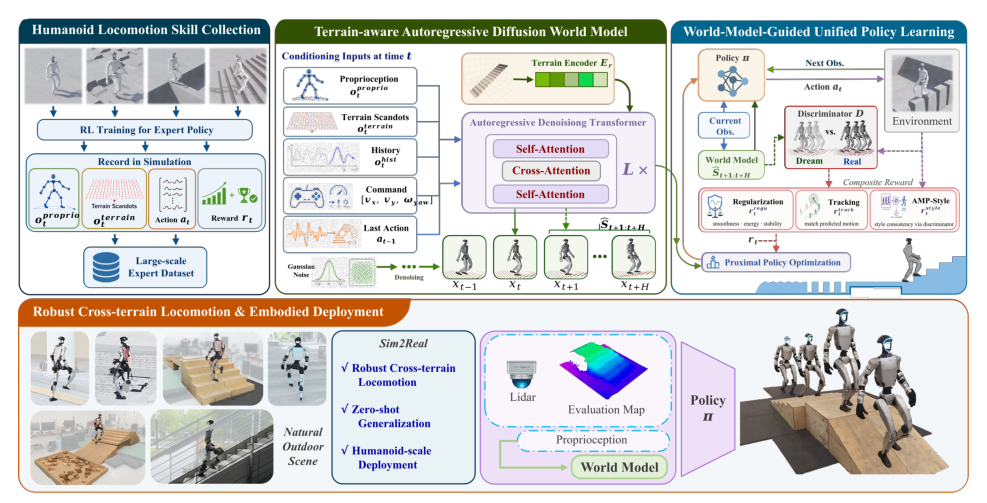

# DreamPolicy：面向可扩展人形运动控制的统一世界模型策略

DreamPolicy想解决“每种地形一个专家”的扩展问题。作者先在五类地形上训练专用RL策略并收集本体状态、地形观测、动作和奖励，再训练一个地形条件的自回归扩散模型生成未来身体状态序列。统一策略不直接复制专家动作，而把生成的未来状态当作动态目标，通过goal-conditioned RL学会跟踪。

## 数据并不是凭空来的

专家策略仍需要基础行走奖励和地形专用塑形，数据采集也发生在仿真中。因此本文减少的是**统一策略阶段**针对混合地形的重复奖励工程，不是完全消除前期专家、场景和奖励设计。数据覆盖哪些地形、专家在哪些状态成功，决定扩散模型能“梦到”什么。

> **主要方法图：** Figure 2，PDF第3页。左侧收集不同地形的专用运动技能数据，右侧用Autoregressive Diffusion World Model形成统一策略的未来运动目标。来源：[原论文](https://arxiv.org/abs/2505.18780)。

## 为什么生成状态而不是直接生成动作

模型在机器人自身坐标系中生成包含本体与地形信息的未来状态，避免依赖全局位置和航向。训练从teacher forcing逐步过渡到使用模型自身历史的自回归rollout，以减轻训练和推理的分布差。部署时扩散模型给出未来状态轨迹，统一策略读取当前观测和该轨迹，输出29维关节位置目标。

输入条件由当前/历史本体、地形表示和技能条件组成，扩散过程学习未来状态序列的去噪目标；它生成的不是视频，也不是最终力矩。未来状态被当作低频动态参考，goal-conditioned controller继续结合实时本体反馈，以较高频率生成PD关节目标。这个分层让生成轨迹偶有误差时仍有低层纠偏空间，也说明模型能力依赖已训练好的locomotion控制器、执行器模型和安全保护。

统一策略的奖励有两层：第一步预测提供即时身体位姿与速度跟踪；在线判别器把策略实际转移与扩散模型生成的未来转移比较，形成类似AMP的长时风格约束。扩散模型因此更像“地形条件运动参考生成器”，而不是可以替代物理仿真、精确预测接触力的完整世界模拟器。

自回归生成会累积误差，所以部署必须滚动更新：感知线程获得新地形与状态后重新生成一段目标，控制线程只消费当前有效前缀。若地形突然变化、生成耗时超限或轨迹落入不可达区域，应丢弃旧计划并退回基础站立/行走策略。论文中的异步频率设计正是在避免扩散推理进入最内层稳定环。

## 当前证据怎样看

论文在Unitree G1上测试楼梯、坡面、沟槽和组合地形，并报告相对蒸馏基线在未见地形上的提升。截至2026-07-14，作者官方项目页未提供代码入口；仍需继续核验数据规模、扩散推理延迟以及跨机器复现。控制约50 Hz、感知/生成约20 Hz的异步部署说明生成模型并未直接占据最内层伺服环；真正的安全与扰动恢复仍由高频RL控制器和底层PD承担。

要证明“统一世界模型”而非专家数据拼接有效，还应按地形来源留出测试，比较专家蒸馏、无扩散目标、无判别器和完整方法，并记录生成状态误差、低层跟踪误差与最终通过率。

## 原文与项目

[论文原文](https://arxiv.org/abs/2505.18780) · [官方项目页](https://dreampolicy.github.io/)
